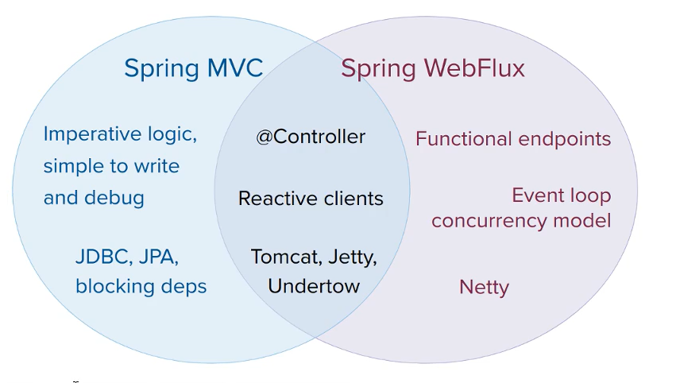
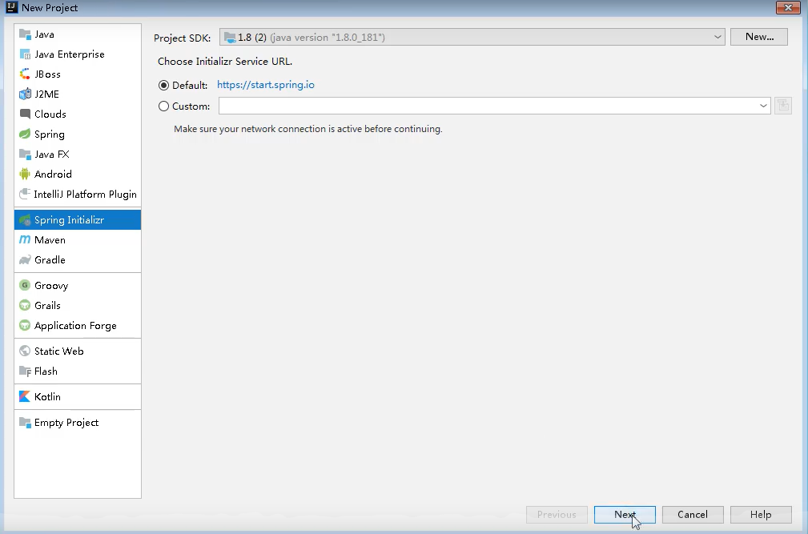
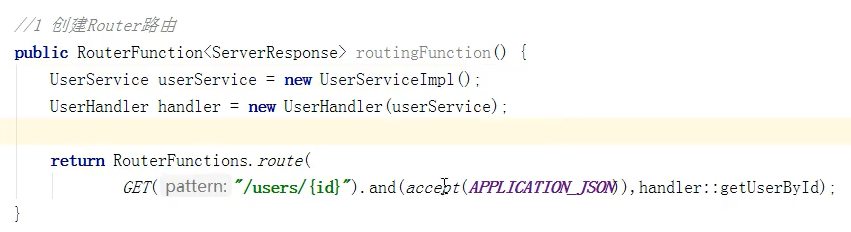
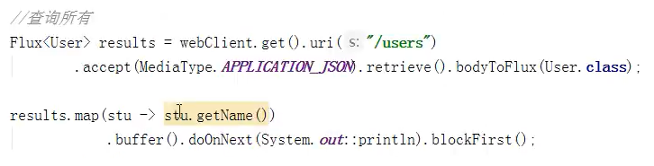

#  WebFlux

> 
>
> 

## 基本概念

> WebFlux是Spring5中出现的**新模块**，**作用于web层**功能与传统的Spring MVC类似，是面向当前热门的响应式编程而编写的模块。
>
> WebFlux**基于reactive（响应式）**实现的Spring-webmvc，有**完全异步非阻塞**的特点
>
> 异步非阻塞框架在**Servlet3.1以后才支持**，核心**基于Reactor**相关API实现
>
> 特点
>
> 1. 增加系统的吞吐量和伸缩性（异步非阻塞）
> 2. 响应式编程（Reactor）
> 3. 函数式编程（Java8）
>
> 与传统Spring-MVC的差异
> 
>
> 实际应用场景中，对应接受请求频繁的区域应该使用WebFlux（如微服务网关）

## 响应式编程

### 响应式编程介绍

> 定义：响应式编程是一种**面向数据流**和**变化传播**的**编程范式**。这意味着可以在编程语言中很方便地表达静态或动态的数据流，而相关的计算模型会自动将变化的值通过数据流进行传播。
>
> 举例：
>
> 
>
> 
>
> 
>
> 简单的说就是牵一发动全身
>
> 底层原理：就是**修改原数据**时增加**额外步骤**，这个步骤会**修改和这个数据有关联的所有数据**，这个行为就是传播。（java中采用观察者设计模式实现）
>
> （例子a=c+b，修该c时会发生的步骤
>
> 1、修改c
>
> 2、调用方法修改a
>
> **响应式本质上就是通过增加额外操作的方式实现**）
>
> java观察者模式提供的API：Observer、Observable。
>
> 响应式编程是观察者模式的一种具体应用

### 简单的响应式编程实现（Java8）

> 1. 环境：IDEA快速创建Spring Boot 2.2.1版本项目
>     
> 2. 创建类继承Observable
>     1. 创建main方法，在方法中创建该类对象，添加观察者
>         
>     2. 触发数据变化，发出通知
>         

### 简单的响应式编程实现（Java9）

> 在Java9及以后版本使用Flow，取代Observer、Observable，Flow中有两个主要的API一个是publisher（发布者）、Subscriber（订阅者）
>
> 1. 创建发布者，实现发布消息时对应订阅者应该做出的反应
>     （下面定义了发布者发布消息后会调用订阅者两次调用onNext方法和一次onError方法）
>
>     
>
> 2. 创建订阅者，实现发布者要调用的方法
>     （下面使用匿名类创建一次性的订阅者）
>
>     

### Reactor响应式编程

#### Reactor介绍

> Reactor框架是基于**Java9API**实现的满足Reactive设计规范的框架
>
> Reactor核心类：Mono、Flux这两个类都实现了Publisher接口
>
> Mono、Flux都是数据流发布者，可以发出三种数据信号
>
> 1. 元素值
> 2. 错误信号
> 3. 完成信号
>
> 错误信号和完成信号都是**终止信号**，终止信号用于**告诉订阅者**数据流结束了。错误信号处理终止还会传递错误信息给订阅者。**错误信号和完成信号不能同时使用**。
>
> Mono：一次性只发送一个元素值，发送一次终止信号
>
> Flux：一次性能够发送N个元素值，发送一次终止信号
>
> 无限数据流：没有终止信号
>
> 空数据流：没有发送元素值，直接发送终止信号

#### 代码示例

> 1. 引入Reactor框架依赖
>     
>
> 2. 创建Flux，Mono对象，使用just方法发送元素值
>     
>
> 3. Flux从集合中获取元素值并发送
>     
>
> 4. 创建接收者响应数据流方法
>     （下面表示直订阅者收到元素值后，对元素值进行输出）
>
>     

#### Reactor操作符

> 操作符：对发布者发出的数据流进行特点的处理，使得元素值在到达订阅者时是理想的状态
>
> 几种常见的操作符：
>
> 1. map操作符，将元素映射为新元素（就是python中的map方法，对可迭代对象中的**每一个元素**都**进行指定处理**）
>     
> 2. flatmap操作符，将每个元素映射为流，将所有元素流组合起来发送
>     

## WebFlux基本流程核心API

> WebFlux是基于Reactor实现响应式，默认容器时Netty，Netty是高性能异步非阻塞框架

### WebFlux基本流程

> SpringWebFlux整个执行过程由核心控制器主导。
>
> DispatchHandler核心控制器：基本流程处理客户端请求并返回响应，实现了WebHandler接口。
>
> WebHandler接口
> 
> DispatchHandler实现类中的handle方法（就是WebFlux执行流程）
> 
>
> DispatchHandler三个组件
>
> 1. HandlerMapping：将请求url映射到对应处理servlet
> 2. HandlerAdapter：适配器，处理请求场所
> 3. HandlerResultHandler：返回结果
>
> 

### 核心API

> 使用SpringWebFlux时主要实现的两个接口：RouterFunction（路由处理）和HandlerFunction接口（处理函数）

## SpringWebFlux基于注释实现

> 使用Spring Boot快速创建Spring项目时默认使用Netty容器
>
> 1. 使用Idea创建Spring Boot项目（2.2.1默认使用Spring5）
>     
>     
>     
>
> 2. 引入WebFlux依赖
>     
>
> 3. 在application.properties配置文件中配置SpringBoot启动端口号
>     
>
> 4. 创建3个包
>     
>
> 5. 在entity中创建实体类，并实现对应属性的get、set方法
>     
>
> 6. 在service包中创建接口，定义数据库操作方法
>     （数据库操作只有一个返回值使用Mono类型，多个返回值使用Flux类型，泛型括号内写返回值的类型）
>
>     
>
> 7. 创建接口实现类，为了方便使用map集合代替数据库
>     
>     
>
>     
>
>     
>
>     1. 实现根据ID查询
>         
>
>     2. 实现查询所有用户
>         
>
>     3. 实现添加用户
>         获取形参，添加到map
>         doOnNext
>
>         
>
> 8. controller类创建，注入service对象，配置url-service映射
>     @RestController是SpringMVC中创建控制器的注解
>
>     
>
>     1. 配置id查询（GetMapping表示get请求的映射）
>         
>
>     2. 配置查询所有
>         
>
>     3. 配置添加（PostMapping表示Post请求的映射）
>         （@RequestBody注解表示将post请求参数转换为json格式）
>
>         
>
> 9. 调用启动类启动Spring Boot项目
>     
>
> SpringMVC与SpringWebFlux的差异
>
> 

## SpringWebFlux基于函数实现

> 函数式编程实现步骤：
>
> 1. 实现RouterFunction接口（**路由处理，将其转发给对应的Handler**）
> 2. 实现HandlerFunction接口（**具体的请求处理函数**）
> 3. 手动初始化Web服务（本来默认使用contoller包中的类启动服务器）
>
> 
>
> 注意
>
> 函数式编程时Http请求和响应不在使用ServletRequest、ServletResponse对象，而使用ServerRequest、ServerResponse

### 创建Handler（HandlerFunction接口）

> 直接在注解实现项目中修改
>
> 1. 删除controller，创建handler包，创建UserHandler类
>     通过有参构造方法传入Service
>
>     
>
> 2. 实现根据id查询
>
>     1. 从ServerRequest对象获取请求中的id参数
>
>     2. 调用service处理
>
>     3. 将Mono对象转换为ServerResponse格式格式返回
>         （Mono对象转换的过程使用了**flatMap方法**传入**lambel表达式**代表使用的转换方法，将user对象转换成接送格式）
>
>         （这里的flatMap方法可以被调用，Spring会默认调用，这里只时一个演示实际转换过程）
>
>     
>
> 3. 实现查询所有（**这里也要添加ServerRequest形参**，和djano视图函数必须携带request参数含义一致）
>     
>
> 4. 实现添加
>     

### 配置路由（RouterFunction接口）

> 1. 在应用目录下创建Server类
>     
>     
>     
> 2. 在类中配置路由
>     （使用GET方法配置url路径，and方法配置接受url参数的格式，和handler中对应的方法）
>     1. 配置id查询
>         
>     2. 配置查询所有
>         
>     3. 配置添加（同上）
>
> （routingFunction方法返回RouterFunction对象，方法体内的操作等于在编辑一张url映射，后续还要将这对象配置到服务器上，才能实现路由效果）

### 配置服务器

> Server类下在创建一个方法
> 
>
> 1. 创建路由适配器
>
>     1. 获取RouterFunction路由映射对象
>     2. 使用RouterFunction对象创建HttpHandler对象
>     3. 使用HttpHandler对象创建ReactorHttpHandlerAdapter对象完成路由适配器创建
>
>     
>
> 2. 创建服务器
>
>     1. 创建服务器对象
>     2. 添加路由适配器
>
>     
>
> 3. 创建main方法启动服务器
>     

### 终结

> 使用编程式方法时，handler可以看作django中的视图编写，Router可以看作django中的url配置文件的编写

## 使用WebClient测试

> 使用WebClient可以不使用浏览器完成效果测试
>
> 1. 在应用文件夹下创建Client类
>     
> 2. 创建main方法，测试对应URL
>     1. 设置服务器地址+端口
>     2. 调用客户端对象的get、post方法模拟get、post请求
>     3. 调用uri方法设置请求的URL，可以动态传入参数
>     4. 设置接受响应的格式（accept方法）
>     5. 初始化（retrieve方法）
>     6. 将响应结果封装成类（bodyToMono方法）
>     7. 输出返回结果
>
> 
>
> 
> （doNext，定义订阅者执行的方法，blockFirst方法相当于订阅操作）
>
> 
>
> 总结：WebClient傻子采用

