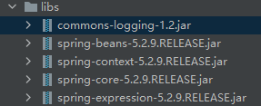
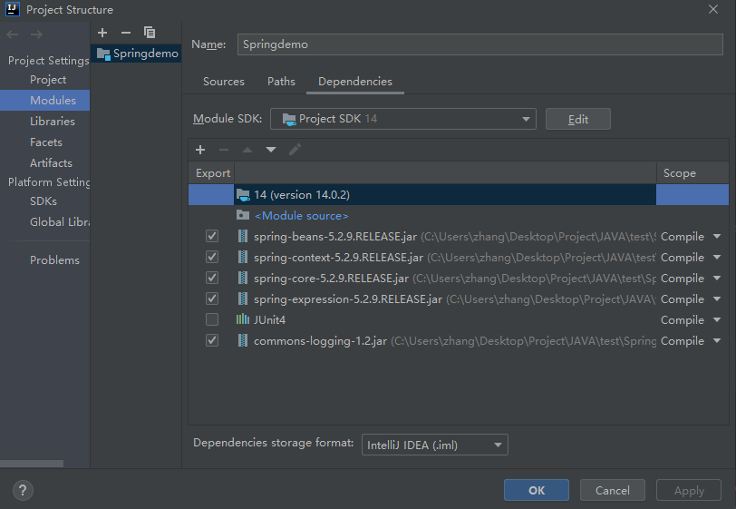
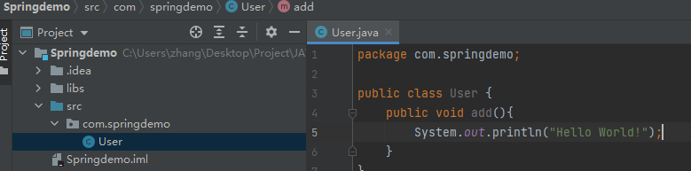
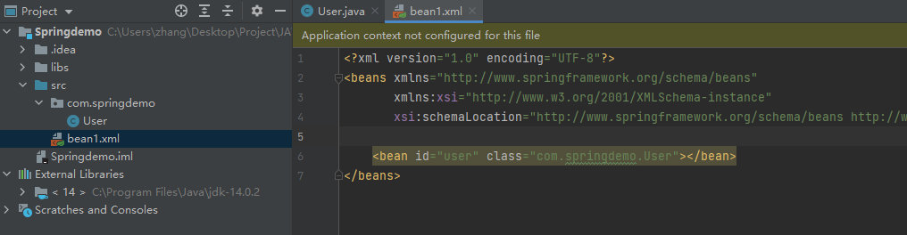
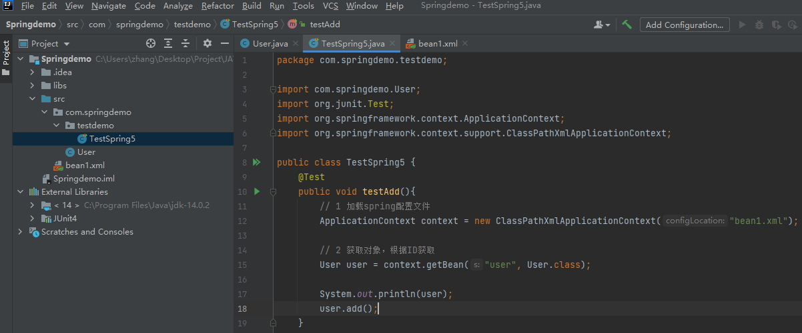
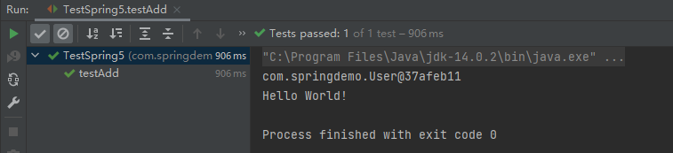

# Spring安装与实例

## Spring安装

> 1. jar包地址：https://repo.spring.io/ui/repos/tree/General/libs-release%2Forg%2Fspringframework%2Fspring%2F5.2.9.RELEASE%2Fspring-5.2.9.RELEASE-dist.zip
>2. 源码地址：https://repo.spring.io/ui/repos/tree/General/release

## SpringIOC示例创建对象

> 1. 在IDEA中创建一个普通的java项目
>2. 在项目中创建libs文件夹存放依赖包
> 3. 导入Spring5相关的jar包到libs文件夹中，只需要导入Spring框架中的核心容器相关的Jar包即可。（下图中的core container部分）
>     
>     
> 4. 导入到IDEA中
>     
> 5. 创建一个普通类
>     
> 6. 创建xml文件，class属性表示类所在路径，id唯一表示一个bean
>     
> 7. 进行测试代码编写，测试利用xml文件是否能够创建对象并且正确执行方法
>     
> 8. 运行结果
>     

