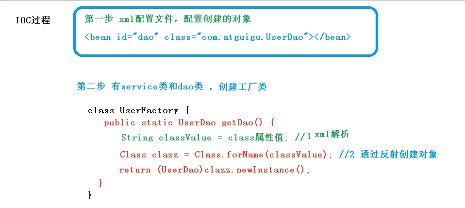
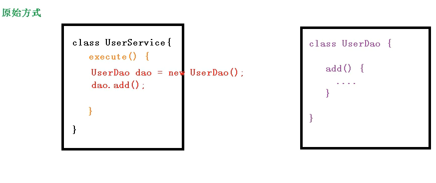
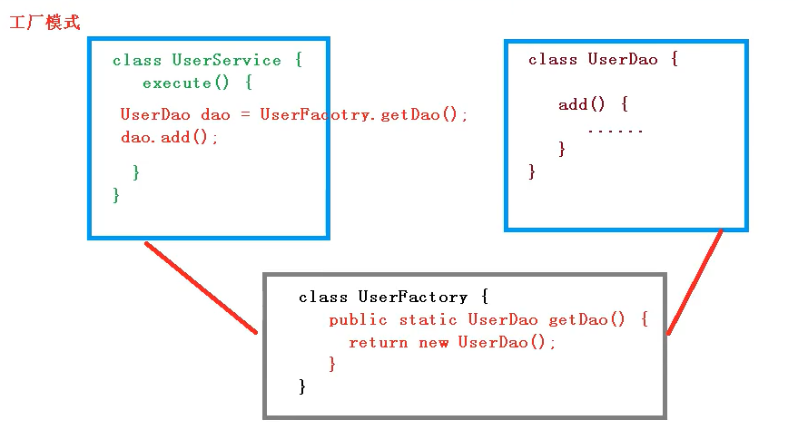
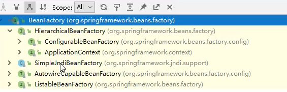
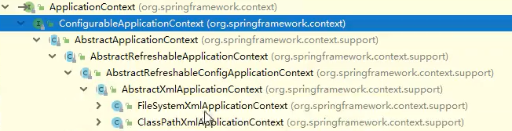

# IOC原理和接口

## IOC容器

> IOC容器：所谓的容器就是一些事物的存放空间，**可以从这个容器中取出实例**。IOC容器即使一个对象创建的工厂，可以从中获取想要的对象。
>
> 
>
> IOC容器中将介绍以下三个部分
>
> 1. IOC原理
>2. IOC接口
> 3. IOC对Bean的管理
>     1) 基于xml管理bean
>     2) 基于注释管理bean

## IOC原理

> IOC：Inversion of Control即控制反转，是面向对象编程中的**一种设计原则**，可以减低计算机代码之间的耦合度。**最常见的实现方式**是**依赖注入**，在spring中IOC的体现就是将对象的创建工作交给spring管理
>

#### IOC底层原理

> 1. xml解析：读取配置
>2. 工厂模式：降低耦合
> 3. 反射：创建对象
>

#### IOC工作流程

> 
>

#### 传统的对象创建(高耦合)

> 一个类中直接创建另一个类的对象，当需要修改时需要对每一个使用类代码进行修改
>
> 
>

#### 工厂模式创建对象（低耦合）

> 所有对象都从一个中间工厂获取当需要使用不同对象时只需要修改工厂API的返回值即可，不需要每个类的修改，**减少依赖的直接关联数，从原来的n：1变为n：1：1**（类似的例子在计算机网络中路由分发中也有类是体现，每个路由器从一个权威路由器获取路由信息，不需要与每一个路由器建立连接）
>
> 

## IOC接口

> IOC接口：即使用IOC工厂的API
>

#### SPring提供两种IOC容器接口

> 1. BeanFactory：是IOC容器的基本实现，开发中一般不使用
>    
> 
>2. ApplicationContext：是BeanFactory接口的子接口，提供更丰富的功能，该接口有两个实现类：
>     FileSystemXmlApplicationContext：从操作系统路径下获取配置
>    ClassPathXmlApplicationContext：默认从src文件夹中获取配置
> 
>     
>

#### 两个接口的区别

> BeanFactory**接口加载配置文件时不会创建对象**，在调用获取对象方法时才进行对象创建，ApplicationContext接口在**加载xml配置时就会创建对象**，调用获取方法时返回对象的引用。
>
> ApplicationContext接口更加适合用在程序中，因为将对象创建的过程放在服务启动时可以减少服务启动后的开销，加长服务启动时间往往不会带来太大影响