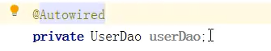

# IOC基于XML的bean管理

## Bean管理

> Bean管理，即Spring对Bean对象的两个操作
>
> 1. Spring创建bean对象
> 2. Spring注入属性到bean对象：将传统的调用类方法设置属性转变为由spring来为类的属性赋值
>

### Bean管理的方式

> 1. 基于xml方式
>2. 基于注释方式

## 基于xml

### 基于XML方式创建对象

> 1. 在xml中使用bean标签并添加对应属性即可由Spring创建bean对象
>    
> 2. bean标签中的属性
>    1. id：唯一表示一个bean标签
>     2. class：类的全路径
>     3. name：早期框架使用的属性，基本不用
> 3. Spring默认使用无参数构造方法
> 

### 基于xml方式注入属性

#### 传统属性设置

> 使用类的set方法，或有参构造方法
> 

#### IOC属性注入方式

##### 1、IOC_set方法注入

> 1. 在类中创建对应属性的set方法，**方法名以set开头变量首字母大写**。
>     
> 2. 在xml文件中配置property标签完成属性注入
>     

##### 2、IOC_有参构造方法注入

> 1. 在类中定义有参数的构造方法
>
>     
>
> 2. 在xml中使用constructor-arg标签，使得spring调用有参构造方法并注入属性
>     
>
> 3. 也可以使用constructor-arg标签中的index属性，该属性表示构造方法中的参数索引，0就表示方法中的第一个参数，value表示参数值
>     

##### 3、IOC_P名称空间注入（是set注入方式的一种简化）

> 1. 在xml文件中导入新的命名空间P（xmlns（XML Namespaces的缩写）是一个属性，是XML（[标准通用标记语言](https://baike.baidu.com/item/标准通用标记语言/6805073)的子集）命名空间。作用是赋予[命名空间](https://baike.baidu.com/item/命名空间/2887476)一个唯一的[名称](https://baike.baidu.com/item/名称/6546057)。冒号后面是别名用于区分多个xmlns属性）
>     http://www.springframework.orgschema/p
>
>     
>
> 2. 使用**p属性**代替property标签
>     

#### IOC注入特殊值

##### IOC注入null

> 1. IOC注入null值， 不设置value属性，添加一个null标签
>     

##### IOC注入特殊符号

> 特殊符号就是xml中已经使用的符号，如<>
>
> 1. 使用转译符代替
>     
>     
> 2. 把特殊符号写入CDATA，被`<![CDATA[]]>`这个标记所包含的内容将表示为**纯文本**。
>     

##### IOC注入外部Bean（注入对象作为属性）

> web服务端可以被分为3层web层、service层、DAO层(Data Access Object) 对应MVC架构，其中DAO层对service层来说就是外部，其中的bean就是外部类（简单的说外部类就是其他类，外部bean其实是先对内部bean的一种叫法）
>
> 1. 创建service类和dao类
>     
>
> 2. 传统的调用方式，在service中创建dao对象再调用其方法
>     
>
> 3. 使用IOC注入的方式将一个对象注入到另一个对象的属性
>     创建类，使用set方法注入（或构造方法）
>
>     
>
> 4. 编辑xml，既然要注入类就需要有两个对象
>      
>
> 5. 设置service对象的属性，**当一个对象作为属性值是就不能使用value属性，需要使用ref属性**，表示关联到另一个对象，ref的属性值为对象bean标签的Id值
>      （使用ApplicationContext的情况下ref可以直接获取到对象的引用，使用BeanFactory的情况下处理ref是需要先创建对象在返回引用）
>      

##### IOC注入内部Bean(注入对象作为属性)

> 内部bean和级联赋值**是用来处理数据表之间1：1，1：n，n：m关系**时的工作，级联赋值就和数据表的级联修改操作一致，在java中使用类来表示数据表
>
> 1. 一对多关系（1：n），例：部门和员工之间的关系
>
> 2. 用实体类表示1：n关系，创建部门类和员工类
>     
>
>     
>
> 3. 配置xml，在xml中将部门类的bean创建放在了员工bean创建的内部，这就是内部bean的表示
>
>     
>
> （内部bean和外部bean的区别是**内部bean创建的对象对外不可知**，只能被当前bean使用，外部bean创建的对象对整个xml环境中的对象可知可以被多个次引用）

##### IOC级联赋值

> IOC级联赋值，对所有存在依赖的对象同时赋值，观察上述内部bean和外部bean注入式可以发现在创建一个类的对象时会将和**这个类有关联**的对象**一起创建并赋值**。
>
> 1. 外部bean级联赋值
>
> 2. 内部bean级联赋值
>
> 3. 通过property级联赋值
>     name属性中使用**类名.属性**形式，value填写属性值就可以给dept对象赋值，**这种方法要求dept对象已经创建，并且当前类中要实现get方法获取dept类**。
>     （整个流程：创建当前类、get方法获取dept对象、调用dept对象的set方法进行赋值）
>
>      
>     
>      

##### IOC注入collection类型数据

> 1. 创建对象，设置对应的set方法
>     
>
> 2. 配置xml配置数组类型
>     通过在属性标签内使用array标签都可以支持数组对象的赋值，array标签中包含多个value标签表示数组值，**value标签只能存放基本数据类型**。
>
>      
>
> 3. 配置list类型
>     
>
> 4. 配置map类型
>     使用**map标签**导入map对象，使用**entry标签**设置key-value
>
>     
>
> 5. 配置set类型
>     
>
> （这个配置结构和内部bean的结构很类似都是将一个对象赋值给一个属性，内部bean需要使用bean标签导入对象，这里直接使用内置的array等标签就可以导入对象）

##### IOC注入的collection成员为类对象

> 1. 创建类
>     
>
> 2. 配置XML配置course对象
>     
>
> 3. 配置List属性
>     将list中的value标签替换成ref标签，ref标签中的bean属性用来指向要存放的对（外部bean形式的引用，内部bean形式能否适用不清楚）
>
>     

##### IOC注入collection对外公有

> 1. 创建类
>     
>
> 2. 配置XML引入命名空间：http://www.springframework.orgschema/util
>     
>      
>
> 3. 适用util标签完成list集合提取
>
>     
>
> 4. 被bean使用（就是外部bean的形式调用）
>
>     
>
> **collection对外公有就是将其写成外部bean形式**，可以被其他对象通过ref属性引用。**引入命名空间的作用就是免去了自己创建list类的过程**直接使用util内置的list类。
> （原来的list只是一个标签无法被引用就是一个没有id和属性的内部bean。）

### XML自动装配

> 自动装配：即不需要在XML中手动输入属性值。xml自动装配实际使用较少
>
> 1. 手动装配的XML
>     
> 2. 自动装配XML
>     使用bean标签中的auotowrite实现**自动为dept属性注入dept对象**。
>     
>
> auto有两个属性值
>
> 1. byName：根据属性名称注入，要求变量名与标签id属性值一致
> 2. byType：根据属性类型注入，要求变量类型和bean类型一致
>     
>
> 使用byType是要求相同类型的bean不能定义多个，否则spring无法判断使用那个bean

### 引入外部属性文件

> 外部属性文件：将xml中需要手动添加的属性值统一放置到一个额外的文件中，通过读取外部文件自动加载到xml中
>
> 外部属性文件**实现了XML中属性值的动态化**，修改属性值是不需要修改xml，只需要修改配置文件

#### 用druid.jar连接池连接数据库（手动配置）

> 1. 在xml中配置连接池bean
>
> 

#### 用druid.jar连接池连接数据库（外部文件配置）

> 1. 创建外部属性文件，properties格式（k-v格式）
>     
> 2. 在XML引入名称空间context
>     
>     
>     
> 3. 在xml引入外部文件
>     
> 4. 配置连接池Bean（**${key}，表达式通过配置文件中的key获取值**）
>     
>
> 

## 基于注释

> 什么是注解：注解是代码中特殊的标记，可以作用在类、方法、属性
>
> 格式：@注解名称(属性名称=属性值，......)
>
> 使用注解的目的：**简化XML配置**。

### 基于注释创建对象

> Spring为创建对象提供的几种注解
>
> 1. @Component：组件，一般对象都可以用这个注解创建
> 2. @Service：用在业务逻辑层
> 3. @controller：用在web层
> 4. @Repository：用在dao层
>
> （不强制要求使用层次，是一种约定规范，可以更加清晰的看到当前对象使用的层次，四个注解都可以创建对象）

#### 注解创建对象流程

> 1. 引入注解所需的依赖，spring-aop.jar
>     
>
> 2. 开启组件扫描，让Spring扫描指定包下的类。若类存在注解则创建对象
>
>     1. 配置xml，引入名称空间context
>         
>
>     2. 配置组件扫描，使用**context:component-scan标签**，在**base-package属性**中写入要扫描的包路径
>
>         
>
>         
>
> 3. 创建类，添加注解
>     
>
> 4. 测试
>     
>     

#### 注解和xml创建对象的本质

> Spring_xml创建对象过程
>
> 1. 获取xml配置信息（xml解析）
> 2. 读取bean标签中id、class属性值，获得类所在路径
> 3. 反射创建对象，赋值id作为对象名
>
> Spring_注解方式创建对象
>
> 1. 获取xml信息（xml解析）
> 2. 读取要扫描的包信息（因为引入context:component-scan标签）
> 3. 扫描包，将其中带有注释的类通过反射创建对象，赋值value作为对象名

#### 开启组件扫描中的细节配置

> 细节配置：可以要求Spring进行更加细致的扫描，例如对包下的哪个类不进行扫描。**通过配置包扫描过滤器实现**。
>
> 默认情况下spring使用默认过滤器进行扫描，该过滤器默认扫描所有

##### 示例一

> 只扫描com.atguigu包下的controller注解的类
>
> 
>
> use-default-filters=false，表示关闭默认过滤器
>
> context:include-filter，标签表示引入一个新的过滤器，其中设置要扫描的类规则
>
> type=annotation，表示根据注解类型过滤
>
> expression，表示具体注解类型，这里写了controller注解，需要写注解所在java包中的全路径（就是import导入路径）

##### 示例二

> 不扫描com.atguigu包下的controller注解的类
>
> 
>
> context:exclude-filter，标签表示引入一个新的过滤器，其中设置不扫描的类规则

### 基于注释注入属性

#### @Autowired注入（将对象注入到属性）

> 根据属性类型进行自动注入
>
> （与xml自动装配使用byType属性一样有着注入的类型不能存在两个实例的限制）

> 1. 创建service、dao类，添加注释
>     （dao中类继承接口的写法有利于java中多态的实现
>     使用接口定义变量，可以将所有实现该接口的类赋值给这个变量）
>
>     
>
>     
>
>     
>
>     
>
> 2. 在要注入的属性上使用注解，@Autowire**根据属性类型**在已创建对象中**找到对应类型的对象**，将其赋值给该属性
>     
>
> 3. 测试
>     
>
>     

#### @Qualifier注入（将对象注入到属性）

> 根据**对象名称**进行注入（对象名称由**注解**创建类中**value的值**决定，或bean中的id属性值决定）

> 可以和@AutoWired注解配合使用可以解决@AutoWired注解不能同时存在两个相同实例的限制。
> 
>
> 也可以单独使用

#### @Resource注入（将对象注入到属性）

> 可以根据类型注入，也可以根据名称注入

> 1. 根据类型注入
>     
> 2. 根据名称注入
>     
>
> （@Resourece注解是javax包中定义的
>
> @AutoWired、@Qualifier是spring包中定义的）
>
> 
> 

#### @Value注入（注入基本类型属性）

> 注入基本类型属性

> 

### 纯注解开发

> 完全不使用xml配置文件

> 1. 使用注解时xml中需要开启组件扫描配置
>
>     
>
> 2. 将这条配置使用配置类实现，**使用@Configuration注解**标识配置类
>     
>
> 3. **使用@ComponentScan注解**开启组件扫描
>     
>
> 4. 测试，使用配置类时其获取对象的方式发生了变化
>     使用配置类时，其工厂类不在是ClassPathXmlApplicationContext变成由AnnotationConfigApplicationContext它同样实现了ApplicatonContext接口
>
>     
>     
>
> （实际应用中一般使用spring boot来实现纯注解开发，spring boot就是spring的简化开发）