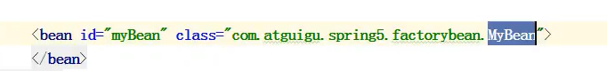

# Spring中Bean分类

### 分类

> 1. 自建bean
> 2. 工厂bean（FactoryBean）

### 普通bean

> 普通bean：自定义类
>
> 特点：Spring获取对象的类型和配置文件中的类型保持一致

#### 普通bean的创建

> 1. 定义类
>     
> 2. 配置xml
>     

### 工厂bean

> 工厂bean：自定义类，实现FactoryBean接口
>
> 特点：Spring获取对象的类型可以和配置文件中的类型不一致

#### 工厂bean的创建

> 1. 定义类，实现FactoryBean接口
>
>     1. 重写三个方法，分别为**获取对象方法**，**获取对象类型方法**，判断**是否为单例方法**。
>
>         
>
>     2. 重写getObject方法
>         
>
> 2. 配置xml
>     
>
> 3. 测试
>     
>     
>
> 4. 可以看到定义的类是MyBean，xml中配置的也是MyBean，Spring获取对象是获取的是Course类型，同时getBean方法中的参数也要改写成Course.class
>
> 