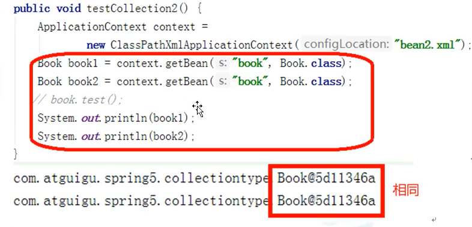
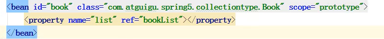
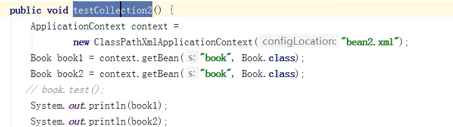
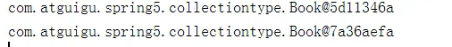

# Bean作用域

> 作用域：即设置Bean是单实例模式还是多实例模式。
>
> Spring默认创建的bean都为单实例模式。

### 单实例

> 默认情况下的单实例bean
>
> 

### 多实例

> 1. 在xml配置时，在bean标签中使用scope属性
>
> 2. scope属性值
>
>     1. 默认值：singleton，单实例
>     2. prototype：多实例，该模式下ApplicationContext接口也不会在加载配置时创建对象，在调用get方法时才创建对象。
>     3. request：设置该对象生命周期为request
>     4. session：设置该对象生命周期为session
>
>     
>
> 3. 测试
>     
>
>     