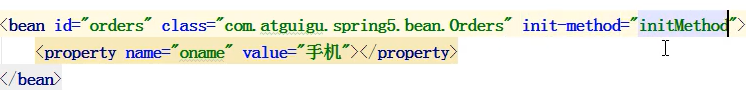
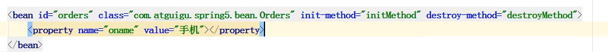
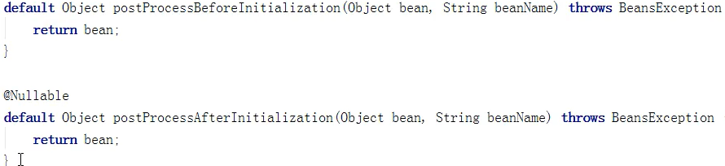
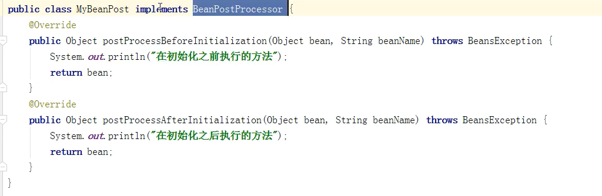
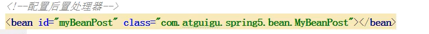

# Spring_Bean生命周期

> 生命周期：对象的创建到对象销毁的时间段

### Bean生命周期

> 1. 创建bean：调用bean构造方法
>
> 2. 注入属性：调用bean的set方法
>
> 3. 初始化bean：调用初始化方法，该方法自己编写并手动配置到xml
>     使用Bean标签中的init-method属性设置初始化方法
>     （该方法的含义时是**bean初始化完成后**要执行的任务）
>
>     
>
> 4. 使用Bean：通过IOC的get方法获取对象并使用
>
> 5. 销毁Bean：调用销毁方法，销毁方法需要自己编写并配置到xml
>     使用Bean标签中的destroy-method属性设置销毁方法
>     （该方法的含义时**bean销毁前要执行的任务**，**真正的销毁工作**是由**ApplicationContext接口**的实现类中的**close方法执行**）
>
>     

### Bean的后置处理器

> **增加后置处理器**后的Bean生命周期
>
> 1. 创建Bean
> 2. 注入属性
> 3. **把bean实例传递给前置处理器**
> 4. 调用初始化方法
> 5. **把bean实例传递给后置处理器**
> 6. 使用Bean
> 7. 销毁Bean
>
> 配置后置处理器
>
> 1. 创建类实现接口BeanPostProcessor中的两个方法
>     一个BeforeInit方法、一个AfterInit方法
>
>     
>
>     
>
> 2. 配置xml
>     
>
> **配置后置处理器后，Spring会为当前XML中的所有Bean都添加后置处理器**
>
> 