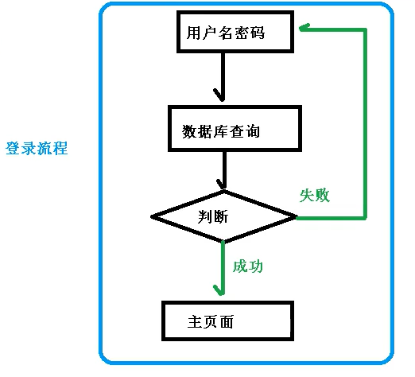
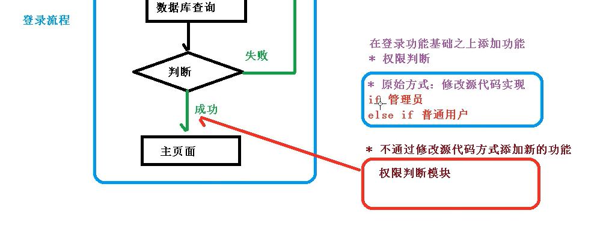

# AOP基本概念

> AOP：Aspect Oriented Programming，面向切面编程，通过[预编译](https://baike.baidu.com/item/预编译/3191547)方式和运行期间动态代理实现程序功能的统一维护的一种技术。AOP是[OOP](https://baike.baidu.com/item/OOP)的延续，是[函数式编程](https://baike.baidu.com/item/函数式编程/4035031)的一种衍生范型。
>
> 特点：利用AOP可以对业务逻辑的**各个部分进行隔离**，从而使得业务逻辑各部分之间的[耦合度](https://baike.baidu.com/item/耦合度/2603938)降低，提高程序的可**重用性**，同时提高了开发的效率。
>
> 

### 面向切面编程举例

> 1. 一个正常的登录流程
>     
>
> 2. 现要增加一个用户权限判断的功能
>
>     1. 原始做法，修改源代码
>         
>
>     2. AOP做法，单独编写模块，添加到登录流程中
>         （类似过滤器的使用形式，**需要时添加到流程中，不需要时从流程中去除**。）
>
>         