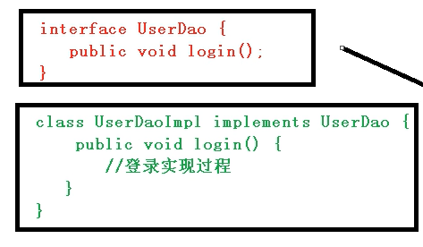
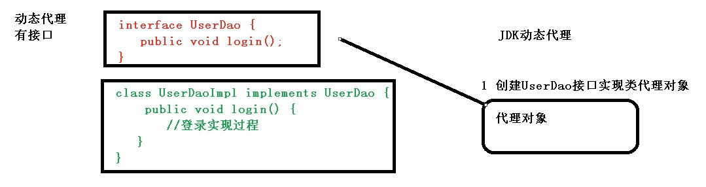
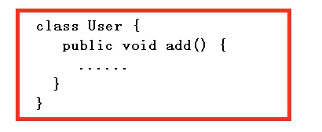
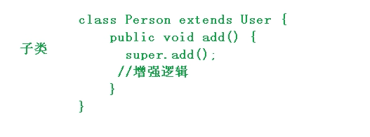
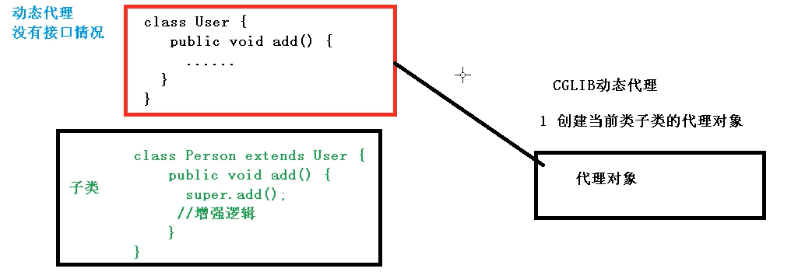
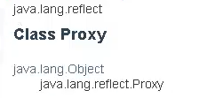
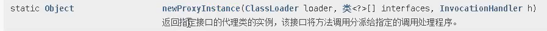
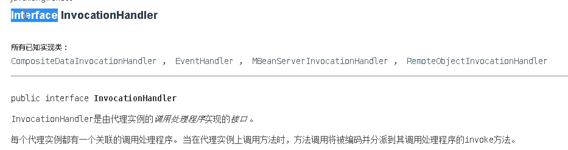
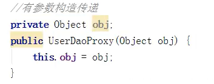
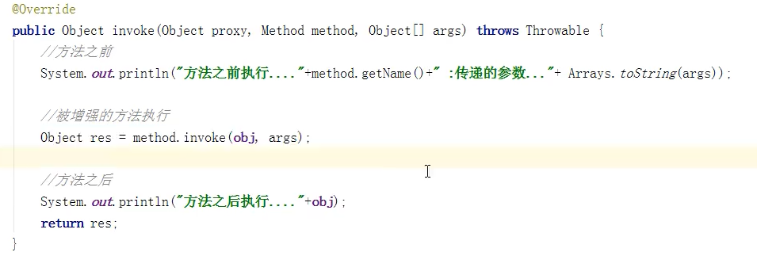

# 底层原理

> AOP底层原理：使用动态代理方式，增强类中某个方法的功能
>
> 代理：字面意思找人代替，http代理是使用另一个客户端代替自己发送请求，**动态代理**同理，**使用一个新模块来代替工作流程中的老模块**，这个新模块完全胜任老模块的工作，同时也有老模块不具备的新功能。

### 两种情况的动态代理

#### 1、有接口情况(JDK)

> 有接口情况，使用JDK中的动态代理
>
> 1. 存在一个接口，和接口的实现类
>     
>
> 2. 在创建一个UserDao接口的实现类，这个类就可以代替原程序中的UserDaoImpl类
>     （**新的实现类中login就可以增加新功能**）
>
>     

#### 2、没有接口情况(CGLIB)

> 没有接口情况使用CGLIB动态代理
>
> 1. 存在一个类，并且有子类
>     
>
>     
>
> 2. CGLIB创建创建子类的代理对象，去替换
>     

### JDK动态代理实现

#### 依赖类Proxy

> 1. 使用java标准API中的Proxy类（位于java.lang.reflect）
>
>     
>
> 2. 使用newProxyInstance方法创建代理对象，作用是，**返回指定接口的代理类的实例，该接口将方法调用分派给指定的调用处理程序**。
>     
>
>     1. ClassLoader，类加载器来定义代理类，用来构造代理实例
>     2. 类<?>[]，代理类实现的接口列表，用来获取接口中的方法
>     3. InvocationHandler：调度方法调用的调用处理函数，是一个接口类型，该参数接受实现该接口的实现类对象，**接口中的方法将会分配给该实现类执行**
>         

#### 动态代理实现

> 1. 创建接口，定义方法
>     
>     ```java
>     package com.springdemo;
>     
>     public interface UserDao {
>         public int add(int a,int b);
>         public String update(String s);
>     }
>     
>     ```
>     
> 2. 创建实现类，实现方法
>     
>     ```java
>     package com.springdemo;
>     
>     public class UserDaoImpl implements UserDao{
>         @Override
>         public int add(int a, int b) {
>             return a+b;
>         }
>     
>         @Override
>         public String update(String s) {
>             return s;
>         }
>     }
>     
>     ```
>     
> 3. 创建**调度处理程序**，继承InvocationHandler，
>
>     1. 传递被代理对象，为了保持原模块功能不变（通过有参构造传递）
>
>         
>
>     2. 实现invoke方法，**处理**代理实例上的**方法调用**并返回结果。当代理实例调用方法时，就会调用处理程序中的invoke方法
>
>         1. proxy参数：表示代理实例对象
>         2. method参数：表示代理实例执行的方法
>         3. args参数：表示代理实例调用方法时传入的参数列表
>
>         
>
>     ```java
>     class UserDaoProxy implements InvocationHandler{		// 调度处理程序
>         
>         // 使用有参构造方法，传入原有实现类，为了执行原有的方法
>         private Object obj;
>         public UserDaoProxy(Object obj){
>             this.obj=obj;
>         }
>     
>         @Override	// 代理实例执行任何方法，都会执行该方法，所以可以在该方法中进行功能增加
>         public Object invoke(Object proxy, Method method, Object[] args) throws Throwable {
>             
>             // 原有方法之前执行
>             System.out.println("在方法："+ method.getName()+ "之前执行");
>             // 执行原有方法
>             Object res = method.invoke(obj,args);
>             // 原有方法之后执行
>             System.out.println("在方法："+ method.getName()+ "之后执行");
>             return res;
>         }
>     }
>     ```
>
>     
>
> 4. 使用Proxy类创建对应接口的代理实例
>
>     ```java
>     public class JDKProxy {
>         public static void main(String[] args) {
>             // 代理类实现的接口列表
>             Class[] Interfaces = {UserDao.class};
>             
>             UserDao userDao = new UserDaoImpl();
>             // 返回指定接口的代理类的实例，该接口将方法调用分派给指定的调用处理程序。
>             UserDao dao = (UserDao)Proxy.newProxyInstance(JDKProxy.class.getClassLoader(), Interfaces, new UserDaoProxy(userDao));
>             /* 
>             	代理实例调用方法的实际流程
>             	1、代理实例调用接口方法，
>             	2、实际上将代理实例（dao）、调用方法（add）、传入参数（1，2）三个参数传递给调度处理程序的invoke方法
>             	3、UserDaoProxy类（调度处理程序）执行invoke方法
>             	即
>             	dao.add(1,2);
>             	UserDaoProxy.invoke(dao,add,[1,2]);
>             */
>             int res = dao.add(1,2);
>             System.out.println(res);
>         }
>     }
>     ```
>
> （将动态代理看作python中的装饰器会便于理解，装饰器既可以在不修改原函数的情况下给函数增加功能
>
> **两者原理一致，都是在原函数执行之前后之后添加新代码块**）

