### Vue CLI构建Vue程序

#### 1、创建一个webpack打包的项目

1. 进入项目放置目录

   ```
   cd C:\Users\zhang\Desktop\Project\Vue\vue-cli
   ```

2. 执行项目构建命令，构建基于webpack打包工具的项目

   ```
   vue init webpack firstvue-cli
   ```

   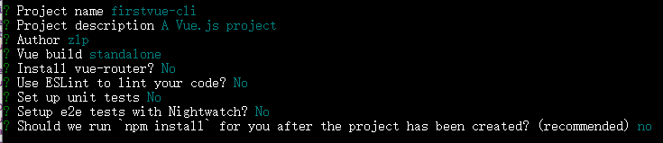

   拒绝自动安装依赖

3. 项目结构
   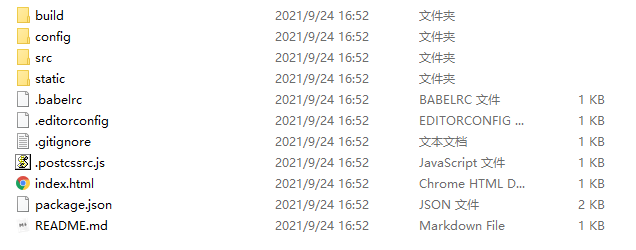
   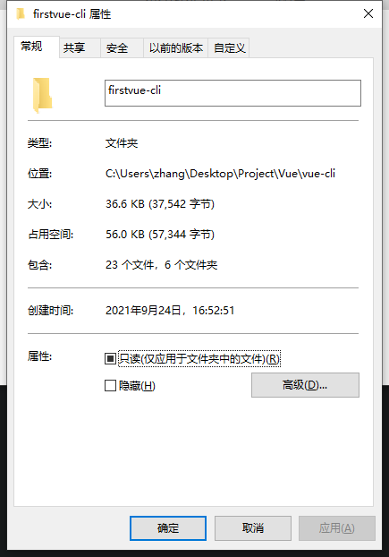

#### 2、使用npm安装项目依赖

项目的依赖信息都放在package.json文件中

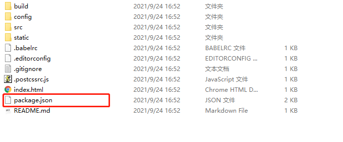

进入项目目录，执行npm insatll命令，安装依赖模块

```
cd firstvue-cli
npm install // 该命令会自动读取package.json文件的信息，安装对应依赖
```

安装依赖后的目录结构

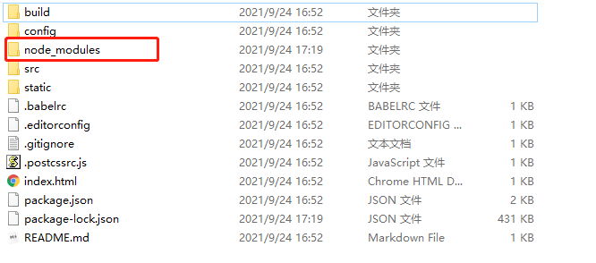

安装的依赖都存放在node_modules目录下

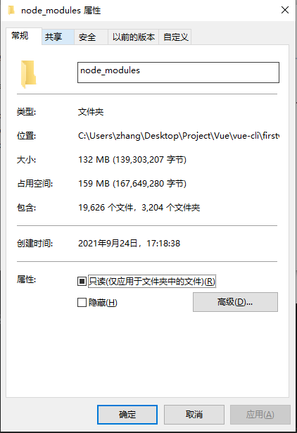

#### 3、启动项目

1. 当前目录下执行npm run dev，启动开发环境
2. 浏览器访问http://localhost:8080/，进入首页
   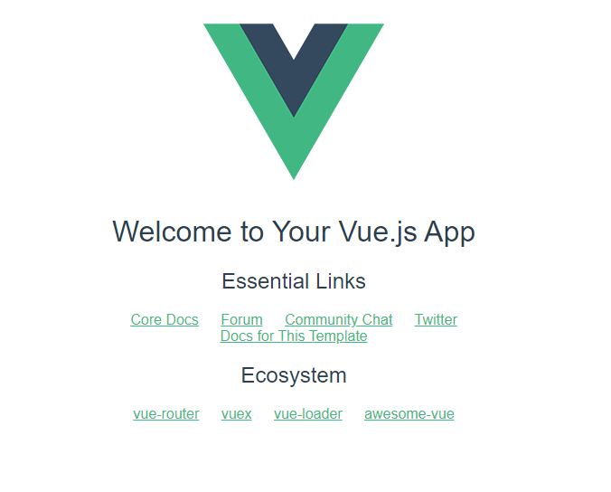

#### 4、项目目录解析

build文件夹：存放项目构建文件

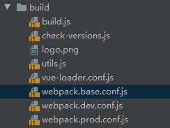

webpack.base.conf.js：基础环境搭建

webpack.dev.conf.js：开发环境搭建

webpack.prod.conf.js：生产环境搭建


config文件夹：存放项目配置文件

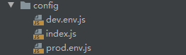


node_modules文件夹：存放依赖


src文件夹：存放源码

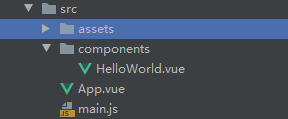


static文件夹：存放静态资源


#### 5、项目入口页面

入口页面：index.html

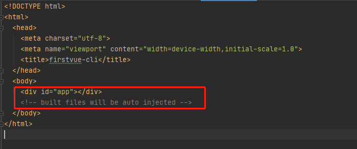

入口页面的js文件：main.js，将Vue实例挂载到DOM

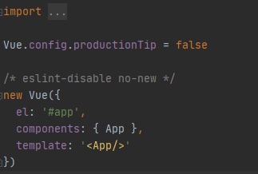

App.vue：index.html的主要内容，这里引用了组件HelloWorld.vue

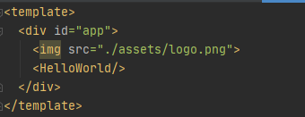

HelloWorld.vue：修改该组件内容为

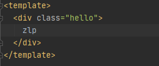

效果

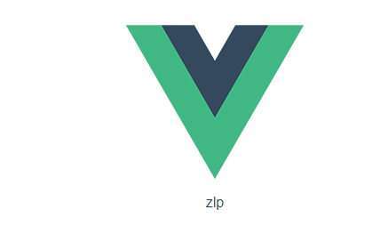