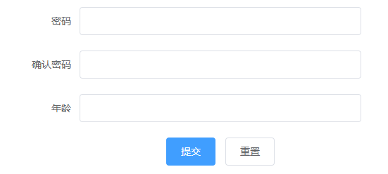

### 示例

#### 1、安装Element模块

```
// i表示install，-S表示安装到当前项目
npm i element-ui -S
```


#### 2、安装sass加载器（动态输出css）

```
cnpm i sass-loader node-sass --save-dev
```

#### 3、选择模板，定义组件文件


```js
<template>
  <el-form :model="ruleForm" status-icon :rules="rules" ref="ruleForm" label-width="100px" class="demo-ruleForm">
    <el-form-item label="密码" prop="pass">
      <el-input type="password" v-model="ruleForm.pass" autocomplete="off"></el-input>
    </el-form-item>
    <el-form-item label="确认密码" prop="checkPass">
      <el-input type="password" v-model="ruleForm.checkPass" autocomplete="off"></el-input>
    </el-form-item>
    <el-form-item label="年龄" prop="age">
      <el-input v-model.number="ruleForm.age"></el-input>
    </el-form-item>
    <el-form-item>
      <el-button type="primary" @click="submitForm('ruleForm')">提交</el-button>
      <el-button @click="resetForm('ruleForm')">重置</el-button>
    </el-form-item>
  </el-form>
</template>
<script>
  export default {
    data() {
      var checkAge = (rule, value, callback) => {
        if (!value) {
          return callback(new Error('年龄不能为空'));
        }
        setTimeout(() => {
          if (!Number.isInteger(value)) {
            callback(new Error('请输入数字值'));
          } else {
            if (value < 18) {
              callback(new Error('必须年满18岁'));
            } else {
              callback();
            }
          }
        }, 1000);
      };
      var validatePass = (rule, value, callback) => {
        if (value === '') {
          callback(new Error('请输入密码'));
        } else {
          if (this.ruleForm.checkPass !== '') {
            this.$refs.ruleForm.validateField('checkPass');
          }
          callback();
        }
      };
      var validatePass2 = (rule, value, callback) => {
        if (value === '') {
          callback(new Error('请再次输入密码'));
        } else if (value !== this.ruleForm.pass) {
          callback(new Error('两次输入密码不一致!'));
        } else {
          callback();
        }
      };
      return {
        ruleForm: {
          pass: '',
          checkPass: '',
          age: ''
        },
        rules: {
          pass: [
            { validator: validatePass, trigger: 'blur' }
          ],
          checkPass: [
            { validator: validatePass2, trigger: 'blur' }
          ],
          age: [
            { validator: checkAge, trigger: 'blur' }
          ]
        }
      };
    },
    methods: {
      submitForm(formName) {
        this.$refs[formName].validate((valid) => {
          if (valid) {
            this.$router.push("/submit");
            console.log("to submit");
          } else {
            console.log('error submit!!');
            return false;
          }
        });
      },
      resetForm(formName) {
        this.$refs[formName].resetFields();
      }
    }
  }
</script>

```

#### 4、vue整合Element

main.js

```js
import Vue from 'vue';
import App from './App.vue';
// 引入组件
import ElementUI from 'element-ui';
// 引入样式
import 'element-ui/lib/theme-chalk/index.css';


Vue.use(ElementUI);

new Vue({
  el: '#app',
    // 引入渲染函数
  render: h => h(App)
});
```

#### 5、使用组件

App.vue

```vue
<template>
  <div id="app">
    <MyForm/>
  </div>
</template>

<script>
  import MyForm from "./components/MyForm";
export default {
  name: 'App',
  components:{MyForm},
}
</script>
```

#### 6、效果



