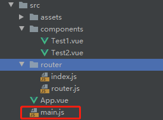

### 示例

### 1、安装

当前项目下，安装vue-router

```
npm install vue-router
```

在项目的modules文件夹下可以看到

即安装成功

### 2、编写组件


Test1.vue

```vue
<template>
    <p>Test1</p>
</template>

<script>
    export default {
        name: "Test1"
    }
</script>

<style scoped>

</style>

```

Test2.vue

```vue
<template>
    <p>test2</p>
</template>

<script>
    export default {
        name: "Test2"
    }
</script>

<style scoped>

</style>

```

### 3、编写路由


router.js

```js
import Vue from 'vue'
import VueRouter from "vue-router";
import Test1 from "../components/Test1";
import Test2 from "../components/Test2";

// vue安装路由功能
Vue.use(VueRouter);

// 创建路由对象，对外提供
export default new VueRouter({
    // 设置路由规则
  routes:[
    {
        // 路由路径
      path:'/test1',
        // 目标组件
      component:Test1
    },
    {
      path: '/test2',
      component: Test2
    }
  ],
})

```

### 4、vue根实例添加路由对象



main.js

```js
import Vue from 'vue'
import App from './App'
import router from './router/router'
Vue.config.productionTip = false

/* eslint-disable no-new */
new Vue({
  el: '#app',
    // 传入路由对象
  router:router,
  components: { App },
  template: '<App/>'
})
```

### 5、在APP.vue中添加路由跳转连接

App.vue

```vue
<template>
  <div id="app">
    <h1>Vue-Router</h1>
      <!--跳转链接-->
    <router-link to="/test1">toTest1</router-link>
    <router-link to="/test2">toTest2</router-link>
      <!-- 组件内容展示 -->
    <router-view></router-view>
  </div>
</template>

<script>


  export default {
    name: 'App',

  }
</script>

<style>
  #app {
    font-family: 'Avenir', Helvetica, Arial, sans-serif;
    -webkit-font-smoothing: antialiased;
    -moz-osx-font-smoothing: grayscale;
    text-align: center;
    color: #2c3e50;
    margin-top: 60px;
  }
</style>

```

