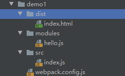
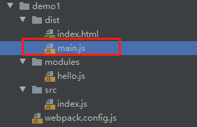

### 示例

1、创建一个空文件夹

2、在文件夹下创建一个modules目录，存放js模块

3、创建src文件夹存放原程序代码

4、在modules下自定义js文件充当模块

5、在src文件夹下创建index.js，作为整个项目的js模块入口

6、创建dist文件夹作为项目输出目录

7、在dist下创建index.html

8、在项目目录下创建webpack.config.js作为webpack打包的配置文件



hello.js

```js
export function f() {
    document.write("<h1>zlp</h1>");
}
```

index.js

```js
import {f} from "../modules/hello"

f()
```

webpack.config.js

```js
const path = require('path');

module.exports = {
    // 打包入口
    entry:'./src/index.js',
    // 打包出口，path要求绝对路径
    output:{
        filename:'main.js',
        path: path.resolve(__dirname, 'dist'),
    }
}
```

index.html

```js
<!DOCTYPE html>
<html lang="en">
<head>
    <meta charset="UTF-8">
    <title>webpack-demo</title>
</head>
<body>

<script type="text/javascript" src="main.js"></script>
</body>
</html>
```

当前目录下执行webpack打包命令

```
npx webpack --config webpack.config.js
```

输出一个main.js



index.html渲染效果


### 总结

JavaScript的模块化发展使得前端设计变得简洁，webpack等打包工具，编程人员可以专注于模块化设计，不需要考虑过多的依赖整合