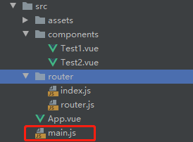
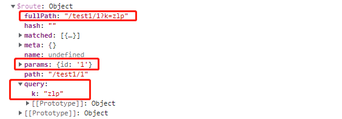
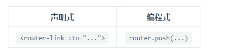
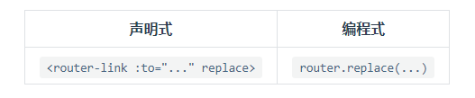

### 前端路由

前端路由对于SAP应用来讲就是锚链接的跳转，跳转前后浏览器url不发生改变，浏览器会产生历史记录。


前端路由的效果：通过点击锚链接使得浏览器hash地址发生改变，通过监听该事件可以使用js动态做出对应的响应。


### 简单示例

#### 1、安装

当前项目下，安装vue-router

```
npm install vue-router -S
```

在项目的modules文件夹下可以看到

即安装成功

#### 2、编写组件


Test1.vue

```vue
<template>
    <p>Test1</p>
</template>

<script>
    export default {
        name: "Test1"
    }
</script>

<style scoped>

</style>

```

Test2.vue

```vue
<template>
    <p>test2</p>
</template>

<script>
    export default {
        name: "Test2"
    }
</script>

<style scoped>

</style>

```

#### 3、编写路由


router.js

```js
import Vue from 'vue'
import VueRouter from "vue-router";
import Test1 from "../components/Test1";
import Test2 from "../components/Test2";

// vue安装路由功能
Vue.use(VueRouter);

// 创建路由对象，对外提供
export default new VueRouter({
    // 设置路由规则
  routes:[
    {
        // 路由路径
      path:'/test1',
        // 目标组件
      component:Test1
    },
    {
      path: '/test2',
      component: Test2
    }
  ],
})

```

#### 4、vue根实例添加路由对象



main.js

```js
import Vue from 'vue'
import App from './App'
import router from './router/router'
Vue.config.productionTip = false

/* eslint-disable no-new */
new Vue({
  el: '#app',
    // 传入路由对象
  router:router,
  components: { App },
  template: '<App/>'
})
```

#### 5、在APP.vue中添加路由跳转连接

App.vue

```vue
<template>
  <div id="app">
    <h1>Vue-Router</h1>
      <!--跳转链接-->
    <router-link to="/test1">toTest1</router-link>
    <router-link to="/test2">toTest2</router-link>
      <!-- 组件内容展示 -->
    <router-view></router-view>
  </div>
</template>

<script>


  export default {
    name: 'App',

  }
</script>

<style>
  #app {
    font-family: 'Avenir', Helvetica, Arial, sans-serif;
    -webkit-font-smoothing: antialiased;
    -moz-osx-font-smoothing: grayscale;
    text-align: center;
    color: #2c3e50;
    margin-top: 60px;
  }
</style>

```


### 使用router-link代理a标签

```
<a href="#/main"></a>

# 使用router-link代替a标签。to属性相当于href
# 在to属性中可以不需要标明锚链接的#号，路由含义更加明显
# 在渲染页面时会自动将router-link标签替换成带锚链接的a标签
<router-link to="/main"></router-link>
```


### Router对象

#### 基本路由

```js
const router = new Router({
  routes: [
    {
      path: '/main',
      component: Main
    }
]})
```

#### 路由命名规则

- 精确匹配
- 使用通配符匹配
- 使用正则表达式匹配

示例

```js
const router = new VueRouter({
  mode: 'history',
  base: __dirname,
  routes: [
    { path: '/' },
    // 使用冒号添加路径参数
    { path: '/params/:foo/:bar' },
      // 添加问号值得路径参数可选
    // a param can be made optional by adding "?"
    { path: '/optional-params/:foo?' },
    // 路径参数后可以跟正则表达式
    // 下面路由表示路径参数只匹配数值类型
    { path: '/params-with-regex/:id(\\d+)' },
    // 使用通配符匹配任意
    { path: '/asterisk/*' },
    // 使用括号和问号配合使得部分路径可选
    { path: '/optional-group/(foo/)?bar' }
  ]
})
```


#### 路由匹配优先级

若有多个匹配的路由项则按照定义的顺序，定义的越早优先级越高


#### 重定向路由

```js
const router = new Router({
  routes: [
    {
      path: '/main',
      component: Main
    },
    {
      path: '/',
        // 重定向到一个路由项
      redirect '/main'
    }
]})

```

#### 路由别名

`/a` 的别名是 `/b`，意味着，当用户访问 `/b` 时，URL 会保持为 `/b`，但是路由匹配则为 `/a`，就像用户访问 `/a` 一样。

```js
const router = new VueRouter({
  routes: [
    { path: '/a', component: A, alias: '/b' }
  ]
})
```

“别名”的功能让你可以自由地将 UI 结构映射到任意的 URL，而不是受限于配置的嵌套路由结构。


#### 子路由

在浏览器地址栏中体现路由的现层级关系


页面结构

- router-link
- router-view
  - router-link
  - router-view


路由结构

```js
const router = new Router({
  routes: [
    {
      path: '/main',
      component: Main,
        // 所有子路由都以/main开头显示
      children: [
          {
              path: 'table1',
              component: Table1,
          },
          {
              path: 'table2',
              component:Table2,
          },
      ]
    },
    {
      path: '/',
        // 重定向到一个路由项
      redirect '/main'
    }
]})
```

#### 默认路由

```js
const router = new Router({
  routes: [
    {
        // path值为空时，作为默认路由使用，会自动被展示
        // 若子路由中存在默认路由，那么默认子路由也会被自动展示
      path: '',
      component: Main
    },
]})
```

#### 动态路由

提高路由规则的复用性

```JS
const router = new Router({
  routes: [
    {
        // path中使用英文冒号引入动态参数
        // 该路径可以匹配：/main/1，/main/2，/main/3
        // 相当于spring中的路径参数，同理该动态参数会被传入对应的组件对象中
        // 可以从组件对象中获取，this.$route.params.id获取对应动态值
      path: '/main/:id',
      component: Main
    },
]})
```

##### 获取路径参数的方式

1. 参数默认保存在组件的属性中：this.$route.params.id

2. 通过props接受参数

   ```js
   const router = new Router({
     routes: [
       {
         path: '/main/:id',
         component: Main,
           // 通过props接受路径参数
         props: true,
       },
   ]})
   ```

##### 获取url中查询参数

例：www.baidu.com?k=zlp

1. 查询参数默认保存在组件的属性中：this.$route.query.k

2. props获取

   ```js
   const router = new VueRouter({
     routes: [
       {
         path: '/search',
         component: SearchUser,
         props: route => ({ query: route.query.q })
       }
     ]
   })
   ```

route对象



#### 编程式路由

路由按照形式分类

- 声明式路由：在页面中通过router-link标签方式声明的路由
- 编程式路由：在浏览器中通过调用API的方式定义的路由

vue-router中提供了几种常见的路由API

1. this.$router.push('hash地址')：跳转到指定的地址，相当于一次点击链接操作，参数可以是表示路径的字符串或者描述地址的对象
   

   ```js
   // 字符串
   router.push('home')
   
   // 对象
   router.push({ path: 'home' })
   
   // 命名的路由，路径参数
   router.push({ name: 'user', params: { userId: '123' }})
   
   // 带查询参数，变成 /register?plan=private
   router.push({ path: 'register', query: { plan: 'private' }})
   ```

   > **注意：如果提供了 `path`，`params` 会被忽略，上述例子中的 `query` 并不属于这种情况。取而代之的是下面例子的做法，你需要提供路由的 `name` 或手写完整的带有参数的 `path`：**

   ```js
   const userId = '123'
   router.push({ name: 'user', params: { userId }}) // -> /user/123
   router.push({ path: `/user/${userId}` }) // -> /user/123
   // 这里的 params 不生效
   router.push({ path: '/user', params: { userId }}) // -> /user
   ```

2. this.$router.replace('hash地址')：替换当前地址为目标地址，页面会发生转变，但是不会有新增历史操作记录，会替换掉当前的历史
   

3. this.$router.go(数值 n)：在浏览历史中前进或后退

   ```js
   // 相当于后退一个历史记录
   // 若后退层数超过上限则，无响应
   this.$router.go(-1)
   ```

4. this.$router.back()：后退一个历史记录

5. this.$router.forward()：前进一个历史记录

#### 命名路由

可以在配置路由项时指定name属性来给路由命名，被命名的路由可以使得vue-router根据name的值来知道要跳转的路由项

```js
const router = new VueRouter({
  routes: [
    {
      path: '/user/:userId',
      name: 'user',
      component: User
    }
  ]
})
```

```js
<router-link :to="{ name: 'user', params: { userId: 123 }}">User</router-link>
```

```js
router.push({ name: 'user', params: { userId: 123 } })
```

#### 命名视图

应用场景：一个路由存在多个视图每个视图需要不同的组件渲染，给视图命名就可以达到将指定的组件渲染到指定的视图中。常用于主页中同时渲染侧边栏和主要内容

```html
<router-view class="view one"></router-view>
<router-view class="view two" name="a"></router-view>
<router-view class="view three" name="b"></router-view>
```

```js
const router = new VueRouter({
  routes: [
    {
      path: '/',
      components: {
          // 没有命名的视图就叫default
        default: Foo,
        a: Bar,
        b: Baz
      }
    }
  ]
})
```

#### History模式

`vue-router` 默认 hash 模式 —— 使用 URL 的 hash 来模拟一个完整的 URL，于是当 URL 改变时，页面不会重新加载。

如果不想要很丑的 hash，我们可以用路由的 **history 模式**，这种模式充分利用 `history.pushState` API 来完成 URL 跳转而无须重新加载页面。

```js
const router = new VueRouter({
  mode: 'history',
  routes: [...]
})
```

当你使用 history 模式时，URL 就像正常的 url，例如 `http://yoursite.com/user/id`，也好看！

> 不过这种模式要玩好，还需要后台配置支持。因为我们的应用是个单页客户端应用，如果后台没有正确的配置，当用户在浏览器直接访问 `http://oursite.com/user/id` 就会返回 404，这就不好看了。


### 导航守卫

导航：表示路由正在发生改变

守卫：表示路由改变前后可能会做出响应的配置，可以视为过滤器


#### 全局前置守卫（beforeEach）

全局：对所有路由生效

前置：在路由改变之前执行守卫，全部前置守卫执行完成后才执行路由改变（不同前置守卫处于异步执行状态）

注册前置守卫

```js
const router = new VueRouter({ ... })

router.beforeEach((to, from, next) => {
  // ...
})
```

参数说明

- **`to: Route`**: 即将要进入的目标 [路由对象](https://router.vuejs.org/zh/api/#路由对象)
- **`from: Route`**: 当前导航正要离开的路由
- **`next: Function`**: 一定要调用该方法来 **resolve** 这个钩子。执行效果依赖 `next` 方法的调用参数。
  - **`next()`**: 进行管道中的下一个钩子。如果全部钩子执行完了，则导航的状态就是 **confirmed** (确认的)。
  - **`next(false)`**: 中断当前的导航。如果浏览器的 URL 改变了 (可能是用户手动或者浏览器后退按钮)，那么 URL 地址会重置到 `from` 路由对应的地址。
  - **`next('/')` 或者 `next({ path: '/' })`**: 跳转到一个不同的地址。当前的导航被中断，然后进行一个新的导航。你可以向 `next` 传递任意位置对象，且允许设置诸如 `replace: true`、`name: 'home'` 之类的选项以及任何用在 [`router-link` 的 `to` prop](https://router.vuejs.org/zh/api/#to) 或 [`router.push`](https://router.vuejs.org/zh/api/#router-push) 中的选项。
  - **`next(error)`**: (2.4.0+) 如果传入 `next` 的参数是一个 `Error` 实例，则导航会被终止且该错误会被传递给 [`router.onError()`](https://router.vuejs.org/zh/api/#router-onerror) 注册过的回调。

> 确保next函数在过程中一定被调用一次，它相当于return，可以重复出现，每个逻辑出口必须要调用

示例

```js
// 访问其他路由前必须登录
router.beforeEach((to, from, next) => {
  if (to.name !== 'Login' && !isAuthenticated) next({ name: 'Login' })
  // 如果用户未能验证身份，则 `next` 会被调用两次
  next()
})
```


#### 全局解析守卫（beforeEach）

结构和注册与beforeEach类使，调用顺序不同


#### 全局后置钩子（afterEach）

在导航行为结束后调用，由于导航已经结束，该守卫不会影响导航本身，可以作为一种触发使用

```js
router.afterEach((to, from) => {
  // ...
})
```


#### 路由独享守卫（beforeEnter）

顾名思义，是作用与特定路由上的守卫，在特定路由执行前执行

注册

```js
const router = new VueRouter({
  routes: [
    {
      path: '/foo',
      component: Foo,
      beforeEnter: (to, from, next) => {
        // ...
      }
    }
  ]
})
```


#### 组件内守卫

在导航执行过程中，将要处理组件渲染步骤阶段的守卫

这些导航在组件内部被直接定义

```js
const Foo = {
  template: `...`,
  beforeRouteEnter(to, from, next) {
    // 在渲染该组件的对应路由被 confirm 前调用
    // 不！能！获取组件实例 `this`
    // 因为当守卫执行前，组件实例还没被创建
  },
  beforeRouteUpdate(to, from, next) {
    // 在当前路由改变，但是该组件被复用时调用
    // 举例来说，对于一个带有动态参数的路径 /foo/:id，在 /foo/1 和 /foo/2 之间跳转的时候，
    // 由于会渲染同样的 Foo 组件，因此组件实例会被复用。而这个钩子就会在这个情况下被调用。
    // 可以访问组件实例 `this`
  },
  beforeRouteLeave(to, from, next) {
    // 导航离开该组件的对应路由时调用
    // 可以访问组件实例 `this`
  }
}
```

- `beforeRouteEnter`：渲染组件前

  > `beforeRouteEnter` 守卫 **不能** 访问 `this`，因为守卫在导航确认前被调用，因此即将登场的新组件还没被创建。
  >
  > 不过，你可以通过传一个回调给 `next`来访问组件实例。在导航被确认的时候执行回调，并且把组件实例作为回调方法的参数。

  ```js
  beforeRouteEnter (to, from, next) {
    next(vm => {
      // 通过 `vm` 访问组件实例
    })
  }
  ```

- `beforeRouteUpdate`：组件被复用时(2.2 新增)

  > 注意 `beforeRouteEnter` 是支持给 `next` 传递回调的唯一守卫。对于 `beforeRouteUpdate` 和 `beforeRouteLeave` 来说，`this` 已经可用了，所以**不支持**传递回调，因为没有必要了。

  ```js
  beforeRouteUpdate (to, from, next) {
    // just use `this`
    this.name = to.params.name
    next()
  }
  ```

- `beforeRouteLeave`：渲染组件后

  > 这个离开守卫通常用来禁止用户在还未保存修改前突然离开。该导航可以通过 `next(false)` 来取消。

  ```js
  beforeRouteLeave (to, from, next) {
    const answer = window.confirm('Do you really want to leave? you have unsaved changes!')
    if (answer) {
      next()
    } else {
      next(false)
    }
  }
  ```


#### 完整的导航解析流程

1. 导航被触发。
2. 在失活的组件里调用 `beforeRouteLeave` 守卫。
3. 调用全局的 `beforeEach` 守卫。
4. 在重用的组件里调用 `beforeRouteUpdate` 守卫 (2.2+)。
5. 在路由配置里调用 `beforeEnter`。
6. 解析异步路由组件。
7. 在被激活的组件里调用 `beforeRouteEnter`。
8. 调用全局的 `beforeResolve` 守卫 (2.5+)。
9. 导航被确认。
10. 调用全局的 `afterEach` 钩子。
11. 触发 DOM 更新。
12. 调用 `beforeRouteEnter` 守卫中传给 `next` 的回调函数，创建好的组件实例会作为回调函数的参数传入。


### 路由元信息

在定义路由项时可以为路由项定义所需要的属性，这些属性被放在meta字段中，做路由元信息使用

meta定义：可以在意在任意路由项中，不论子路由还是根路由

```js
const router = new VueRouter({
  routes: [
    {
      path: '/foo',
      component: Foo,
      children: [
        {
          path: 'bar',
          component: Bar,
          // a meta field
          meta: { requiresAuth: true }
        }
      ]
    }
  ]
})
```

meta字段的查看：一个路由匹配到的所有路由记录会暴露为 `$route` 对象 (还有在导航守卫中的路由对象) 的 `$route.matched` 数组。因此，我们需要遍历 `$route.matched` 来检查路由记录中的 `meta` 字段。


```js
router.beforeEach((to, from, next) => {
    // 查看离开路由项中的mete字段中的元数据
  if (to.matched.some(record => record.meta.requiresAuth)) {
    // this route requires auth, check if logged in
    // if not, redirect to login page.
    if (!auth.loggedIn()) {
      next({
        path: '/login',
        query: { redirect: to.fullPath }
      })
    } else {
      next()
    }
  } else {
    next() // 确保一定要调用 next()
  }
})
```

### 过渡动态

`<router-view>` 是基本的动态组件，所以我们可以用 `<transition>` 组件给它添加一些过渡效果：

```html
<transition>
  <router-view></router-view>
</transition>
```

transition标签中可以包含多个组件，所有组件都使用一种过渡效果


#### 单路由过渡

给每个组件单独设置过渡效果

```js
const Foo = {
  template: `
    <transition name="slide">
      <div class="foo">...</div>
    </transition>
  `
}

const Bar = {
  template: `
    <transition name="fade">
      <div class="bar">...</div>
    </transition>
  `
}
```


#### 动态过渡

基于当前路由与目标路由的变化关系，动态设置过渡效果

```html
<!-- 使用动态的 transition name -->
<transition :name="transitionName">
  <router-view></router-view>
</transition>
```

```js
// 接着在父组件内
// watch $route 决定使用哪种过渡
watch: {
  '$route' (to, from) {
    const toDepth = to.path.split('/').length
    const fromDepth = from.path.split('/').length
    this.transitionName = toDepth < fromDepth ? 'slide-right' : 'slide-left'
  }
}
```

### 数据获取

有时候，进入某个路由后，需要从服务器获取数据。例如，在渲染用户信息时，你需要从服务器获取用户的数据。我们可以通过两种方式来实现：

- **导航完成之后获取**：先完成导航，然后在接下来的组件生命周期钩子中获取数据。在数据获取期间显示“加载中”之类的指示。
- **导航完成之前获取**：导航完成前，在路由进入的守卫中获取数据，在数据获取成功后执行导航。

从技术角度讲，两种方式都不错 —— 就看你想要的用户体验是哪种。

#### 导航完成后获取数据

当你使用这种方式时，我们会马上导航和渲染组件，然后在组件的 `created` 钩子中获取数据。这让我们有机会在数据获取期间展示一个 loading 状态，还可以在不同视图间展示不同的 loading 状态。

假设我们有一个 `Post` 组件，需要基于 `$route.params.id` 获取文章数据：

```html
<template>
  <div class="post">
    <div v-if="loading" class="loading">
      Loading...
    </div>

    <div v-if="error" class="error">
      {{ error }}
    </div>

    <div v-if="post" class="content">
      <h2>{{ post.title }}</h2>
      <p>{{ post.body }}</p>
    </div>
  </div>
</template>
```

```js
export default {
  data () {
    return {
      loading: false,
      post: null,
      error: null
    }
  },
  created () {
    // 组件创建完后获取数据，
    // 此时 data 已经被 observed 了
    this.fetchData()
  },
  watch: {
    // 如果路由有变化，会再次执行该方法
    '$route': 'fetchData'
  },
  methods: {
    fetchData () {
      this.error = this.post = null
      this.loading = true
      // replace getPost with your data fetching util / API wrapper
      getPost(this.$route.params.id, (err, post) => {
        this.loading = false
        if (err) {
          this.error = err.toString()
        } else {
          this.post = post
        }
      })
    }
  }
}
```


#### 在导航完成前获取数据

通过这种方式，我们在导航转入新的路由前获取数据。我们可以在接下来的组件的 `beforeRouteEnter` 守卫中获取数据，当数据获取成功后只调用 `next` 方法。

```js
export default {
  data () {
    return {
      post: null,
      error: null
    }
  },
  beforeRouteEnter (to, from, next) {
    getPost(to.params.id, (err, post) => {
      next(vm => vm.setData(err, post))
    })
  },
  // 路由改变前，组件就已经渲染完了
  // 逻辑稍稍不同
  beforeRouteUpdate (to, from, next) {
    this.post = null
    getPost(to.params.id, (err, post) => {
      this.setData(err, post)
      next()
    })
  },
  methods: {
    setData (err, post) {
      if (err) {
        this.error = err.toString()
      } else {
        this.post = post
      }
    }
  }
}
```

在为后面的视图获取数据时，用户会停留在当前的界面，因此建议在数据获取期间，显示一些进度条或者别的指示。如果数据获取失败，同样有必要展示一些全局的错误提醒。


### 滚动行为

使用前端路由，当切换到新路由时，想要页面滚到顶部，或者是保持原先的滚动位置，就像重新加载页面那样。 `vue-router` 能做到，而且更好，它让你可以自定义路由切换时页面如何滚动。

**注意: 这个功能只在支持 `history.pushState` 的浏览器中可用。**

当创建一个 Router 实例，你可以提供一个 `scrollBehavior` 方法：

```js
const router = new VueRouter({
  routes: [...],
  scrollBehavior (to, from, savedPosition) {
    // return 期望滚动到哪个的位置
  }
})
```

`scrollBehavior` 方法接收 `to` 和 `from` 路由对象。第三个参数 `savedPosition` 当且仅当 `popstate` 导航 (通过浏览器的 前进/后退 按钮触发) 时才可用。

scrollBehavior方法返回值类型

- 坐标对象：{x: number, y: number}
- { selector: string, offset? : { x: number, y: number }}(offset 只在 2.6.0+ 支持)

示例

1. 所有导航时都跳转到页面顶部

   ```js
   scrollBehavior (to, from, savedPosition) {
     return { x: 0, y: 0 }
   }
   ```

2. 返回 `savedPosition`，在按下 后退/前进 按钮时，就会像浏览器的原生表现那样：

   ```js
   scrollBehavior (to, from, savedPosition) {
     if (savedPosition) {
       return savedPosition
     } else {
       return { x: 0, y: 0 }
     }
   }
   ```

3. 模拟“滚动到锚点”的行为：

   ```js
   scrollBehavior (to, from, savedPosition) {
     if (to.hash) {
       return {
         selector: to.hash
       }
     }
   }
   ```

4. 异步滚动

   ```js
   scrollBehavior (to, from, savedPosition) {
     return new Promise((resolve, reject) => {
       setTimeout(() => {
         resolve({ x: 0, y: 0 })
       }, 500)
     })
   }
   ```

   将其挂载到从页面级别的过渡组件的事件上，令其滚动行为和页面过渡一起良好运行是可能的。但是考虑到用例的多样性和复杂性，我们仅提供这个原始的接口，以支持不同用户场景的具体实现。

5. 平滑滚动
   只需将 `behavior` 选项添加到 `scrollBehavior` 内部返回的对象中，就可以为[支持它的浏览器 (opens new window)](https://developer.mozilla.org/en-US/docs/Web/API/ScrollToOptions/behavior)启用原生平滑滚动：

   ```js
   scrollBehavior (to, from, savedPosition) {
     if (to.hash) {
       return {
         selector: to.hash,
         behavior: 'smooth',
       }
     }
   }
   ```

   

### 路由懒加载

当打包构建应用时，JavaScript 包会变得非常大，影响页面加载。如果我们能把不同路由对应的组件分割成不同的代码块，然后当路由被访问的时候才加载对应组件，这样就更加高效了。

结合 Vue 的[异步组件 (opens new window)](https://cn.vuejs.org/v2/guide/components-dynamic-async.html#异步组件)和 Webpack 的[代码分割功能 (opens new window)](https://doc.webpack-china.org/guides/code-splitting-async/#require-ensure-/)，轻松实现路由组件的懒加载。

url：https://router.vuejs.org/zh/guide/advanced/lazy-loading.html


### 导航故障

*导航故障*，或者叫*导航失败*，表示一次失败的导航，原文叫 navigation failures，本文统一采用*导航故障*。

当使用 `router-link` 组件时，Vue Router 会自动调用 `router.push` 来触发一次导航。 虽然大多数链接的预期行为是将用户导航到一个新页面，但也有少数情况下用户将留在同一页面上：

- 用户已经位于他们正在尝试导航到的页面
- 一个[导航守卫](https://router.vuejs.org/zh/guide/advanced/navigation-guards.html)通过调用 `next(false)` 中断了这次导航
- 一个[导航守卫](https://router.vuejs.org/zh/guide/advanced/navigation-guards.html)抛出了一个错误，或者调用了 `next(new Error())`

当使用 `router-link` 组件时，**这些失败都不会打印出错误**。然而，如果你使用 `router.push` 或者 `router.replace` 的话，可能会在控制台看到一条 *"Uncaught (in promise) Error"* 这样的错误，后面跟着一条更具体的消息。让我们来了解一下如何区分*导航故障*。

url：https://router.vuejs.org/zh/guide/advanced/navigation-failures.html