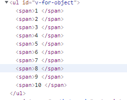

### 列表渲染

基于数组，渲染一组元素

指令：v-for

作用对象：Array | Object | number | string | Iterable (2.6 新增)

#### 1、作用在数组

遍历数组对象：创建对应数量的元素。可以携带参数index代表当前元素索引。

##### 示例1

```html
<ul id="example-1">
  <li v-for="item in items" :key="item.message">
    {{ item.message }}
  </li>
</ul>
```

```js
var example1 = new Vue({
  el: '#example-1',
  data: {
    items: [
      { message: 'Foo' },
      { message: 'Bar' }
    ]
  }
})
```

渲染结果

```html
<li>Foo</li>
<li>Bar</li>
```

##### 示例2

使用index参数获得索引值，v-for中可以访问父对象的属性`parentMessage`

```html
<ul id="example-2">
  <li v-for="(item, index) in items">
    {{ parentMessage }} - {{ index }} - {{ item.message }}
  </li>
</ul>
```

```js
var example2 = new Vue({
  el: '#example-2',
  data: {
    parentMessage: 'Parent',
    items: [
      { message: 'Foo' },
      { message: 'Bar' }
    ]
  }
})
```

渲染结果

```html
<li>Parent - 0 - Foo</li>
<li>Parent - 1 - Bar</li>
```


#### 2、作用在对象

遍历对象属性，创建对应数量的元素，可以携带参数index、property代表键名

##### 示例1

```html
<ul id="v-for-object" class="demo">
  <li v-for="value in object">
    {{ value }}
  </li>
</ul>
```

```js
new Vue({
  el: '#v-for-object',
  data: {
    object: {
      title: 'How to do lists in Vue',
      author: 'Jane Doe',
      publishedAt: '2016-04-10'
    }
  }
})
```

渲染结果

```html
<li>How to do lists in Vue</li>
<li>Jane Doe</li>
<li>2016-04-10</li>
```

##### 示例2

```html
<ul id="v-for-object">
    <div v-for="(value, name, index) in object">
        {{ index }}. {{ name }}: {{ value }}
    </div>
</ul>
```

```js
new Vue({
  el: '#v-for-object',
  data: {
    object: {
      title: 'How to do lists in Vue',
      author: 'Jane Doe',
      publishedAt: '2016-04-10'
    }
  }
})
```

渲染结果

```html
<li>0. title: How to do lists in Vue</li>
<li>1. author: Jane Doe</li>
<li>2. publishedAt: 2016-04-10</li>
```

#### 3、作用在数字

循环对应的次数，创建对应数量的元素

##### 示例1

```html
<ul id="v-for-object">
    <span v-for="n in 10">{{ n }} </span>
</ul>
```

```js
    new Vue({
        el: '#v-for-object',
        }
    })
```

渲染结果




#### 4、在模板上使用v-for

用于每次遍历批量生成多个元素

```html
<ul>
  <template v-for="item in items">
    <li>{{ item.msg }}</li>
    <li class="divider" role="presentation"></li>
  </template>
</ul>
```

#### 5、在组件上使用v-for

创建对应数量的组件，在v-for作用在组件上时key属性时必须的

```html
<my-component v-for="item in items" :key="item.id"></my-component>
```

示例

url：https://cn.vuejs.org/v2/guide/list.html#%E5%9C%A8%E7%BB%84%E4%BB%B6%E4%B8%8A%E4%BD%BF%E7%94%A8-v-for

#### 6、 数组更新检测

v-for指令和其作用的对象之间存在响应式关联，若数组发生了改变则会动态更新页面DOM

示例

```html
<ul id="example-1">
    <li v-for="item in items" :key="item.message">
        {{ item.message }}
    </li>
</ul>
```

```js
    var example1 = new Vue({
        el: '#example-1',
        data: {
            items: [
                { message: 'Foo' },
                { message: 'Bar' }
            ]
        }
    })
```

渲染结果

```html
<li>Foo</li>
<li>Bar</li>
```

控制台执行

```js
example1.items.push({message:"zlp”})
```

渲染结果

```html
<li>Foo</li>
<li>Bar</li>
<li>zlp</li>
```

变更数组的方法：这些方法会修改原数组

- `push()`
- `pop()`
- `shift()`
- `unshift()`
- `splice()`
- `sort()`
- `reverse()`

替换数组的方法：这些方法会返回一个新数组，不修改原数组

- filter()：传一个方法，将数组中的每个元素作用在这个方法上，若返回值为true则加入新数组
- concat()：拼接两个数组
- slice()：分隔数组

#### 7、状态维护

当 Vue 正在更新使用 `v-for` 渲染的元素列表时，它默认使用“就地更新”的策略。如果数据项的顺序被改变，Vue 将不会移动 DOM 元素来匹配数据项的顺序，而是就地更新每个元素，并且确保它们在每个索引位置正确渲染。

这个默认的模式是高效的，但是会不适应与一些场景，若不想使用就地更新则需要给元素添加key属性