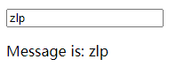
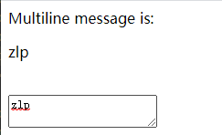
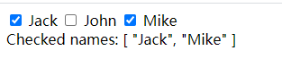
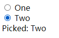
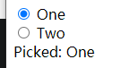
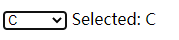
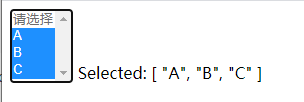

### 表单输入绑定

 `v-model` 指令在表单 `<input>`、`<textarea>` 及 `<select>` 元素上创建双向数据绑定。它会根据控件类型自动选取正确的方法来更新元素。

 `v-model` 本质上不过是语法糖。`它负责监听用户的输入事件以更新数据`，并对一些极端场景进行一些特殊处理。

#### 1、文本框双向绑定

动态示例：https://cn.vuejs.org/v2/guide/forms.html#%E6%96%87%E6%9C%AC

```html
<div id="app">
    <input v-model="message" placeholder="edit me">
    <p>Message is: {{ message }}</p>
</div>
```

```js
    var example1 = new Vue({
        el: '#app',
        data: {
            message:"zlp",
        }
    })
```

渲染结果



改变文本框输入会改变message，改变message会改变文本框输入，会忽略原来的value属性值

上述示例等价于

```html
监听事件，改变数据
<div id="app">
    <input v-bind:value="message" v-on:input="message=$event.target.value">
    <p>Message is: {{ message }}</p>
</div>
```


#### 2、多行文本框双向绑定

动态示例：https://cn.vuejs.org/v2/guide/forms.html#%E5%A4%9A%E8%A1%8C%E6%96%87%E6%9C%AC

```html
    <span>Multiline message is:</span>
    <p style="white-space: pre-line;">{{ message }}</p>
    <br>
    <textarea v-model="message" placeholder="add multiple lines"></textarea>
```

```js
    var example1 = new Vue({
        el: '#app',
        data: {
            message:"zlp",
        }
    })
```

渲染结果



#### 3、复选按钮双向绑定

动态示例：https://cn.vuejs.org/v2/guide/forms.html#%E5%A4%8D%E9%80%89%E6%A1%86

```html
    <input type="checkbox" id="jack" value="Jack" v-model="checkedNames">
    <label for="jack">Jack</label>
    <input type="checkbox" id="john" value="John" v-model="checkedNames">
    <label for="john">John</label>
    <input type="checkbox" id="mike" value="Mike" v-model="checkedNames">
    <label for="mike">Mike</label>
    <br>
    <span>Checked names: {{ checkedNames }}</span>
```

```js
    var example1 = new Vue({
        el: '#app',
        data: {
            checkedNames: [],
        }
    })
```

渲染结果



#### 4、单选按钮双向绑定

动态示例：https://cn.vuejs.org/v2/guide/forms.html#%E5%8D%95%E9%80%89%E6%8C%89%E9%92%AE

```html
  <input type="radio" id="one" value="One" v-model="picked">
  <label for="one">One</label>
  <br>
  <input type="radio" id="two" value="Two" v-model="picked">
  <label for="two">Two</label>
  <br>
  <span>Picked: {{ picked }}</span>
```

```js
    var example1 = new Vue({
        el: '#app',
        data: {
            picked: ''
        }
    })
```

渲染结果





#### 5、选择框双向绑定

动态示例：https://cn.vuejs.org/v2/guide/forms.html#%E9%80%89%E6%8B%A9%E6%A1%86

单选示例

```html
<div id="app">
    <select v-model="selected">
        <option disabled value="">请选择</option>
        <option>A</option>
        <option>B</option>
        <option>C</option>
    </select>
    <span>Selected: {{ selected }}</span>
</div>
```

```js
    var example1 = new Vue({
        el: '#app',
        data: {
            selected: ''
        }
    })
```

渲染结果



多选示例

```html
<div id="app">
    <select v-model="selected" multiple>
        <option disabled value="">请选择</option>
        <option>A</option>
        <option>B</option>
        <option>C</option>
    </select>
    <span>Selected: {{ selected }}</span>
</div>
```

```js
    var example1 = new Vue({
        el: '#app',
        data: {
            selected: []
        }
    })
```

渲染结果



#### 6、动态值绑定

使用变量作为单选、复选、选择元素的value属性值，使用v-bind实现

```html
复选按钮，若是布尔值可以直接使用true-value、false-value插入
<input
  type="checkbox"
  v-model="toggle"
  true-value="yes"
  false-value="no"
>

单选按钮
<input type="radio" v-model="pick" v-bind:value="a">

选择框，value值为对象时会输出对象键和对应的值
<select v-model="selected">
    <!-- 内联对象字面量 -->
  <option v-bind:value="{ number: 123 }">123</option>
</select>

```

#### 7、修饰符

- [`.lazy`](https://cn.vuejs.org/v2/guide/forms.html#lazy) - 取代 `input` 监听 `change` 事件

  > 在默认情况下，`v-model` 在每次 `input` 事件触发后将输入框的值与数据进行同步 (除了[上述](https://cn.vuejs.org/v2/guide/forms.html#vmodel-ime-tip)输入法组合文字时)。你可以添加 `lazy` 修饰符，从而转为在 `change` 事件_之后_进行同步：
  >
  > ```html
  > <!-- 在“change”时而非“input”时更新 -->
  > <input v-model.lazy="msg">
  > ```

- [`.number`](https://cn.vuejs.org/v2/guide/forms.html#number) - 输入字符串转为有效的数字

  ```html
  <input v-model.number="age" type="number">
  ```

- [`.trim`](https://cn.vuejs.org/v2/guide/forms.html#trim) - 输入首尾空格过滤

  ```html
  <input v-model.trim="msg">
  ```

  


