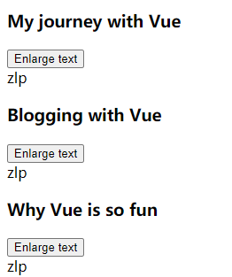

### 组件

组件是一个`Vue实例`，目的是为了复用，将实例注册为Vue组件后

我们可以在一个通过 `new Vue` 创建的 Vue 根实例中，把这个组件作为自定义元素来使用

#### 1、示例

```html
<div id="components-demo">
    <button-counter></button-counter>
</div>
```

```js
    Vue.component('button-counter', {
        data: function () {
            return {
                count: 0
            }
        },
        template: '<button v-on:click="count++">You clicked me {{ count }} times.</button>'
    });

    new Vue({ el: '#components-demo' });
```

渲染结果


> 因为组件是可复用的 Vue 实例，所以它们与 `new Vue` 接收相同的选项，例如 `data`、`computed`、`watch`、`methods` 以及生命周期钩子等。仅有的例外是像 `el` 这样根实例特有的选项。

> data的值必须是一个函数，目的是为了每个组件实例都有自己的数据对象独立拷贝

#### 2、组件的组织结构

从一个根节点开始，也要求组件内部只能有一个根节点

​	

#### 3、组件注册

##### 组件名格式

> - 短横线分隔命名：my-component-name
> - 驼峰命名：MyComponentName

##### 全局注册

> 方式：通过`Vue.component`函数注册组件。
>
> 要求：必须在根Vue示例创建之前注册才有效
>
> ```js
> Vue.component('component-a', { /* ... */ })
> Vue.component('component-b', { /* ... */ })
> Vue.component('component-c', { /* ... */ })
> 
> new Vue({ el: '#app' })
> ```
>
> ```html
> <div id="app">
>   <component-a></component-a>
>   <component-b></component-b>
>   <component-c></component-c>
> </div>
> ```
>
> 这样注册后所有组件可以在根模板的任意出使用，包括组件内使用其他组件
>
> 缺点：
>
> 使用一个像 webpack 这样的构建系统，全局注册所有的组件意味着即便你已经不再使用一个组件了，它仍然会被包含在你最终的构建结果中。这造成了用户下载的 JavaScript 的无谓的增加。

##### 局部注册

> 方式：
>
> 1、创建选项对象
>
> 2、在根示例的选项对象中的components属性中添加创建好的对象
>
> ```js
> var ComponentA = { /* ... */ }
> var ComponentB = { /* ... */ }
> var ComponentC = { /* ... */ }
> 
> new Vue({
>   el: '#app',
>   components: {
>       // 键就是组件名
>     'component-a': ComponentA,
>     'component-b': ComponentB
>   }
> })
> ```
>
> 注意：**局部注册的组件在其子组件中\*不可用\***
>
> 如果想要嵌套使用必须将可能嵌套的组件先定义在目标组件中，或者外部导入的方式
>
> ```js
> // 事先嵌套
> var ComponentA = { /* ... */ }
> 
> var ComponentB = {
>   components: {
>     'component-a': ComponentA
>   },
>   // ...
> }
> 
> // 外部导入
> import ComponentA from './ComponentA.vue'
> export default {
>   components: {
>     ComponentA
>   },
>   // ...
> }
> ```
>
> 

##### 模块系统

> - 模块系统中局部注册
>   https://cn.vuejs.org/v2/guide/components-registration.html#%E5%9C%A8%E6%A8%A1%E5%9D%97%E7%B3%BB%E7%BB%9F%E4%B8%AD%E5%B1%80%E9%83%A8%E6%B3%A8%E5%86%8C
>
> - 模块系统中自动化全局注册
>   https://cn.vuejs.org/v2/guide/components-registration.html#%E5%9F%BA%E7%A1%80%E7%BB%84%E4%BB%B6%E7%9A%84%E8%87%AA%E5%8A%A8%E5%8C%96%E5%85%A8%E5%B1%80%E6%B3%A8%E5%86%8C

#### 4、Prop

定义组件接受数据的接口，这些接口将被`作为组件标签的属性`使用

示例

```js
Vue.component('blog-post', {
    // 定义属性
  props: ['title'],
    // 使用属性
  template: '<h3>{{ title }}</h3>'
})
```

```html
<!--通过属性方式传入数据-->
<blog-post title="My journey with Vue"></blog-post>
<blog-post title="Blogging with Vue"></blog-post>
<blog-post title="Why Vue is so fun"></blog-post>
```

##### Prop类型

props属性可以接受一个数组，表示所有组件属性

```js
props: ['title', 'likes', 'isPublished', 'commentIds', 'author']
```

props属性可以接受一个对象，键表示属性名，值表示属性的类型，这种方式可以验证传入属性值的类型是否正确

##### Prop传递参数

传递静态参数：attribute="value"

传递动态参数：v-bind:attribute="表达式"

1. 传入数字

   ```html
   <blog-post v-bind:likes="42"></blog-post>
   
   <!-- 用一个变量进行动态赋值。-->
   <blog-post v-bind:likes="post.likes"></blog-post>
   ```

2. 传入布尔值

   ```html
   <!-- 即便 `false` 是静态的，我们仍然需要 `v-bind` 来告诉 Vue -->
   <!-- 这是一个 JavaScript 表达式而不是一个字符串。-->
   <blog-post v-bind:is-published="false"></blog-post>
   
   <!-- 用一个变量进行动态赋值。-->
   <blog-post v-bind:is-published="post.isPublished"></blog-post>
   ```

3. 传入数组

   ```html
   <!-- 即便数组是静态的，我们仍然需要 `v-bind` 来告诉 Vue -->
   <!-- 这是一个 JavaScript 表达式而不是一个字符串。-->
   <blog-post v-bind:comment-ids="[234, 266, 273]"></blog-post>
   
   <!-- 用一个变量进行动态赋值。-->
   <blog-post v-bind:comment-ids="post.commentIds"></blog-post>
   ```

4. 传入对象

   ```html
   <!-- 即便对象是静态的，我们仍然需要 `v-bind` 来告诉 Vue -->
   <!-- 这是一个 JavaScript 表达式而不是一个字符串。-->
   <blog-post
     v-bind:author="{
       name: 'Veronica',
       company: 'Veridian Dynamics'
     }"
   ></blog-post>
   
   <!-- 用一个变量进行动态赋值。-->
   <blog-post v-bind:author="post.author"></blog-post>
   ```

5. 传入所有属性

   ```js
   post: {
     id: 1,
     title: 'My Journey with Vue'
   }
   ```

   ```html
   <blog-post v-bind="post"></blog-post>
   ```

   等价于

   ```html
   <blog-post
     v-bind:id="post.id"
     v-bind:title="post.title"
   ></blog-post>
   ```

##### Prop验证

组件的 prop 指定验证要求，例如你知道的这些类型。如果有一个需求没有被满足，则 Vue 会在浏览器控制台中警告你。

验证的类型可以是内置类或者自定义类型，自定义类型必须使用构造器实例化

示例

设置props属性为对象实现验证

```js
Vue.component('my-component', {
  props: {
    // 基础的类型检查 (`null` 和 `undefined` 会通过任何类型验证)
    propA: Number,
    // 多个可能的类型
    propB: [String, Number],
    // 必填的字符串
    propC: {
      type: String,
      required: true
    },
    // 带有默认值的数字
    propD: {
      type: Number,
      default: 100
    },
    // 带有默认值的对象
    propE: {
      type: Object,
      // 对象或数组默认值必须从一个工厂函数获取
      default: function () {
        return { message: 'hello' }
      }
    },
    // 自定义验证函数
    propF: {
      validator: function (value) {
        // 这个值必须匹配下列字符串中的一个
        return ['success', 'warning', 'danger'].indexOf(value) !== -1
      }
    }
  }
})
```

##### 非Prop属性

一个非 prop 的 attribute 是指传向一个组件，但是该`组件并没有相应 prop 定义的 attribute。`

因为`显式定义的 prop `适用于向一个子组件传入信息，然而组件库的作者并不总能预见组件会被用于怎样的场景。

这也是为什么`组件可以接受任意的 attribute`，而这些 attribute 会被`添加到`这个组件的`根元素`上。

示例

```html
<div id="components-demo">
    <button-counter onname="zlp"></button-counter>
</div>
```

```js
    Vue.component('button-counter', {
        data: function () {
            return {
                count: 0
            }
        },
        template: '<input type="date" class="">'
    });
    new Vue({ el: '#components-demo' });
```

渲染结果


input元素上多出了一个onname属性

###### 同名属性的处理

若外部传入属性和组件根元素的属性相同属性会有两种处理方式

- 替换：对于非样式属性（class、style），从外部提供给组件的值会替换掉组件内部设置好的值

- 合并：对于样式属性（class、style），外部提供给组件的值会和内部组件的值合并在一起

###### 禁用属性继承

禁用属性继承使用，外部的属性就无法对组件内部产生影响

```js
Vue.component('my-component', {
    // 设置false不会影响class、style属性的继承
  inheritAttrs: false,
  // ...
})
```

inheritAttrs属性为false情况下在使用`$attrs`设置是否接受外部属性

$attrs属性包含了所有外部非props的属性

```js
    Vue.component('button-counter', {
        // v-bind="$attrs"接受外部所有属性
        template: '<input type="date" class="" v-bind="$attrs">'
    });
```

##### 单向数据流

约定规范：所有的 prop 都使得其父子 prop 之间形成了一个**单向下行绑定**：父级 prop 的更新会向下流动到子组件中，但是反过来则不行。这样会防止从子组件意外变更父级组件的状态，从而导致你的应用的数据流向难以理解。

（组件内部可以通过修改props中的属性从而改变外层对象属性，通过this.prop方式访问）

若想当作本地使用

- 本地创建一个data，将传入的prop作为初始值

  ```js
  props: ['initialCounter'],
  data: function () {
    return {
      counter: this.initialCounter
    }
  }
  ```

- 本地创建一个计算属性，依赖prop初始值

  ```js
  props: ['size'],
  computed: {
    normalizedSize: function () {
      return this.size.trim().toLowerCase()
    }
  }
  ```

#### 5、监听组件内部事件

##### 组件内部事件对外层没有依赖

使用v-on指令正常处理

```html
<div id="blog-posts-events-demo">
    <blog-post></blog-post>
</div>
```

```js
    Vue.component('blog-post', {
        props: ['post'],
        methods:{
            onClick:function(){
                document.getElementsByTagName("p")[0].innerHTML='zlp';
            }
        },
        template: `
      <div>
          <button v-on:click="this.onClick">
              Enlarge text
          </button>
          <p></p>
      </div>
  `
    })
```

```js
    var vm = new Vue({
        el: '#blog-posts-events-demo',
    })
```

渲染结果


事件触发后


##### 组件内部事件需要外层进行处理

1. 内部捕获事件并自定义别名抛出

   ```html
   使用v-on捕捉原生世事件
   使用$emit()定义事件别名抛出事件
   <button v-on:click="$emit('on-click')">Enlarge text</button>
   ```

2. 外层捕捉并处理

   ```html
   外层使用v-on通过事件别名捕捉事件，进行对应处理
   <div-com v-on:on-click="postFontSize+=0.1">
   ```

示例

外层元素控制组件内部字体样式，组件内部按钮触发点击事件要改变外部字体样式

```html
<div id="blog-posts-events-demo">
    <div :style="{ fontSize: postFontSize + 'em' }">
        <blog-post
                v-for="post in posts"
                v-bind:key="post.id"
                v-bind:post="post"
                v-on:on-click="postFontSize+=0.1"
        ></blog-post>
    </div>
</div>
```

```js
    Vue.component('blog-post', {
        props: ['post'],
        template: `
    <div class="blog-post">
      <h3>{{ post.title }}</h3>
      <button v-on:click="$emit('on-click')">
        Enlarge text
      </button>
      <div v-html="post.content"></div>
    </div>
  `
    })
```

```js
    var vm = new Vue({
        el: '#blog-posts-events-demo',
        data: {
            posts: [
                { id: 1, title: 'My journey with Vue', content:'zlp' },
                { id: 2, title: 'Blogging with Vue', content:'zlp' },
                { id: 3, title: 'Why Vue is so fun', content:'zlp' }
            ],
            postFontSize: 1,
        },
    })
```

渲染结果



事件触发后


`注意：抛出事件名最好使用短横线命名规范，或者sync修饰符命名规范`

##### $emit()抛出参数

方法定义：vm.$emit( eventName, […args\] )

第一个参数为自定义抛出的事件名，后续接受n个参数，这些外层捕获该事件后会将后续参数一并传递给处理函数

示例

```html
<button v-on:click="$emit('enlarge-text', 0.1)">
  Enlarge text
</button>
```

```js
<blog-post
  ...
  v-on:enlarge-text="onEnlargeText"
></blog-post>
```

```js
methods: {
  onEnlargeText: function (enlargeAmount) {
    this.postFontSize += enlargeAmount
  }
}
```

##### 组件上使用v-model

v-model语法糖本质

```html
<input v-model="searchText">
```

等价于：监听input事件，修改绑定的属性

```html
<input
  v-bind:value="searchText"
  v-on:input="searchText = $event"
/>
```

组件上使用时若组件内部的input触发事件，而要修改的属性在外部，这时候v-model不能直接使用，需要一点处理

示例

不使用v-model实现流程

1. 内部input触发input事件，抛出事件和value值
2. 外部捕获事件，并修改对应属性值
3. 动态绑定属性值的存在，属性修改将响应式展示到组件内部input

（内-外-内，由于单向数据流的约束，不应该直接从组件内部修改外部属性值）

```html
捕获组件抛出的事件，并修改对应属性
<custom-input
  v-bind:value="searchText"
  v-on:input="searchText = $event"
></custom-input>
```

```js
// 组件需要抛出事件和input标签value值
// 内部input标签value动态绑定属性值
Vue.component('custom-input', {
  props: ['value'],
  template: `
    <input
      v-bind:value="value"
      v-on:input="$emit('input', $event.target.value)"
    >
  `
})
```

使用v-model实现

```html
直接等价替换
<custom-input v-model="searchText"></custom-input>
```

```js
// 组件部分不需要改变
Vue.component('custom-input', {
  props: ['value'],
  template: `
    <input
      v-bind:value="value"
      v-on:input="$emit('input', $event.target.value)"
    >
  `
})
```

##### 修改v-model默认行为

 `v-model` 默认会利用名为 `value` 的 prop 和名为 `input` 的事件，但是像单选框、复选框等类型的输入控件可能会将 `value` attribute 用于[不同的目的](https://developer.mozilla.org/en-US/docs/Web/HTML/Element/input/checkbox#Value)。

model可以改变v-model默认行为

```js
Vue.component('base-checkbox', {
  model: {
      // prop修该v-model绑定的属性
      // 等价于v-bind:value，变成了
      // v-bind:checked
    prop: 'checked',
      // event修改v-model绑定的事件
      // 等价于v-on:input，变成了
      // v-on:change
    event: 'change'
  },
  props: {
    checked: Boolean
  },
  template: `
    <input
      type="checkbox"
      v-bind:checked="checked"
      v-on:change="$emit('change', $event.target.checked)"
    >
  `
})
```

```html
触发change事件时,修改lovingVue属性，lovingVue数据绑定在标签checked属性上
<base-checkbox v-model="lovingVue"></base-checkbox>
```

##### 将原生事件绑定到组件根标签

在组件标签上使用 `v-on` 的 `.native` 修饰符可以将事件绑定到组件内的根标签

示例

```html
<div id="blog-posts-events-demo">
    将click事件绑定到组件根标签，事件触发时调用onClick方法
    <blog-post v-on:click.native="onClick"></blog-post>
</div>
```

```js
    Vue.component('blog-post', {
        template: `
      <button id="btn1">zlp</button>
  `,
    })
    var vm = new Vue({
        el: '#blog-posts-events-demo',
        methods:{
            onClick:function () {
                alert("Vue");
            }
        }
    })
```

渲染结果


点击效果


##### .sync修饰符

语法糖，简化外层捕捉内部事件，更新数据原的写法

要求：内部抛出事件名必须update + :（冒号）+ 要更新的外部属性值

如：update:title

示例

原生写法

```html
<text-document
  v-bind:title="doc.title"
  v-on:update:title="doc.title = $event"
></text-document>
```

使用sync修饰符

```html
<text-document v-bind:title.sync="doc.title"></text-document>
<!--
v-bind:title.sync="doc.title"会被扩展为
v-bind:title="doc.title"
 v-on:update:title="内部抛出值->修该title属性"
-->
```

sync也可以作用在一个对象的引用上，它会为对象内的每个属性添加v-on:update:attr事件

```html
<text-document v-bind.sync="doc"></text-document>
```

sync不能直接作用于字面量对象

```js
// 这样是不行的
v-bind.sync="{ title: doc.title }"
```

##### $ listeners事件监听器

可以为元素添加批量事件

`$listeners` property，它是一个对象，该对象中可以绑定多个事件和处理方法

```js
{
    // 绑定聚焦事件
  focus: function (event) { /* ... */ }
    // 绑定输入事件
  input: function (value) { /* ... */ },
}
```

使用 `v-on="$listeners"` 将所有的事件监听器指向一个元素

示例

```html
<div id="dynamic-component-demo">
    <input type="text" v-on="inputListeners">
</div>
```

```js
    var vm = new Vue({
        el:'#dynamic-component-demo',
        computed: {
            inputListeners: function () {
                var vm = this
                // `Object.assign` 将所有的对象合并到{}对象中
                return Object.assign({},
                    // 我们从父级添加所有的监听器
                    this.$listeners,
                    // 然后我们添加自定义监听器，
                    // 或覆写一些监听器的行为
                    {
                        // 这里确保组件配合 `v-model` 的工作
                        input: function (event) {
                            alert("zlp")
                        }
                    }
                )
            }
        },
    })
```

渲染效果


触发事件


#### 6、动态组件

在一个标签上动态选择要渲染的组件，通过标签的is属性来实现

##### 示例1

静态绑定：is属性，静态绑定组件名

```html
<div id="blog-posts-events-demo">
    <component is="blog-post"></component>
</div>
```

```js
    Vue.component('blog-post', {
        template: `
      <button id="btn1">zlp</button>
  `,
    })
    var vm = new Vue({
        el: '#blog-posts-events-demo',
    })
```

渲染结果


##### 示例2

动态绑定v-bind+is，动态绑定一个变量

currentTabComponent属性保存要显示的组件名

按钮点击事件改变currentTabComponent属性的值

```html
    <button
            v-for="tab in tabs"
            v-bind:key="tab"
            v-bind:class="['tab-button', { active: currentTab === tab }]"
            v-on:click="currentTab = tab"
    >
        {{ tab }}
    </button>

    <component v-bind:is="currentTabComponent" class="tab"></component>
```

```js
    Vue.component("tab-home", {
        template: "<div>Home component</div>"
    });
    Vue.component("tab-posts", {
        template: "<div>Posts component</div>"
    });
    Vue.component("tab-archive", {
        template: "<div>Archive component</div>"
    });
```

```js
    new Vue({
        el: "#dynamic-component-demo",
        data: {
            currentTab: "Home",
            tabs: ["Home", "Posts", "Archive"]
        },
        computed: {
            currentTabComponent: function() {
                return "tab-" + this.currentTab.toLowerCase();
            }
        }
    });
```

渲染结果


点击按钮后


##### 示例 3

动态绑定+保存组件状态：使用keep-alive标签包裹动态组件

每次组件切换都会重新创建组件实例，老组件的状态不会被保存，若想保存这需要手动设置

```html
<keep-alive>
  <component v-bind:is="currentTabComponent"></component>
</keep-alive>
```

#### 7、异步组件

在大型应用中，我们可能需要将应用分割成小一些的代码块，并且只在需要的时候才从服务器加载一个模块。

为了简化，Vue 允许你以一个工厂函数的方式定义你的组件，这个工厂函数会异步解析你的组件定义。Vue 只有在这个组件需要被渲染的时候才会触发该工厂函数，且会把结果缓存起来供未来重渲染。

##### 示例 1

```js
Vue.component('async-example', function (resolve, reject) {
  setTimeout(function () {
    // 向 `resolve` 回调传递组件定义
    resolve({
      template: '<div>I am async!</div>'
    })
  }, 1000)
})
```

##### 示例 2

一个推荐的做法是将异步组件和 [webpack 的 code-splitting 功能](https://webpack.js.org/guides/code-splitting/)一起配合使用

```js
Vue.component('async-webpack-example', function (resolve) {
  // 这个特殊的 `require` 语法将会告诉 webpack
  // 自动将你的构建代码切割成多个包，这些包
  // 会通过 Ajax 请求加载
  require(['./my-async-component'], resolve)
})
```

##### 示例  3

你也可以在工厂函数中返回一个 `Promise`，所以把 webpack 2 和 ES2015 语法加在一起，我们可以这样使用动态导入：

```js
Vue.component(
  'async-webpack-example',
  // 这个动态导入会返回一个 `Promise` 对象。
  () => import('./my-async-component')
)
```

##### 示例 4

当使用[局部注册](https://cn.vuejs.org/v2/guide/components-registration.html#局部注册)的时候，你也可以直接提供一个返回 `Promise` 的函数：

```js
new Vue({
  // ...
  components: {
    'my-component': () => import('./my-async-component')
  }
})
```

#### 8、其他注意

有些 HTML 元素，诸如 `<ul>`、`<ol>`、`<table>` 和 `<select>`，对于哪些元素可以出现在其内部是有严格限制的。而有些元素，诸如 `<li>`、`<tr>` 和 `<option>`，只能出现在其它某些特定的元素内部。

下面示例将无法正确渲染

```html
<table>
  <blog-post-row></blog-post-row>
</table>
```

使用is代替

```html
<table>
  <tr is="blog-post-row"></tr>
</table>
```


