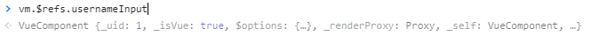
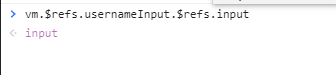

### 边界处理

#### 1、访问元素或组件

在绝大多数情况下，我们最好不要触达另一个组件实例内部或手动操作 DOM 元素。不过也确实在一些情况下做这些事情是合适的。

##### 访问根实例

在每个 `new Vue` 实例的子组件中，其根实例可以通过 `$root` property 进行访问。

```js
// Vue 根实例
new Vue({
  data: {
    foo: 1
  },
  computed: {
    bar: function () { /* ... */ }
  },
  methods: {
    baz: function () { /* ... */ }
  }
})
```

```js
// 所有的子组件都可以将这个实例作为一个全局 store 来访问或使用。

// 获取根组件的数据
this.$root.foo

// 写入根组件的数据
this.$root.foo = 2

// 访问根组件的计算属性
this.$root.bar

// 调用根组件的方法
this.$root.baz()
```

##### 访问父组件

和 `$root` 类似，`$parent` property 可以用来从一个子组件访问父组件的实例。它提供了一种机会，可以在后期随时触达父级组件，以替代将数据以 prop 的方式传入子组件的方式。

```js
// 访问父元素的map属性
this.$parent.map

// 访问父元素的父元素
this.$parent.$parent.map
```

缺点：很快它就会失控。这也是我们针对需要向任意更深层级的组件提供上下文信息时推荐[依赖注入](https://cn.vuejs.org/v2/guide/components-edge-cases.html#依赖注入)的原因。

##### 访问子组件

通过 `ref` 这个 attribute 为子组件或子元素赋予一个 ID 引用，可以`通过父级$refs属性+ID`访问到对应的子组件或子元素

```html
// 子组件设置引用id
<div id="dynamic-component-demo">
    <base-input ref="usernameInput"></base-input>
</div>
```

```js
    Vue.component("base-input",{
        // 子元素设置访问ID
        template:"<input type='text' ref='input'/>",
    })
    var vm = new Vue({
        el:'#dynamic-component-demo',
    })
```

访问子组件



访问子元素



> 当 `ref` 和 `v-for` 一起使用的时候，你得到的 ref 将会是一个包含了对应数据源的这些子组件的数组。

##### 依赖注入

使用 `$parent` property 无法很好的扩展到更深层级的嵌套组件上，这个可以由依赖注入机制解决，依赖注入用到了两个新的实例选项：`provide` 和 `inject`。

`provide`：用于父组件提供给后代组件的数据/方法

```js
provide：Object | () => Object
```

 `inject` ：用于子组件使用上层组件共享的数据

```js
inject：Array<string> | { [key: string]: string | Symbol | Object }

inject 选项应该是：
一个字符串数组，或
一个对象，对象的 key 是本地的绑定名，value 是：
在可用的注入内容中搜索用的 key (字符串或 Symbol)，或
一个对象，该对象的：
from property 是在可用的注入内容中搜索用的 key (字符串或 Symbol)
default property 是降级情况下使用的 value
```

示例

无论嵌套多少层子组件都可以获得上层组件共享出来的数据

```js
<div id="dynamic-component-demo">
    <component-a ></component-a>
</div>
```

```js
    var vm = new Vue({
        el:'#dynamic-component-demo',
        data:{
            name:'zlp',
            lname:'p',
            fname:'z',
        },
        // provide属性提供一个共享对象，对象中的属性可以被下层使用
        provide:function () {
            return {
                name : this.name,
            }
        },
        components:{
            'component-a': ComponentA,
        }
    })
```

```js
    var ComponentC = {template:'<div><div id="d3">d3：{{name}}</div></div>',
        // 获取上层共享数据，并使用
        inject:['name'],
    }

    var ComponentB = {template:'<div><div id="d2">d2：{{name}}</div><component-c></component-c></div>',
        components: {
            'component-c': ComponentC,
        },
        inject:['name'],
    }

    var ComponentA = {template:'<div><div id="d1">d1：{{name}}</div><component-b></component-b></div>',
        components:{
            'component-b': ComponentB,
        },
        inject:['name'],
    }

```

更多示例：https://cn.vuejs.org/v2/api/#provide-inject

> - 祖先组件不需要知道哪些后代组件使用它提供的 property
> - 后代组件不需要知道被注入的 property 来自哪里
>
> 依赖注入还是有负面影响的。它将你应用程序中的组件与它们当前的组织方式耦合起来，使重构变得更加困难。同时所提供的 property 是非响应式的。
>
> 如果你想要共享的这个 property 是你的应用特有的，而不是通用化的，或者如果你想在祖先组件中更新所提供的数据，那么这意味着你可能需要换用一个像 [Vuex](https://github.com/vuejs/vuex) 这样真正的状态管理方案了。

#### 2、程序化事件监听器

- 通过 `$on(eventName, eventHandler)` 侦听一个事件
- 通过 `$once(eventName, eventHandler)` 一次性侦听一个事件
- 通过 `$off(eventName, eventHandler)` 停止侦听一个事件

示例

没有使用接口的场景

```js
// 一次性将这个日期选择器附加到一个输入框上
// 它会被挂载到 DOM 上。
mounted: function () {
  // Pikaday 是一个第三方日期选择器的库
  this.picker = new Pikaday({
    field: this.$refs.input,
    format: 'YYYY-MM-DD'
  })
},
// 在组件被销毁之前，
// 也销毁这个日期选择器。
beforeDestroy: function () {
  this.picker.destroy()
}
```

这里有两个潜在的问题：

- 它需要在这个组件实例中保存这个 `picker`，如果可以的话最好只有生命周期钩子可以访问到它。这并不算严重的问题，但是它可以被视为杂物。
- 我们的建立代码独立于我们的清理代码，这使得我们比较难于程序化地清理我们建立的所有东西。

通过一个程序化的侦听器解决这两个问题：

```js
mounted: function () {
  var picker = new Pikaday({
    field: this.$refs.input,
    format: 'YYYY-MM-DD'
  })

  this.$once('hook:beforeDestroy', function () {
    picker.destroy()
  })
}
```

甚至可以让多个输入框元素同时使用不同的 Pikaday，每个新的实例都程序化地在后期清理它自己：

```js
mounted: function () {
  this.attachDatepicker('startDateInput')
  this.attachDatepicker('endDateInput')
},
methods: {
    // 创建对象
  attachDatepicker: function (refName) {
    var picker = new Pikaday({
      field: this.$refs[refName],
      format: 'YYYY-MM-DD'
    })
    
    // 给对象hook销毁事件
    this.$once('hook:beforeDestroy', function () {
      picker.destroy()
    })
  }
}
```


#### 3、循环引用

##### 递归组件

组件是可以在它们自己的模板中调用自身的。不过它们只能通过 `name` 选项来做这件事

当你使用 `Vue.component` 全局注册一个组件时，这个全局的 ID 会自动设置为该组件的 `name` 选项。

```js
name: 'stack-overflow',
template: '<div><stack-overflow></stack-overflow></div>'

```

类似上述的组件将会导致“max stack size exceeded”错误，所以请确保递归调用是条件性的 (例如使用一个最终会得到 false 的 v-if)。


##### 组件之间循环引用

A组件内部引用B组件，B组件内部引用A组件。

场景：

A组件：为文件夹组件

B组件：为文件夹下内容，内容包括文件和文件夹

A会调用B渲染内部内容，B也会调用A渲染内部文件夹类内容，类似操作系统的资源管理器

示例：

```html
// A组件
<tree-folder>
<p>
  <span>{{ folder.name }}</span>
    // 文件夹使用B组件渲染内部项，调用B
  <tree-folder-contents :children="folder.children"/>
</p>
</tree-folder>
```

```html
//  B组件
<tree-folder-contents>
<ul>
  <li v-for="child in children">
      // 若内部项为文件夹则使用A组件渲染，调用A
    <tree-folder v-if="child.children" :folder="child"/>
    <span v-else>{{ child.name }}</span>
  </li>
</ul>
</tree-folder-contents>
```

这种场景在全局注册下可以正常编译

如果你使用一个*模块系统*依赖/导入组件，例如通过 webpack 或 Browserify，你会遇到一个错误：

```
Failed to mount component: template or render function not defined.
```

解决方法

1、把 `<tree-folder>` 组件先注册，等到生命周期钩子 `beforeCreate` 时去注册`<tree-folder-contents>` 组件

```js
beforeCreate: function () {
  this.$options.components.TreeFolderContents = require('./tree-folder-contents.vue').default
}
```

2、在本地注册组件的时候，你可以使用 webpack 的异步 `import`：

```js
components: {
  TreeFolderContents: () => import('./tree-folder-contents.vue')
}
```

#### 4、模板定义的替代品

```js
    Vue.component('component-a',{
        template:'<div></div>'
    })
```

`在组件template属性中写html代码总是那么不舒适，有两个方法可以不在组件内部定义模板`

1. 内联模板：使用 `inline-template` 这个特殊的 attribute 作用在模板标签上，`该标签内部的html会作为模板内容`

   ```html
   <my-component inline-template>
     <div>
       <p>These are compiled as the component's own template.</p>
       <p>Not parent's transclusion content.</p>
     </div>
   </my-component>
   ```

   > 不过，`inline-template` 会让模板的作用域变得更加难以理解。所以作为最佳实践，请在组件内优先选择 `template` 选项或 `.vue` 文件里的一个 `<template>` 元素来定义模板。

2. X-Template：另一个定义模板的方式是在一个 `<script>` 元素中，并为其带上 `text/x-template` 的类型，然后通过一个 id 将模板引用过去

   ```html
   // 在script内编写模板
   <script type="text/x-template" id="hello-world-template">
     <p>Hello hello hello</p>
   </script>
   ```

   ```js
   Vue.component('hello-world', {
       // 使用id表示引用模板
     template: '#hello-world-template'
   })
   ```

   > 这些可以用于模板特别大的 demo 或极小型的应用，但是其它情况下请避免使用，因为这会将模板和该组件的其它定义分离开。

#### 5、控制更新

感谢 Vue 的响应式系统，它始终知道何时进行更新 (如果你用对了的话)。不过还是有一些边界情况，你想要强制更新，尽管表面上看响应式的数据没有发生改变。也有一些情况是你想阻止不必要的更新。

##### 强制更新

> 如果你发现你自己需要在 Vue 中做一次强制更新，99.9% 的情况，是你在某个地方做错了事。
>
> 然而，如果你已经做到了上述的事项仍然发现在极少数的情况下需要手动强制更新，那么你可以通过 [`$forceUpdate`](https://cn.vuejs.org/v2/api/#vm-forceUpdate) 来做这件事。

##### 阻止不必要的更新

你可能有一个组件，这个组件包含了**大量**静态内容。在这种情况下，你可以在根元素上添加 `v-once` attribute 以确保这些内容只计算一次然后缓存起来

```js
Vue.component('terms-of-service', {
  template: `
    <div v-once>
      <h1>Terms of Service</h1>
      ... a lot of static content ...
    </div>
  `
})
```

> 再说一次，试着不要过度使用这个模式。当你需要渲染大量静态内容时，极少数的情况下它会给你带来便利，除非你非常留意渲染变慢了，不然它完全是没有必要的——再加上它在后期会带来很多困惑。例如，设想另一个开发者并不熟悉 `v-once` 或漏看了它在模板中，他们可能会花很多个小时去找出模板为什么无法正确更新。