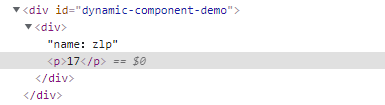

### 插槽

插槽是一种内容分发机制，它在页面的特定位置留白，等待内容插入，就像字符串中的占位符，插入内容可以是一个html元素或者vue组件

使用：slot标签进行留白

#### 插槽的示例

不使用插槽的情况

```html
<div id="dynamic-component-demo">
    <component-a >
        <p>zlp</p>
    </component-a>
</div>
```

```js
    Vue.component('component-a',{
        template:'<div>' +
            '</div>',
    })
```

```js
    var vm = new Vue({
        el:'#dynamic-component-demo',
    })
```

渲染结果


component-a标签中的内容会被直接丢弃

使用插槽后

```js
    Vue.component('component-a',{
        // <slot>将被替换
        template:'<div><slot></slot>' +
            '</div>',
    })
```

渲染结果


component-a标签中的内容被放置在`插槽标签（slot）留白处`

> 当 `inline-template` 这个特殊的 attribute 出现在一个子组件上时，这个组件将会使用其里面的内容作为模板，而不是将其作为被分发的内容。这会和插槽语义有冲突。
>
> 这也是为什么`inline-template` 不建议使用的原因


#### 插槽的作用域

`插入内容作用域为当前实例，不是插入后的实例`

示例

```html
<div id="dynamic-component-demo">
    <component-a v-bind:user="user">
        // 根实例作用域
        <p> age：{{user.age}}</p>
    </component-a>
</div>
```

```js
    Vue.component('component-a',{
        props:['user'],
        template:'<div>name：{{user.name}}<slot></slot>' +
            '</div>',
    })
```

```js
    var vm = new Vue({
        el:'#dynamic-component-demo',
        data:{
            user:{
                name:'zlp',
                age:19,
                birth:'11-16',
            },
        }
    })
```

渲染结果


插入内容不能访问组件内部的作用域

```html
<div id="dynamic-component-demo">
    <component-a>
        <p> age：{{user.age}}</p>
    </component-a>
</div>
```

```js
    Vue.component('component-a',{
        data:function () {
            return {
                user:{
                    name:'zlp',
                    age:19,
                    birth:'11-16',
                }
            }
        },
        template:'<div>name：{{user.name}}<slot></slot>' +
            '</div>',
    })
```

```js
    var vm = new Vue({
        el:'#dynamic-component-demo',

    })
```

渲染结果

```
Property or method "user" is not defined
```


#### 后备内容（形参默认值）

插槽不仅仅可以留白，还可以定义默认值，若没有内容被分发则使用默认值填充，若有分发内容则使用分发内容

示例

```html
<div id="dynamic-component-demo">
    <component-a>
    </component-a>
</div>
```

```js
    Vue.component('component-a',{

        template:'<div><slot>zlp123</slot>' +
            '</div>',
    })

    var vm = new Vue({
        el:'#dynamic-component-demo',
    })
```

渲染结果


存在分发内容

```html
<div id="dynamic-component-demo">
    <component-a>
        <p>zlp</p>
    </component-a>
</div>
```

渲染结果


#### 具名插槽（关键字形参）

给插槽命名，分发内容时指定要分发到哪个插槽

使用slot的name属性给插槽命名

使用v-slot给分发内容指定插槽，v-slof只能作用在模板标签或组件标签上

##### 示例 1

不进行插槽命名

```html
<div id="dynamic-component-demo">
    <component-a>
        <p>zlp</p>
        <p>16</p>
    </component-a>
</div>
```

```js
    Vue.component('component-a',{
        // 定义了两个插槽
        template:'<div><slot></slot>' +
            '<slot></slot></div>',
    })

    var vm = new Vue({
        el:'#dynamic-component-demo',
    })
```

渲染结果


并不是每一个插槽分配一个p标签，而是每个插槽都渲染了全部的分发内容

##### 示例2

插槽命名情况下

```html
<div id="dynamic-component-demo">
    <component-a>
        <template v-slot:s1>
            <p>zlp</p>
            <p>16</p>
        </template>
    </component-a>
</div>
```

```js
    Vue.component('component-a',{
        template:'<div><slot name="s1">zlp123</slot>' +
            '<slot name="s2">zlp1234</slot></div>',
    })

    var vm = new Vue({
        el:'#dynamic-component-demo',
    })
```

渲染结果


分发内容只被渲染到指定的插槽中

##### 示例 3

一个不带 `name` 的 `<slot>` 插槽会带有隐含的名字“default”。

任何没有被包裹在带有 `v-slot` 的 `<template>` 中的内容都会被视为默认插槽的内容。

```html
<div id="dynamic-component-demo">
    <component-a>
        <component-b v-slot:default></component-b>
    </component-a>
</div>
```

```js
    Vue.component('component-a',{
        template:'<div><slot>zlp123</slot>' +
            '<slot>zlp1234</slot></div>',
    })

    Vue.component("component-b", {
        template:"<div>component-b</div>"
    })
    var vm = new Vue({
        el:'#dynamic-component-demo',
    })
```

渲染结果


定义的插槽都没有指定name属性，分发内容显示指定分发到default插槽，两个插槽都获得内容。

```html
<div id="dynamic-component-demo">
    <component-a>
        <component-b></component-b>
    </component-a>
</div>
```

渲染结果


分发内容没有指定分发的插槽，但默认分发到default插槽


#### 作用域插槽

有时候需要使得分发内容访问插槽所在组件的作用域数据

使用方法：

1. slot标签使用v-bind绑定属性，抛出数据
2. v-slot定义接收域，所有slot抛出的数据都可以在这个域中访问

示例

```html
<div id="dynamic-component-demo">
    <component-a>
        // 定义接收域名称为aScope
        <template v-slot:default="aScope">
            // 从接收域中访问插槽抛出数据
            <p>{{aScope.user.age}}</p>
        </template>
    </component-a>
</div>
```

```js
    Vue.component('component-a',{
        data:function () {
            return {
                user:{
                    name:'zlp',
                    age:19,
                    birth:'11-16',
                }
            }
        },
        // 抛出user对象
        template:'<div>name：{{user.name}}<slot v-bind:user="user"></slot>' +
            '</div>',
    })

    var vm = new Vue({
        el:'#dynamic-component-demo',

    })
```

渲染结果


> 被提供的内容*只有*默认插槽时，可以使用缩写
>
> ```html
> <current-user v-slot:default="slotProps">
> 等价于
> <current-user v-slot="slotProps">
> ```
>
> 默认插槽的缩写语法**不能**和具名插槽混用，因为它会导致作用域不明确：
>
> ```html
> <!-- 无效，会导致警告 -->
> <current-user v-slot="slotProps">
>   {{ slotProps.user.firstName }}
>   <template v-slot:other="otherSlotProps">
>     slotProps is NOT available here
>   </template>
> </current-user>
> ```

##### 解构插槽数据

作用域插槽的内部工作原理是将你的插槽内容包裹在一个拥有单个参数的函数里：

```js
function (aScope) {
  return aScope={user};
}
// 访问user中的内容就需要aScope.user.age

// 使用 ES2015 解构来传入具体的插槽 prop,传入{ obj }形式为参数
<current-user v-slot="{ user }">
function (aScope) {
  return {aScope}={user};
}
// 访问形式变成了，user.age，减少一层索引
```

示例

```html
<div id="dynamic-component-demo">
    <component-a>
        <template v-slot:default="{user}">
            <p>{{user.age}}</p>
        </template>
    </component-a>
</div>
```

```js
    Vue.component('component-a',{
        data:function () {
            return {
                user:{
                    name:'zlp',
                    age:19,
                    birth:'11-16',
                }
            }
        },
        template:'<div>name：{{user.name}}<slot v-bind:user="user"></slot>' +
            '</div>',
    })

    var vm = new Vue({
        el:'#dynamic-component-demo',

    })
```

渲染结果


使用这种`解构形式还可以自定义参数`，若插槽没有传递数据则使用默认数据

```html
<div id="dynamic-component-demo">
    <component-a>
        <template v-slot:default="{user={age:17}}">
            <p>{{user.age}}</p>
        </template>
    </component-a>
</div>
```

```js
    Vue.component('component-a',{
        data:function () {
            return {
                user:{
                    name:'zlp',
                    age:19,
                    birth:'11-16',
                }
            }
        },
        template:'<div>name：{{user.name}}<slot ></slot>' +
            '</div>',
    })

    var vm = new Vue({
        el:'#dynamic-component-demo',

    })
```

渲染结果




#### 动态插槽名

[动态指令参数](https://cn.vuejs.org/v2/guide/syntax.html#动态参数)也可以用在 `v-slot` 上，来定义动态的插槽名，动态指定内容分配

```html
<base-layout>
  <template v-slot:[dynamicSlotName]>
    ...
  </template>
</base-layout>
```


#### 具名插槽缩写

跟 `v-on` 和 `v-bind` 一样，`v-slot` 也有缩写

参数之前的所有内容 (`v-slot:`) 替换为字符 `#`。例如 `v-slot:header` 可以被重写为 `#header`：

不带作用域

```html
<base-layout>
  <template #header>
    <h1>Here might be a page title</h1>
  </template>

  <p>A paragraph for the main content.</p>
  <p>And another one.</p>

  <template #footer>
    <p>Here's some contact info</p>
  </template>
</base-layout>
```

带作用域

```html
<current-user #default="{ user }">
  {{ user.firstName }}
</current-user>
```

