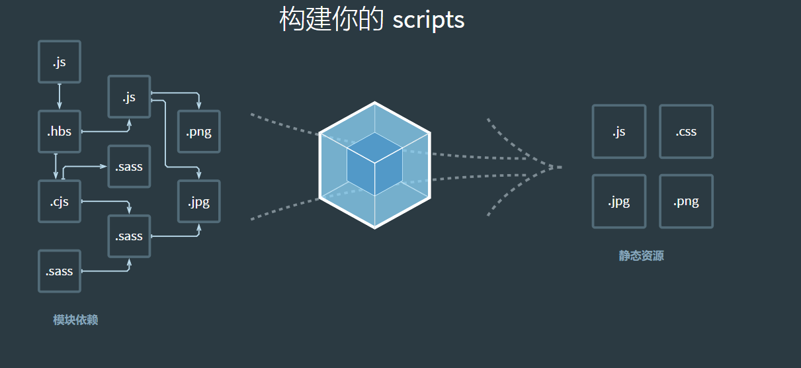

### 介绍

#### 1、Html

描述页面结构

#### 2、CSS

描述页面样式

#### 3、Javascript

描述页面行为

#### 4、CSS预处理

**原生CSS的缺点：**

- 语法不够强大，比如无法嵌套书写，导致模块化开发中需要书写很多重复的选择器；
- 没有变量和合理的样式复用机制，使得逻辑上相关的属性值必须以字面量的形式重复输出，导致难以维护。

**预处理的目的：**使CSS开发更加具有编程性，将传统的CSS文本视为一种输出，使用程序化的方式更加灵活的输出CSS文本。如：当一个条件满足时才输出这个样式。

**常用的预处理器：**

1. SASS：基于Ruby，通过服务端处理，功能强大解析效率高。需要有Ruby知识上手难度高，在服务端解析
2. LESS：基于Node.js，通过客户端处理，使用简单，功能比SASS简单，可以运行在服务器端或浏览器端

**预处理器作用：**执行程序，输出对应的CSS文件

#### 5、Node.js

使用JavaScript编写的后端框架，使得JavaScript可以做到PHP、Python等语言实现的后端功能

Node.js出现是JavaScript语言的主要转折点，使得JavaScript可以在浏览器之外的环境下运行，使得模块化开发得到壮大的温床，逐渐趋于大流。

NPM：Node.js框架开发后台应用程序的项目管理工具，类似于Maven，便捷的安装各种依赖

YARN：NPM的替代方案，类似于Maven与Gradle。

Deno：NodeJS作者开发的全新框架，旨在替代笨重的NodeJS

#### 6、JavaScript框架

- jQuery：早年最流行的javascript框架，优点时简化了DOM操作，缺点时DOM操作太频繁影响前端性能
- Angular：Google开发的一个javascript框架，由java程序员开发，将后端MVC理念使用到前端设计中，并增加了`模块开发`的理念，与微软合作采用TypeScript语法开发。特点是体量较大
- React：Facebook提出的JavaScript框架，是一款高性能框架，提出了虚拟DOM的概念，减少真实DOM操作，增加了前端渲染效率，缺点是使用复杂，需要学习JSX语法
- Vue：一款渐进式JavaScript框架，渐进式表示逐渐更新，它结合了Angular的模块开发和React的虚拟DOM的特点，并且体量较小
- Axios：前端通信框架，用于进行网络通信，和AJAX功能相同，但效率更高

#### 7、UI框架

- Ant-Design：阿里巴巴出品，基于React的UI框架
- ElementUI（主用PC）：饿了么出品基于Vue的UI框架
- iview（主用移动端）：基于Vue，使用单文件的Vue组件化开发基于npm+webpack+babel开发
- ice：阿里巴巴开发，组件以React为主
- Bootstrap：Twitter推出的前端框架
- AmazeUI：是一款Html5跨屏前端UI

#### 8、JavaScript构建工具

- Babel：JS编译工具主要用于浏览器不支持的新特性，比如用于编译TypeScript
- WebPack：静态模块打包工具
  

#### 9、混合开发Hybrid

目的：编写一套代码运行在PC、Android、IOS

Flutter：谷歌开发的移动端UI框架

打包方式：

- 云打包：HBuild、HbuildX、DCloud出品API Could
- 本地打包：Cordova

