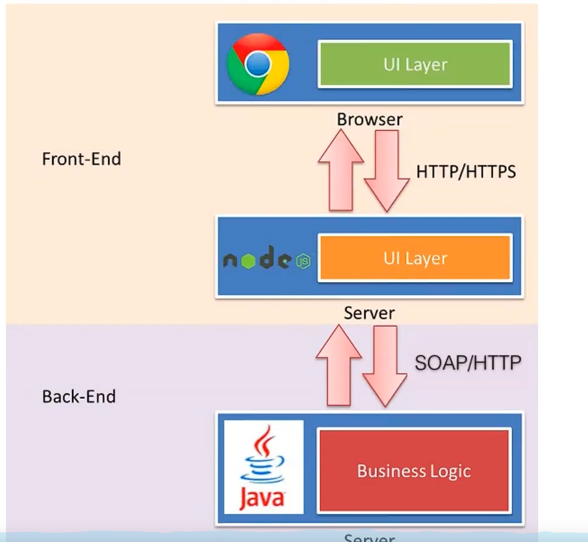

### 发展史

#### 1、后端为主的MVC时代（Web 1.0）

后端包揽数据库操作、业务逻辑操作、路由分发、视图编辑

缺点：

- 前端重度依赖开发环境，开发效率低下：由于JSP、Thtmeleaf等视图面板的存在，一个页面的开发往往需要几个步骤
  - 前端开发样式demo，后端嵌套模板语言，不断沟通调试
- 前后端职责纠缠不清

#### 2、前后端初次分离（Web 2.0）

转折点：AJAX被正式提出，并使用CDN节点作为静态资源存储，进入SPA（单页面应用时代）

优点：前后端分工清晰，AJAX成为前后端协作的关键。

缺点：

- 前后端需要约定接口，前端通过接口调用后端数据。后端接口不够稳定就会导致前端页面不断更改
- 前端开发复杂度大：SPA主要以交互型为主，JavaScript代码经常超过10w行

#### 3、大前端时代（Web 3.0）

为了简化前端开发的难度出现各种前端框架，在引入工程理念做分层设计

优点：

- 前后端职责分明：前端在浏览器工作、后端在服务端工作。前端可以在本地测试数据模拟，后端可以专注业务逻辑，输出RestFul接口
- 前端开发复杂度可控：合理分层让代码各司其职
- 部署相对独立：可以快速改进产品体验

缺点：

#### 4、NodeJS带来的新全栈时代（Web 4.0）

Node.js使得JavaScript可以在服务端运行，使得一种全新的开发模式的出现

全栈从后端迁移到了前端

特点：前端将自主把控路由设计，无论单页面还是多页面应用前端都可以只有调控，后端终于可以摆脱对展现的强度关注，专注于业务逻辑的开发。

