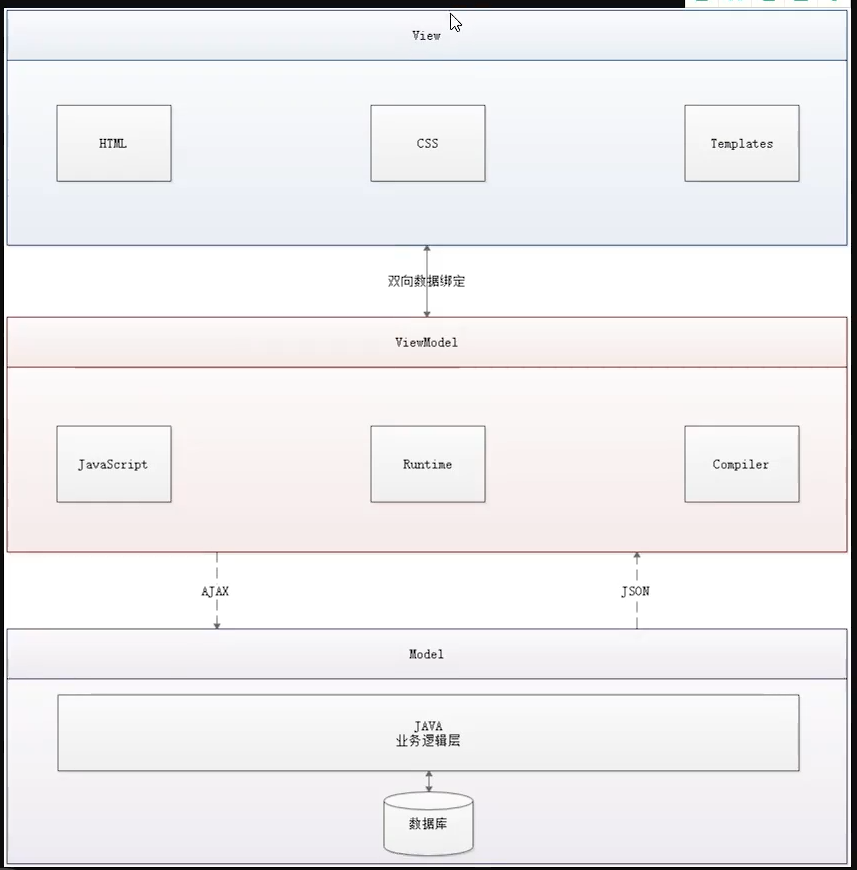
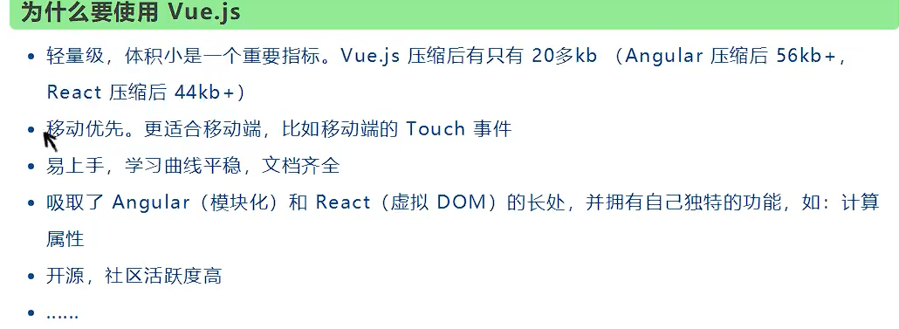
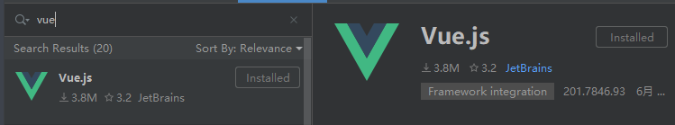
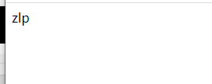
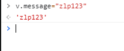
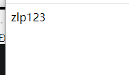

### Vue初探

#### 1、MVVM架构

MVVM：Model-View-VeiwModel



MVVM优点

- 低耦合：视图可以独立于模型修改，一个ViewModel可以绑定到不同的View
- 可复用：将视图逻辑放置在ViewModel中可以应用到不同的View
- 独立开发：开发人员专注于业务逻辑开发，设计人员专注于页面设计
- 可测试：数据不依赖与后端，可以自行模拟

#### 2、Vue简介

是一个用于构建用户界面的渐进式框架，发布于2014年2月，Vue被设计层自底向上，`Vue核心库最关心视图层面，只做与DOM效果的工作`。它可以与其他第三方库整合（vue-route，vue-resource，vuex）

Vue.js采用MVVM架构，在中MVVM对应如下

- Model：模型层对应JavaScript对象
- View：视图层对应DOM
- ViewModel：连接视图和数据的中间件

在MVVM中Model与View不允许直接通信，只能通过ViewModel来通信，ViewModel实现了与视图层的双向数据绑定，实现响应式效果。

ViewModel：采用观察者设计模式，定义了一个Observer

- ViewModel能够观察数据的变化，并对视图内容进行更新
- ViewModel能够监听视图的变化，并通知数据发生改变

Vue.js就是ViewModel层的实现者，它的核心就是实现了DOM监听与数据捆绑

Vue的优点



#### 3、Vue程序示例

1. 使用IDEA开发Vue，安装vue插件
   

2. 在html中引入vue.js
   cdn方式引入：

   ```html
   <script src="https://cdn.jsdelivr.net/npm/vue@2.6.14/dist/vue.js"></script>
   ```

   本地js方式引入：
   下载vue：https://github.com/vuejs/vue/releases

   ```html
   <script src="xxx/vue.js"></script>
   ```

   

3. demo

   ```html
   <!DOCTYPE html>
   <html lang="en">
   <head>
       <meta charset="UTF-8">
       <title>Vue-demo</title>
   </head>
   <!-- 视图 Templates层 -->
   <div id="main">
       {{message}}
   </div>
   <body>
   <script src="https://cdn.jsdelivr.net/npm/vue@2.6.14/dist/vue.js"></script>
   <script type="text/javascript">
       // Vue对象就是ViewModel层
       let v = new Vue({
           el:"#main",
           data:{
               // model层
               message:"zlp",
           }
       })
   </script>
   
   </body>
   </html>
   ```

4. ViewModel双向绑定测试







结果：模型层改变直接显示到视图层（响应式）