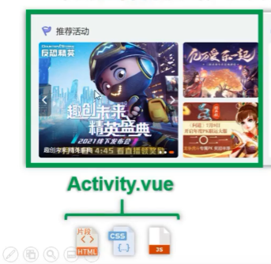

### 基本语法

#### 1、响应式渲染

- 内容渲染：{{name}}

  ```html
  <div id="app">
    {{ message }}
  </div>
  
  ```

  ```js
  var app = new Vue({
    el: '#app',
    data: {
      message: 'Hello Vue!'
    }
  })
  ```

- 属性渲染：v-bind : attribute

  ```html
  <div id="app-2">
    <span v-bind:title="message">
      鼠标悬停几秒钟查看此处动态绑定的提示信息！
    </span>
  </div>
  ```

  ```js
  var app2 = new Vue({
    el: '#app-2',
    data: {
      message: '页面加载于 ' + new Date().toLocaleString()
    }
  })
  ```

#### 2、条件与循环

条件：响应式决定是否展现元素（响应式DOM），执行的分支才会被展示

- **v-if**
- **v-else-if**
- **v-else**

```html
<!-- 视图 Templates层 -->
<div id="main" v-if="vis">
    {{message}}
</div>
```

```js
<script type="text/javascript">
    // Vue对象就是ViewModel层
    let v = new Vue({
        el:"#main",
        data:{
            // model层
            message:"zlp",
            vis:true,
        }
    })
```


循环：

- **v-for**

```html
<div id="app-4">
  <ol>
    <li v-for="todo in todos">
      {{ todo.text }}
    </li>
  </ol>
</div>
```

```js
var app4 = new Vue({
  el: '#app-4',
  data: {
    todos: [
      { text: '学习 JavaScript' },
      { text: '学习 Vue' },
      { text: '整个牛项目' }
    ]
  }
})
```

在控制台里，输入 `app4.todos.push({ text: '新项目' })`，你会发现列表最后添加了一个新项目。

#### 3、绑定事件

```html
<div id="app-5">
  <p>{{ message }}</p>
  <button v-on:click="reverseMessage">反转消息</button>
</div>
```

```js
var app5 = new Vue({
  el: '#app-5',
  data: {
    message: 'Hello Vue.js!'
  },
  methods: {
    reverseMessage: function () {
      this.message = this.message.split('').reverse().join('')
    }
  }
})
```

#### 4、将表单绑定到数据

```html
<div id="app-6">
  <p>{{ message }}</p>
    <!-- 表单输入被绑定到message，输入的改变将响应式的体现在P标签中 -->
  <input v-model="message">
</div>
```

```js
var app6 = new Vue({
  el: '#app-6',
  data: {
    message: 'Hello Vue!'
  }
})
```

#### 5、组件化

组件化的目的就是为了复用

- 简单的组件化可以是一个DOM元素的组件化

  ```html
  <div id="app-7">
      <ol>
          <!-- 创建一个 todo-item 组件的实例 -->
          <todo-item></todo-item>
      </ol>
  </div>
  ```

  ```js
  // 定义名为 todo-item 的新组件
  Vue.component('todo-item', {
      template: '<li>这是个待办项</li>'
  })
  
  var app = new Vue({
      el:"#app-7",
  })
  ```

- 复杂的组件化可以是一个功能完整的模块抽象（抽象成.vue文件）

