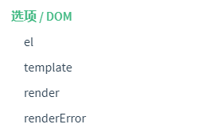
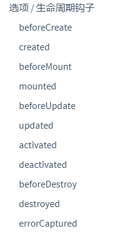
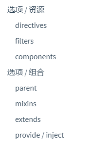
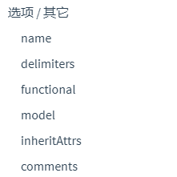

### Vue实例

#### 1、创建Vue实例

Vue构造器接受一个选项对象创建Vue实例

```js
var vm = new Vue({})
```

所有的可选属性：









#### 2、数据

Vue创建时data对象中的所有属性都将被Vue绑定为响应式

> 注意:Vue创建后添加到data中的属性不具备响应式
>
> 一般会将需要被响应式的属性提前添加到Vue中并赋空值
>
> ```js
> data: {
>   newTodoText: '',
>   visitCount: 0,
>   hideCompletedTodos: false,
>   todos: [],
>   error: null
> }
> ```

被Object.freeze()方法修改为只读的对象也无法被响应式

```js
var obj = {
  foo: 'bar'
}

Object.freeze(obj)

new Vue({
  el: '#app',
  data: obj
})
```

#### 3、方法

在Vue中以`$`符号开头的是内置的API接口

```js
var data = { a: 1 }
var vm = new Vue({
  el: '#example',
  data: data
})

vm.$data === data // => true
vm.$el === document.getElementById('example') // => true

// $watch 是一个实例方法
vm.$watch('a', function (newValue, oldValue) {
  // 这个回调将在 `vm.a` 改变后调用
})
```

#### 4、生命周期钩子方法

在Vue对象的整个生命周期中存在多个钩子函数，他们位于生命周期的不同位置，可以实现这些方法被Vue在特点阶段自动调用

```js
new Vue({
  data: {
    a: 1
  },
    //created方法将在Vue对象初始化完成后被调用
  created: function () {
    // `this` 指向 vm 实例
    console.log('a is: ' + this.a)
  }
})
```

生命周期图

