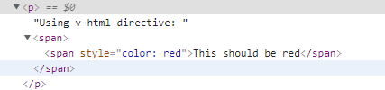
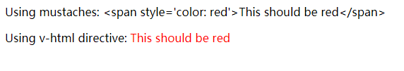

### 模板语法

#### 1、介绍

Vue的模板语法类似于JSP、Thymeleaf等模板语言，这些后端模板语言能够被写在Html中是因为这些html会先经过模板渲染引擎将Html中的模板语法渲染为正常的html语法，然后被浏览器解析。

Vue模板语言是合法的html，可以直接被浏览器解析，被`el`选项绑定的元素其中的vue模板会被vue内置的render函数渲染。

#### 2、插入普通文本

Vue使用双括号的方式插入动态文本，文本的值会随着数据的变化而变化`{{msg}}`

使用v-once指令可以锁定该文本的值，使它不再具有响应式

```html
<span v-once>这个将不会改变: {{ msg }}</span>
```

#### 3、插入Html文本

双括号中只会被Vue解释为普通的文本，若文本中包含html需要被渲染，则需要通过v-html指令来实现

```html
<div id="app">
    <p>Using mustaches: {{ rawHtml }}</p>
    <p>Using v-html directive: <span v-html="rawHtml"></span></p>
</div>
```

```js
    var vm = new Vue({
        el:"#app",
        data:{
            rawHtml:"<span style='color: red'>This should be red</span>",
        }
    });
```

再span标签下生成了一个新的span标签





#### 4、属性的响应式

使用v-bind绑定属性，实现属性响应式变化

```html
<div v-bind:id="dynamicId"></div>
```

#### 5、JavaScript表达式

双括号中可以使用JavaScript表达式

```html
{{ number + 1 }}

{{ ok ? 'YES' : 'NO' }}

{{ message.split('').reverse().join('') }}
```

> 注意
>
> 只有单表达式可以被执行：
>
> ```html
> <!-- 这是语句，不是表达式 -->
> {{ var a = 1 }}
> 
> <!-- 流控制也不会生效，请使用三元表达式 -->
> {{ if (ok) { return message } }}
> ```
>
> 模板表达式都被放在沙盒中，只能访问[全局变量的一个白名单](https://github.com/vuejs/vue/blob/v2.6.10/src/core/instance/proxy.js#L9)，如 `Math` 和 `Date` 。你不应该在模板表达式中试图访问用户定义的全局变量。

#### 6、指令

- 指令格式：是以`v-`开头的特殊属性，指令将绑定单个JavaScript表达式（v-for例外），`指令的职责是，当表达式的值改变时，将其产生的连带影响，响应式地作用于 DOM`

  ```html
  seen就是一个JavaScript表达式
  <p v-if="seen">现在你看到我了</p>
  ```

- 指令参数：指令后使用冒号`：`添加参数

  ```html
  <a v-bind:href="url">...</a>
  <a v-on:click="doSomething">...</a>
  ```

- 指令动态参数：可以根据变量动态的改变参数，使用`[name]`的形式

  ```html
  <a v-bind:[attributeName]="url"> ... </a>
  ```

- 指令修饰符：修饰符 (modifier) 是以半角句号 `.` 指明的特殊后缀，用于指出一个指令应该以特殊方式绑定

  ```html
  .prevent 修饰符告诉 v-on 指令对于触发的事件调用 event.preventDefault()：
  <form v-on:submit.prevent="onSubmit">...</form>
  ```

- 指令缩写：就是指令的别名

  ```html
  v-bind指令缩写
  <!-- 完整语法 -->
  <a v-bind:href="url">...</a>
  
  <!-- 缩写 -->
  <a :href="url">...</a>
  
  <!-- 动态参数的缩写 (2.6.0+) -->
  <a :[key]="url"> ... </a>
  ```

  ```html
  v-on指令缩写
  <!-- 完整语法 -->
  <a v-on:click="doSomething">...</a>
  
  <!-- 缩写 -->
  <a @click="doSomething">...</a>
  
  <!-- 动态参数的缩写 (2.6.0+) -->
  <a @[event]="doSomething"> ... </a>
  ```

  