## 介绍

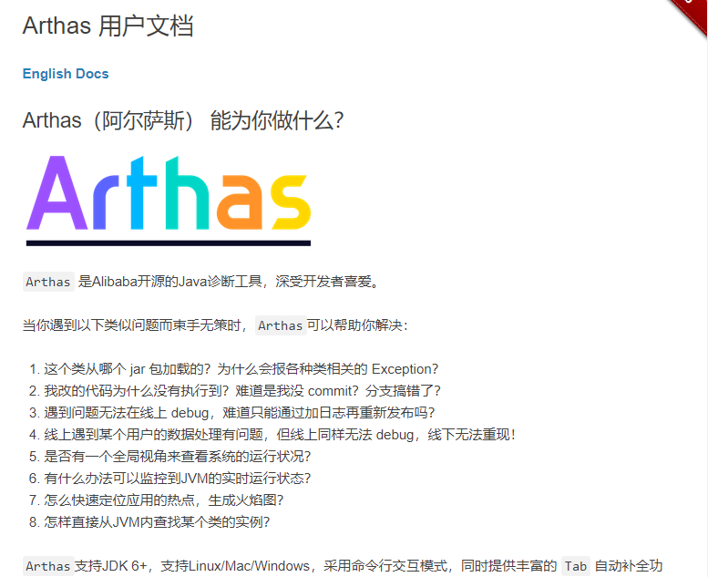

官方文档地址：http://arthas.gitee.io/


## 安装启动


安装

https://arthas.gitee.io/install-detail.html

```shell
curl -O https://arthas.aliyun.com/arthas-boot.jar
java -jar arthas-boot.jar
```

attach进程

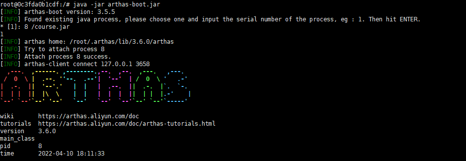


## 指令

### 基础命令

- help——查看命令帮助信息

- [cat](https://arthas.gitee.io/cat.html)——打印文件内容，和linux里的cat命令类似

- [echo](https://arthas.gitee.io/echo.html)–打印参数，和linux里的echo命令类似

- [grep](https://arthas.gitee.io/grep.html)——匹配查找，和linux里的grep命令类似

- [base64](https://arthas.gitee.io/base64.html)——base64编码转换，和linux里的base64命令类似

- [tee](https://arthas.gitee.io/tee.html)——复制标准输入到标准输出和指定的文件，和linux里的tee命令类似

- [pwd](https://arthas.gitee.io/pwd.html)——返回当前的工作目录，和linux命令类似

- cls——清空当前屏幕区域

- session——查看当前会话的信息

- [reset](https://arthas.gitee.io/reset.html)——重置增强类，将被 Arthas 增强过的类全部还原，Arthas 服务端关闭时会重置所有增强过的类

  ```shell
  # 还原指定类
  $ reset Test
  ```

- version——输出当前目标 Java 进程所加载的 Arthas 版本号

- history——打印命令历史

- quit——退出当前 Arthas 客户端，其他 Arthas 客户端不受影响

- stop——关闭 Arthas 服务端，所有 Arthas 客户端全部退出

- [keymap](https://arthas.gitee.io/keymap.html)——Arthas快捷键列表及自定义快捷键


### jvm命令

- [dashboard](https://arthas.gitee.io/dashboard.html)——当前系统的实时数据面板

- [thread](https://arthas.gitee.io/thread.html)——查看当前 JVM 的线程堆栈信息

  ```shell
  # 查看全部线程堆栈信息
  thread
  # 查看最繁忙的前n个线程
  thread -n 3
  # 查看死锁进程
  thread -b
  # 查看特定状态中的线程
  thread --state RUNNABLE
  ```

  

- [jvm](https://arthas.gitee.io/jvm.html)——查看当前` JVM 的信息`

- [sysprop](https://arthas.gitee.io/sysprop.html)——查看和修改JVM的`系统属性`

  ```shell
  # 查看全部
  sysprop
  # 修改系统参数
  sysprop user.country US
  ```

  

- [sysenv](https://arthas.gitee.io/sysenv.html)——查看JVM的`环境变量`

- [vmoption](https://arthas.gitee.io/vmoption.html)——查看和修改JVM里诊断相关的option

  ```shell
  # 更新option
  vmoption PrintGC true
  ```

- [perfcounter](https://arthas.gitee.io/perfcounter.html)——查看当前 JVM 的Perf Counter信息

- [logger](https://arthas.gitee.io/logger.html)——查看和修改logger

- [getstatic](https://arthas.gitee.io/getstatic.html)——查看类的静态属性

- [ognl](https://arthas.gitee.io/ognl.html)——执行ognl表达式

- [mbean](https://arthas.gitee.io/mbean.html)——查看 Mbean 的信息

- [heapdump](https://arthas.gitee.io/heapdump.html)——dump java heap, 类似jmap命令的heap dump功能

  ```shell
  $ heapdump /usr/dump.hprof
  Dumping heap to /usr/dump.hprof ...
  Heap dump file created
  ```

- [vmtool](https://arthas.gitee.io/vmtool.html)——从jvm里查询对象，执行forceGc

- [sc](https://arthas.gitee.io/sc.html)——查看JVM已加载的类信息

  ```shell
  # 打印类信息，类名、路径、注解父类、类加载器
  sc -d class-pattern
  
  # 打印类信息、成员信息
  sc -d -f class-pattern
  ```

### class/classloader相关

- [sm](https://arthas.gitee.io/sm.html)——查看已加载类的方法信息

- [jad](https://arthas.gitee.io/jad.html)——反编译指定已加载类的源码

  ```shell
  # 仅展示源代码
  $ jad --source-only class-pattern
  # 反编译特定方法
  $ jad --source-only class-pattern method-name
  # 反编译文件输出到指定目录
  $ jad --source-only com.example.demo.arthas.user.UserController > /tmp/UserController.java
  ```

- [mc](https://arthas.gitee.io/mc.html)(Memory Compiler)——内存编译器，内存编译`.java`文件为`.class`文件

  ```shell
  # 作用相当于javac
  $ mc .java文件路径 -d 输出文件路径
  # 指定类加载器
  $ mc -c 327a647b /tmp/Test.java
  $ mc --classLoaderClass org.springframework.boot.loader.LaunchedURLClassLoader /tmp/UserController.java -d /tmp
  ```

- [retransform](https://arthas.gitee.io/retransform.html)（推荐使用）——加载外部的`.class`文件，retransform到JVM里

  ```shell
  # 加载指定类,每加载一个 .class 文件，则会记录一个 retransform entry.
  # 如果多次执行 retransform 加载同一个 class 文件，则会有多条 retransform entry.
  $ retransform /tmp/MathGame.class
  
  # 查看retransform entry
  $ retransform -l
  
  # 删除指定 retransform entry
  $ retransform -d 1
  
  # 删除所有 retransform entry
  $ retransform --deleteAll
  
  # 显式触发 retransform,对于同一个类，当存在多个 retransform entry时，如果显式触发 retransform ，则最后添加的entry生效(id最大的)。
  $ retransform --classPattern demo.MathGame
  
  # 消除 retransform 的影响
  删除这个类对应的 retransform entry
  重新触发 retransform
  ```

  > 限制
  >
  > - 不允许新增加field/method
  > - 正在跑的函数，没有退出不能生效，比如下面新增加的`System.out.println`，只有`run()`函数里的会生效
  >
  > ```java
  > public class MathGame {
  >     public static void main(String[] args) throws InterruptedException {
  >         MathGame game = new MathGame();
  >         while (true) {
  >             game.run();
  >             TimeUnit.SECONDS.sleep(1);
  >             // 这个不生效，因为代码一直跑在 while里
  >             System.out.println("in loop");
  >         }
  >     }
  >  
  >     public void run() throws InterruptedException {
  >         // 这个生效，因为run()函数每次都可以完整结束
  >         System.out.println("call run()");
  >         try {
  >             int number = random.nextInt();
  >             List<Integer> primeFactors = primeFactors(number);
  >             print(number, primeFactors);
  >  
  >         } catch (Exception e) {
  >             System.out.println(String.format("illegalArgumentCount:%3d, ", illegalArgumentCount) + e.getMessage());
  >         }
  >     }
  > ```

- [redefine](https://arthas.gitee.io/redefine.html)——加载外部的`.class`文件，redefine到JVM里

  > redefine不能增加新字段和新方法
  >
  > redefine后的原来的类不能恢复，如果想重置，需要`redefine`原始的字节码。
  >
  > `redefine`命令和`jad`/`watch`/`trace`/`monitor`/`tt`等命令会冲突。执行完`redefine`之后，如果再执行上面提到的命令，则会把`redefine`的字节码重置。

  

- [dump](https://arthas.gitee.io/dump.html)——dump 已加载类的 byte code 到特定目录

- [classloader](https://arthas.gitee.io/classloader.html)——查看classloader的继承树，urls，类加载信息，使用classloader去getResource


### monitor/watch/trace

> 指令原理：在被观察的方法中插入切面来实现数据的统计
>
> 请注意，这些命令，都通过字节码增强技术来实现的，会在指定类的方法中插入一些切面来实现数据统计和观测，因此在线上、预发使用时，请尽量明确需要观测的类、方法以及条件，诊断结束要执行 `stop` 或将增强过的类执行 `reset` 命令。

- [monitor](https://arthas.aliyun.com/doc/monitor.html)——方法执行监控

- [watch](https://arthas.aliyun.com/doc/watch.html)——方法执行数据观测

  > 可以监测方法的入参、出参、返回值
  >
  > 参数列表
  >
  > | 参数名称            | 参数说明                                          |
  > | ------------------- | ------------------------------------------------- |
  > | *class-pattern*     | 类名表达式匹配                                    |
  > | *method-pattern*    | 函数名表达式匹配                                  |
  > | *express*           | 观察表达式，默认值：`{params, target, returnObj}` |
  > | *condition-express* | 条件表达式                                        |
  > | [b]                 | 在**函数调用之前**观察                            |
  > | [e]                 | 在**函数异常之后**观察                            |
  > | [s]                 | 在**函数返回之后**观察                            |
  > | [f]                 | 在**函数结束之后**(正常返回和异常返回)观察        |
  > | [E]                 | 开启正则表达式匹配，默认为通配符匹配              |
  > | [x:]                | 指定输出结果的属性遍历深度，默认为 1              |
  >
  > 4个观察事件点 `-b`、`-e`、`-s` 默认关闭，`-f` 默认打开，当指定观察点被打开后，在相应事件点会对观察表达式进行求值并输出
  >
  > 
  >
  > 指令示例：   
  >
  > ```shell
  > # 查看方法返回值
  > [arthas@8]$ watch com.zlp.course.service.impl.ArticleServiceImpl getArticleList returnObj
  > ```
  >
  > 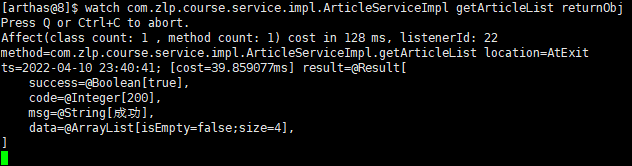
  >
  > ```shell
  > # 查看入参、返回值，指定显示深度
  > [arthas@8]$ watch com.zlp.course.service.impl.ArticleServiceImpl getArticleList {params,returnObj} -x 3
  > ```
  >
  > 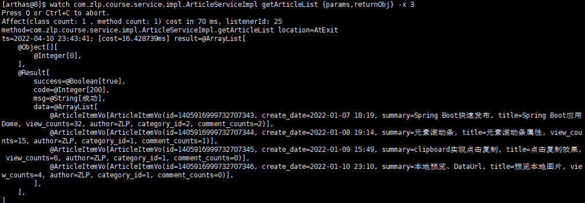

- [trace](https://arthas.aliyun.com/doc/trace.html)——方法内部调用路径，并输出方法路径上的每个节点上耗时

  > 可以监测方法内部调用路径，并输出方法路径上的每个节点上耗时
  >
  > 参数列表
  >
  > | 参数名称            | 参数说明                             |
  > | ------------------- | ------------------------------------ |
  > | *class-pattern*     | 类名表达式匹配                       |
  > | *method-pattern*    | 方法名表达式匹配                     |
  > | *condition-express* | 条件表达式                           |
  > | [E]                 | 开启正则表达式匹配，默认为通配符匹配 |
  > | `[n:]`              | 命令执行次数                         |
  > | `#cost`             | 方法执行耗时                         |
  >
  > 
  >
  > 指令示例
  >
  > ```shell
  > # 检测指定方法调用链路，执行耗时
  > $ trace com.zlp.course.service.impl.ArticleServiceImpl getArticleList
  > 
  > # 默认情况下，trace不会包含jdk里的函数调用
  > # 可以通过--skipJDKMethod false展示
  > # '#cost>5' 根据耗时过滤，单位毫秒
  > ```
  >
  > 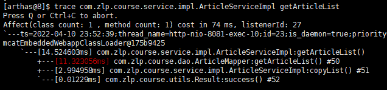
  >
  > 
  >
  > trace指令原理：只会对匹配到的方法内部调用情况进行展示，不会深入展开
  >
  > 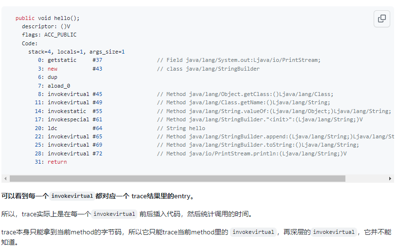
  >
  > ```shell
  > # trace多级展开，使用通配符匹配多个方法
  > $ trace --skipJDKMethod false com.zlp.course.service.impl.ArticleServiceImpl *
  > 
  > 
  > # trace多级展开，使用正则表达式匹配多个方法
  > $ trace -E --skipJDKMethod false com.zlp.course.service.impl.ArticleServiceImpl getArticleList|copyList|copy
  > ```
  >
  > 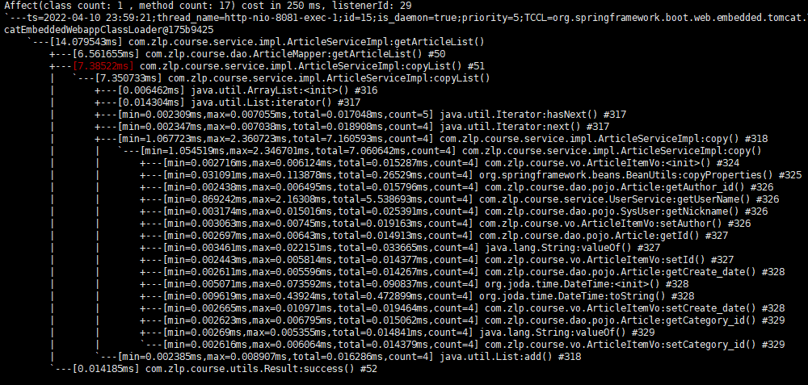
  >
  > 原理：
  >
  > - trace匹配到了多个class，多个method
  > - 多个method在同一个线程里被调用，一个method就会是trace结果里的一层
  > - 因为trace在`ThreadLocal`里记录了树的结点信息，所以在一个线程里调用多个匹配到的method，就会形成一个树
  >
  > 
  >
  > 参考：https://github.com/alibaba/arthas/issues/597

- [stack](https://arthas.aliyun.com/doc/stack.html)——输出当前方法被调用的调用路径

  > 输出当前方法被调用的调用路径
  >
  > 参数列表
  >
  > | 参数名称            | 参数说明                             |
  > | ------------------- | ------------------------------------ |
  > | *class-pattern*     | 类名表达式匹配                       |
  > | *method-pattern*    | 方法名表达式匹配                     |
  > | *condition-express* | 条件表达式                           |
  > | [E]                 | 开启正则表达式匹配，默认为通配符匹配 |
  > | `[n:]`              | 执行次数限制                         |
  >
  > 指令示例
  >
  > ```shell
  > $ stack com.zlp.course.service.impl.ArticleServiceImpl getArticleList
  > ```
  >
  > 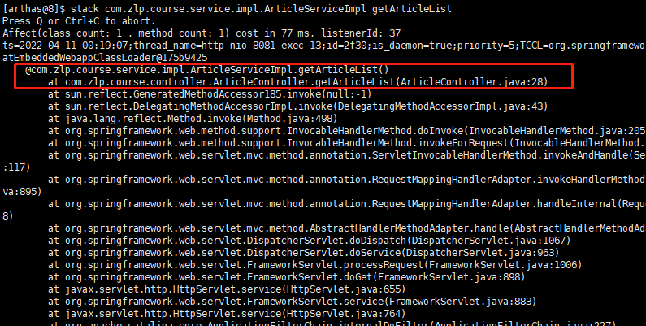

- [tt](https://arthas.aliyun.com/doc/tt.html)（Time-tunnel）——方法执行数据的时空隧道，记录下指定方法每次调用的入参和返回信息，并能对这些不同的时间下调用进行观测

  > 功能
  >
  > 方法执行数据的时空隧道，记录下指定方法每次调用的入参和返回信息，并能对这些不同的时间下调用进行观测。
  >
  > 
  >
  > 介绍
  >
  > `watch` 虽然很方便和灵活，但需要提前想清楚观察表达式的拼写，这对排查问题而言要求太高，因为很多时候我们并不清楚问题出自于何方，只能靠蛛丝马迹进行猜测。
  >
  > 这个时候如果能记录下当时方法调用的所有入参和返回值、抛出的异常会对整个问题的思考与判断非常有帮助。
  >
  > 于是乎，TimeTunnel 命令就诞生了。
  >
  > 
  >
  > 参数列表
  >
  > 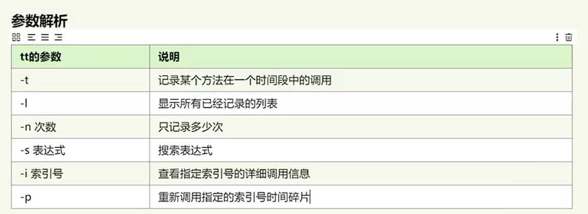
  >
  > 
  >
  > 使用
  >
  > 1. 记录调用
  >
  >    ```shell
  >    $ tt -t com.zlp.course.service.impl.ArticleServiceImpl *
  >    # 参数-n可以指定记录的次数
  >    ```
  >
  > 2. 查看记录列表
  >
  >    ```shell
  >    [arthas@8]$ tt -l
  >    ```
  >
  >    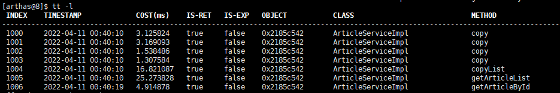
  >
  > 3. 查看具体调用记录
  >
  >    ```shell
  >    [arthas@8]$ tt -i 1000
  >    ```
  >
  >    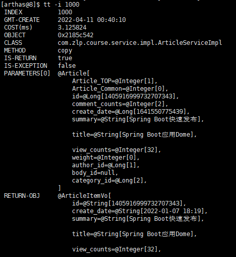
  >
  > 4. 重新调用某个记录(重放)
  >
  >    ```shell
  >    [arthas@8]$ tt -i 1006 -p
  >    # 可以指定重复调用次数、时间间隔
  >    $ tt -i 1006 -p --replay-times 3 --replay-interval 2
  >    ```
  >
  >    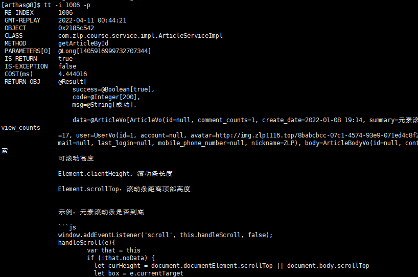
  >
  > 5. 删除已经记录的列表
  >
  >    ```shell
  >    $ tt --delete-all
  >    ```
  >
  >    

  


### profiler/火焰图

- [profiler](https://arthas.gitee.io/profiler.html)–使用[async-profiler](https://github.com/jvm-profiling-tools/async-profiler)对应用采样，生成火焰图

`profiler` 命令支持生成应用热点的火焰图。本质上是通过不断的采样，然后把收集到的采样结果生成火焰图。


参数列表

| 参数名称    | 参数说明                                                     |
| ----------- | ------------------------------------------------------------ |
| *action*    | 要执行的操作                                                 |
| *actionArg* | 属性名模式                                                   |
| [i:]        | 采样间隔（单位：ns）（默认值：10'000'000，即10 ms）          |
| [f:]        | 将输出转储到指定路径                                         |
| [d:]        | 运行评测指定秒                                               |
| [e:]        | 要跟踪哪个事件（cpu, alloc, lock, cache-misses等），默认是cpu |


示例

1. 开始采样

   ```shell
   # 默认采样cup的火焰图
   $ profiler start
   Started [cpu] profiling
   
   # 指定时间自动结束
   profiler start --duration 300
   ```

2. 查看样本数量

   ```shell
   $ profiler getSamples
   23
   ```

3. 查看profiler运行状态

   ```shell
   $ profiler status
   [cpu] profiling is running for 4 seconds
   ```

4. 停止profiler采样(生成svg文件)

   ```shell
   # 指定生成文件格式，默认为svg
   $ profiler stop --format html
   profiler output file: /tmp/test/arthas-output/20211207-111550.html
   OK
   ```

5. 回复采样

   ```shell
   $ profiler resume
   Started [cpu] profiling
   ```

   


### 鉴权

- [auth](https://arthas.gitee.io/auth.html)–鉴权


### options

- [options](https://arthas.gitee.io/options.html)——查看或设置Arthas全局开关

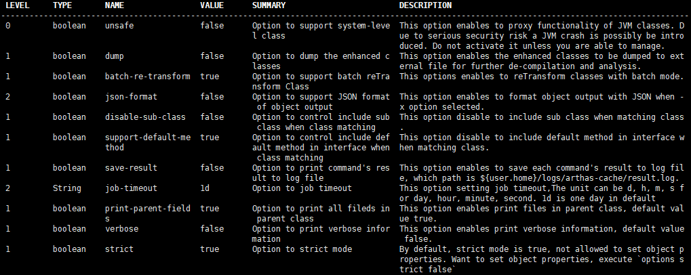

```shell
# arthas设置全局参数
$ options json-format true
```


指令文档：https://arthas.aliyun.com/doc/trace.html#v


## arthas实际案例

- arthas-trace原理分析：https://github.com/alibaba/arthas/issues/597

- 使用arthas排查redisson网络抖动后retry指标持续增长问题：https://mp.weixin.qq.com/s/WcEAmUjtzOLRfGTeKPvrvg

- 基于arthas的web ui：https://github.com/lyghzh/pub/blob/main/doc/%E5%B7%A5%E5%95%86%E9%93%B6%E8%A1%8C%E6%89%93%E9%80%A0%E5%9C%A8%E7%BA%BF%E8%AF%8A%E6%96%AD%E5%B9%B3%E5%8F%B0%E7%9A%84%E6%8E%A2%E7%B4%A2%E4%B8%8E%E5%AE%9E%E8%B7%B5.md

- 使用Arthas显式执行代码，避免重启应用：https://github.com/alibaba/arthas/issues/1823
- Arthas Trace 命令接口优化案例：https://github.com/alibaba/arthas/issues/1892