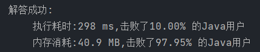
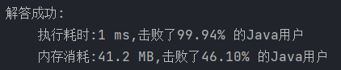
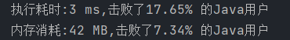
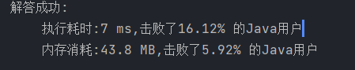

```
//给你一个字符串 s 和一个字符规律 p，请你来实现一个支持 '.' 和 '*' 的正则表达式匹配。 
//
// 
// '.' 匹配任意单个字符 
// '*' 匹配零个或多个前面的那一个元素 
// 
//
// 所谓匹配，是要涵盖 整个 字符串 s 的，而不是部分字符串。 
//
// 示例 1： 
//
// 
//输入：s = "aa", p = "a"
//输出：false
//解释："a" 无法匹配 "aa" 整个字符串。
// 
//
// 示例 2: 
//
// 
//输入：s = "aa", p = "a*"
//输出：true
//解释：因为 '*' 代表可以匹配零个或多个前面的那一个元素, 在这里前面的元素就是 'a'。因此，字符串 "aa" 可被视为 'a' 重复了一次。
// 
//
// 示例 3： 
//
// 
//输入：s = "ab", p = ".*"
//输出：true
//解释：".*" 表示可匹配零个或多个（'*'）任意字符（'.'）。
// 
//
// 
//
// 提示： 
//
// 
// 1 <= s.length <= 20 
// 1 <= p.length <= 20 
// s 只包含从 a-z 的小写字母。 
// p 只包含从 a-z 的小写字母，以及字符 . 和 *。 
// 保证每次出现字符 * 时，前面都匹配到有效的字符 
// 
//
// Related Topics 递归 字符串 动态规划 👍 3938 👎 0

```

p要能完全包含s并且不能有多余字符

```
s=ab
p=abc
（不匹配）
s=ab
p=abc*
（匹配）
```


### 递归

- 将带`*`的看作一组进行匹配，`a*`，此时可以匹配0个或者多个两种情况分支向下递归
- 不带`*`号，单字符匹配相等则继续，不相等则不匹配
- 待匹配字符串`s`遍历结束判断，字符串p是否也能到达结尾，若能则匹配，不能则不匹配

```java
class Solution {
    public boolean isMatch(String s, String p) {
        char[] chars = s.toCharArray();
        char[] matchChars = p.toCharArray();
        return doMatch(chars, matchChars, 0, 0);
    }

    public boolean doMatch(char[] chars, char[] matchChars, int i, int j){
        while (i >= 0 && i < chars.length) {
            if (j >= matchChars.length){
                return false;
            }
            if(j + 1 < matchChars.length && matchChars[j + 1] == '*' ){// 带*

                if ((matchChars[j] == '.' || matchChars[j] == chars[i])){
                    if (doMatch(chars, matchChars, i + 1, j)){// 匹配1个，继续下探
                        return true;
                    }else if (doMatch(chars, matchChars, i, j + 2)){// 匹配0个
                        return true;
                    }
                    return false;
                }else {
                    // 匹配0个
                    j += 2;
                    continue;
                }

            }
            if (matchChars[j] == '.'){
                j++;
                i++;
                continue;
            }
            if (matchChars[j] == chars[i]){
                j++;
                i++;
                continue;
            }
            return false;
        }
        return  i >= chars.length && isCanEnd(matchChars, j);
    }

    public boolean isCanEnd(char[] matchChars, int j) {
        while (j < matchChars.length) {
            if ('*' == matchChars[j]){
                j++;
                continue;
            }
            if (j + 1 < matchChars.length && matchChars[j + 1] == '*'){
                j += 2;
                continue;
            }
            return false;
        }
        return true;
    }
}
```



#### 写法优化

```java
class Solution {
    public boolean isMatch(String s, String p) {
        char[] chars = s.toCharArray();
        char[] matchChars = p.toCharArray();
        return doMatch(chars, matchChars, 0, 0);
    }

    public boolean doMatch(char[] chars, char[] matchChars, int i, int j){
        while (i >= 0 && i < chars.length) {
            if (j >= matchChars.length){
                return false;
            }
            if(j + 1 < matchChars.length && matchChars[j + 1] == '*' ){// 带*
                return doMatch(chars, matchChars, i, j + 2) || ((matchChars[j] == '.' || matchChars[j] == chars[i]) && doMatch(chars, matchChars, i + 1, j))

            }
            if (matchChars[j] == '.'){
                j++;
                i++;
                continue;
            }
            if (matchChars[j] == chars[i]){
                j++;
                i++;
                continue;
            }
            return false;
        }
        return  i >= chars.length && isCanEnd(matchChars, j);
    }

    public boolean isCanEnd(char[] matchChars, int j) {
        while (j < matchChars.length) {
            if ('*' == matchChars[j]){
                j++;
                continue;
            }
            if (j + 1 < matchChars.length && matchChars[j + 1] == '*'){
                j += 2;
                continue;
            }
            return false;
        }
        return true;
    }
}
```

#### 记忆 + 递归

```java
class Solution {
    Boolean[][] flag;// 存储，i、j参数的调用结果，提前枝剪
    public boolean isMatch(String s, String p) {
        char[] chars = s.toCharArray();
        char[] matchChars = p.toCharArray();
        flag = new Boolean[s.length() + 1][p.length() + 1];
        return doMatch(chars, matchChars, 0, 0);
    }

    public boolean doMatch(char[] chars, char[] matchChars, int i, int j){
        if (flag[i][j] != null){
            return flag[i][j];
        }
        while (i >= 0 && i < chars.length) {
            if (j >= matchChars.length){
                flag[i][j] = false;
                return flag[i][j];
            }
            if(j + 1 < matchChars.length && matchChars[j + 1] == '*' ){// 带*
                flag[i][j] = doMatch(chars, matchChars, i, j + 2) || ((matchChars[j] == '.' || matchChars[j] == chars[i]) && doMatch(chars, matchChars, i + 1, j));
                return flag[i][j];

            }
            if (matchChars[j] == '.'){
                j++;
                i++;
                continue;
            }
            if (matchChars[j] == chars[i]){
                j++;
                i++;
                continue;
            }
            flag[i][j] = false;
            return flag[i][j];
        }
        flag[i][j] = i >= chars.length && isCanEnd(matchChars, j);
        return  flag[i][j];
    }

    public boolean isCanEnd(char[] matchChars, int j) {
        while (j < matchChars.length) {
            if ('*' == matchChars[j]){
                j++;
                continue;
            }
            if (j + 1 < matchChars.length && matchChars[j + 1] == '*'){
                j += 2;
                continue;
            }
            return false;
        }
        return true;
    }
}
```


### 动态规划

参考：

https://leetcode.cn/problems/regular-expression-matching/solutions/531001/dong-tai-gui-hua-di-gui-xiang-jie-by-tin-oycu/

https://leetcode.cn/problems/regular-expression-matching/solutions/809586/dai-ma-hui-shuo-hua-dong-tai-gui-hua-hao-b3zh/


我们设置动态转移方程为 dp\[i][j] = true || false，表示s的前i个字符和p的前j个字符是否匹配。注意，前i个的意思是 下标从0到i-1,末尾的元素对应的下标分别是 i - 1 和 j - 1.

**首先看base case。**

dp\[0][0]表示 s 的空串和 p 的空串的匹配情况，那一定是匹配的。

dp\[0][j] 的表示p不是空串，s是空串的情况。比如 `s = "", p = "a*b*"` .

dp\[0][1] 表示 p的第一个字符也就是 p[0] = a 是否和 s 匹配，显然是不匹配的，并且dp\[0][1] 一定是 false，因为不管是什么字符，它都比 s 串多一个。即使是`'*'`也不行，它无法消除掉自己，因为 `'*' `需要根据上一个字符来匹配。

再往后 dp\[0][2]，p[1] = `'*'`，它可以选择消除掉第一个字符a，那么这个子串就也变成了一个空串，因此是匹配的。

再往后推，dp\[0][3]为 false，dp\[i][4] 因为 p[3]是 `'*'` 所以可以消除掉前面的b，同时第一个 `'*'` 可以消除掉 a，所以整体p又变成了一个空串，是匹配的。

据此我们就可以看出来一点这个规律了。我们可以根据这个规律把base case初始化完：

```
dp[0][i] = p.charAt(i - 1) == '*' && dp[0][i - 2] 
```

**接着看普遍情况下的状态转移**。

如果 s[i-1] == p[j-1]，也就是s和p对应的都是普通字符且相等的话，这 s[i-1]和p[j-1]这两个字符就是匹配的，那么[0, i-1]和[0, j-1] 对应的这两个子串匹不匹配就要看前面的子串的匹配情况了。这里如果p[j-1]是`'.'`，那么s[i-1] 也必然和 p[j-1]相等，因为 `'.'`可以匹配任何字符。所以第一种情况我们就可以写出来了:

```java
if (p.charAt(j - 1) == '.' 
                || p.charAt(j - 1) == s.charAt(i - 1)) {
    dp[i][j] = dp[i - 1][j - 1];
}

```

**那么如果 p[j-1] == '\*' 呢？这时候就又要分两种情况来看。**

#### 第一种情况，p[j-2] != s[i-1].

比如 `s = "abc", p = "abcd*"`。

我们遍历到 i - 1 = 2,即 s[2] = `'c'`; j - 1 = 4, 即 p[4] = `'*'` 时，这时我们看 j-2 = 3 对应的字符，也就是 p[3] = `'d'`和当前的 s[2] 也不匹配，那我们就可以使用 `'*'`将 j - 2对应的 `'d'`消除，我们也只有这一个选择，虽然消除后也不一定匹配，但是不消除一定不匹配。

那么这时候，问题就变成了`s = "abc" 和 p = "abc"` 匹配的问题。这就是个子问题了，所以这个情况下状态转移方程就是:

dp\[i][j] = dp\[i][j-2];

#### 第二种情况，p[j-2] = s[i-1]。

这时候还可以分成三种情况。

1. s = 'abc', p = "abcc\*";
   我们用 `'*'`将最后一个 `'c'` 消除掉，或者说让 `'*'` 匹配 0 个 'c', 然后我们可以得到 `p = "abc"`；
   那么对应的方程就是 dp\[i][j] = dp\[i][j-2];

2. s = "abc", p = "abc*";
   我们将 `'*'` 本身消除掉，或者说用 `'*'` 匹配一个 `'c'`。然后我们可以得到 `p = "abc"`；
   那么对应的方程就是 dp\[i][j] = dp\[i][j-1];

3. s = "abcc" or "abccc" or "abcccc..", p = "abc*"
   我们可以用 `'*'` 匹配多个 `'c'`，那怎么个匹配法呢？

   这时千万不能忘记这是一个动态规划的方程，子问题在前面的状态中已经解决过了。所以不管s的最后有多少个c，我们只需要消除最后一个c就可以了。s = `"abccc"` 就变成了 s = `"abcc"`.

   或者我们也可以这样理解，s 变成 `"abcc"`时，p 还是 `"abc*"`，最后这个 `'*'` 还是可以和 s 匹配，最终就可以推到之前的问题，s = `"abc"`, p = `"abc"` 上。

   最后对应的方程就是 dp\[i][j] = dp\[i-1][j]

由此可以写出代码：

```java
public boolean isMatch(String s, String p) {
        int len1 = s.length();
        int len2 = p.length();

        boolean[][] dp = new boolean[len1 + 1][len2 + 1];

        dp[0][0] = true;

        for (int i = 2; i <= len2; i++) {
            dp[0][i] = p.charAt(i - 1) == '*' && dp[0][i - 2];
        }

        for (int i = 1; i <= len1; i++) {
            for (int j = 1; j <= len2; j++) {
                if (p.charAt(j - 1) == '.' || p.charAt(j - 1) == s.charAt(i - 1)) {
                    dp[i][j] = dp[i - 1][j - 1];
                } else if (p.charAt(j - 1) == '*') {
                    if (j > 1 && s.charAt(i - 1) != p.charAt(j - 2) && p.charAt(j - 2) != '.') {
                        dp[i][j] = dp[i][j - 2];
                    } else {
                        dp[i][j] = dp[i - 1][j] || dp[i][j - 1] || dp[i][j - 2];
                    }
                }
            }
        }
        return dp[len1][len2];
    }

```



### NFA

非确定性有限自动机，允许从当前状态通过给定输入转移到多个可能的状态，或者没有转移。NFA 可以使用集合来表示每个状态的可能转移

在使用自动机时，将匹配串`s`输入到自动机中，判断是否能够到达终止状态。

参考：https://leetcode.cn/problems/regular-expression-matching/solutions/30629/liang-chong-jie-fa-by-jason-2-20/

```java
class Solution {
    public boolean isMatch(String s, String p) {
        // S串当前下标位置，刚开始为0
        int index = 0;
        // 下一个状态集合
        // 这里状态用p串的下标表示，代表下一次可以从p的这些下标开始匹配
        Set<Integer> nextState = new HashSet<>();
        // 由于是刚开始匹配，这时候p下一个下标是0
        nextMatch(p, 0, nextState);
        // nextState不为空时，表示还有合法的下一个状态，匹配继续
        while (!nextState.isEmpty()){
            // 当前状态就是上一次的nextState
            Set<Integer> nowState = nextState;
            // 创建新的nextState
            nextState = new HashSet<>();
            // 测试s[index]和集合里的状态是否有匹配
            for (int state : nowState){
                // 如果同时到达s和p串末尾，匹配成功
                if (state >= p.length() && index >= s.length()){
                    return true;
                }
                // 仅仅p到达末尾还不行
                else if (state >= p.length()){
                    continue;
                }
                // s和p都未到达末尾
                else if (index < s.length()){
                    // 这里是匹配上的情况
                    if (p.charAt(state) == '.' || s.charAt(index) == p.charAt(state)){
                        // 如果p串的下一个字符是'*'，当前状态可以匹配任意多次，所以下一个状态还是当前
                        if (state+1 < p.length() && p.charAt(state+1) == '*'){
                            nextMatch(p, state, nextState);
                        }
                        // 否则，下一个状态就是state+1
                        else {
                            nextMatch(p, state+1, nextState);
                        }
                    }
                }
            }
            index++;
        }
        // 此时，nextState为空，代表没有合法的下一个状态了，匹配失败
        return false;
    }

    // p:正则表达式
    // state:下一个状态
    // nextState:下一个状态集合，无重复
    private void nextMatch(String p, int state, Set<Integer> nextState){
        // 首先加上下一个状态到状态集中
        nextState.add(state);
        // 这里是判断下一个字符是'*'的情况，由于此时匹配次数可以是0，所以state+2也是合法的下一个状态
        if (state+1 < p.length() && p.charAt(state+1) == '*'){
            nextMatch(p, state+2, nextState);
        }
    }
}

```



```java
public class Solution {
    public boolean isMatch(String s, String p) {
        //构建有穷自动机
        NFA nfa = new NFA(p);
        return nfa.matches(s);
    }

    /**
     * 不确定的有限自动机
     */
    static class NFA {
        //正则表达式
        private String re;
        //状态个数和正则表达式的字符数相同
        private int statusNum;
        //有向图
        private Digraph graph;

        public NFA(String re) {
            this.re = re;
            this.statusNum = re.length();
            //状态图的节点等于状态数+1
            this.graph = new Digraph(statusNum + 1);
            //根据正则表达式构建图
            this.compile();
        }

        private void compile() {
            for (int i = 0; i < statusNum; i++) {
                //对应字符和字符紧跟*的情况，构建两条边
                if (i < statusNum - 1 && this.re.charAt(i + 1) == '*') {
                    this.graph.addEdge(i, i + 1);
                    this.graph.addEdge(i + 1, i);
                }
                //
                if (this.re.charAt(i) == '*') {
                    this.graph.addEdge(i, i + 1);
                }
            }
        }

        /**
         * 算法的流程如下：
         *
         * 1.设当前状态集合为{0}；
         * 2.什么字符都不读，根据p更新一下当前状态集合。
         * 3.读取s的下一个字符，根据p更新一下当前状态集合。
         * 如果更新之后当前状态集合为空集，即匹配失败，直接返回False. 如果s已经读完了，执行第6步。
         * 4.什么字符都不读，根据p更新一下当前状态集合。
         * 5.循环，回到第3步执行。
         * 6.此时s已经读完了，如果当前状态集合里面有终止状态，则至少有一种状态跳转路径可以匹配成功，返回True，否则返回False.
         * @param txt
         * @return
         */
        public boolean matches(String txt) {
            Set<Integer> pc = new HashSet<>();
            HashSet<Integer> source = new HashSet<Integer>() {{
                add(0);
            }};
            //从0开始匹配
            DirectedDFS dfs = new DirectedDFS(graph, source);
            for (int v = 0; v < graph.v; v++) {
                if (dfs.visited[v]) {
                    pc.add(v);
                }
            }
            int len = txt.length();
            for (int i = 0; i < len; i++) {
                Set<Integer> match = new HashSet<>();
                for (Integer v : pc) {
                    if (v < this.statusNum) {
                        if (this.re.charAt(v) == txt.charAt(i) || this.re.charAt(v) == '.') {
                            match.add(v + 1);
                        }
                    }
                }
                pc = new HashSet<>();
                dfs = new DirectedDFS(graph, match);
                for (int v = 0; v < graph.v; v++) {
                    if (dfs.visited[v]) {
                        pc.add(v);
                    }
                }
            }
            //如果当前状态集合里面有终止状态，则至少有一种状态跳转路径可以匹配成功
            return pc.contains(this.statusNum);
        }


    }

    /**
     * 有向图
     */
    static class Digraph {
        //顶点和边
        private int v;
        private int e;
        //临接表
        private List<List<Integer>> adj;

        public Digraph(int v) {
            this.v = v;
            this.e = 0;
            this.adj = new ArrayList<>();
            for (int i = 0; i < v; i++) {
                this.adj.add(new ArrayList<>());
            }
        }

        private void addEdge(int v, int w) {
            this.adj.get(v).add(w);
            this.e++;
        }
    }

    /**
     * 有向图的深度优先遍历
     */
    static class DirectedDFS {
        private Digraph graph;
        //初始状态集
        private Set<Integer> source;
        private boolean[] visited;

        /**
         * 从初始状态集开始对图进行深度优先遍历，把能访问到的点进行标记
         * @param graph
         * @param source
         */
        public DirectedDFS(Digraph graph, Set<Integer> source) {
            this.graph = graph;
            this.source = source;
            this.visited = new boolean[graph.v];
            for (Integer s : source) {
                if (!visited[s]) {
                    this.dfs(graph, s);
                }
            }
        }

        /**
         * 图的深度优先遍历
         *
         * @param graph
         * @param v
         */
        private void dfs(Digraph graph, Integer v) {
            this.visited[v] = true;
            for (Integer w : graph.adj.get(v)) {
                if (!visited[w]) {
                    this.dfs(graph, w);
                }
            }
        }


    }
}
```

