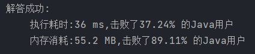

给定 *n* 个非负整数，用来表示柱状图中各个柱子的高度。每个柱子彼此相邻，且宽度为 1 。

求在该柱状图中，能够勾勒出来的矩形的最大面积。

 

**示例 1:**


```
输入：heights = [2,1,5,6,2,3]
输出：10
解释：最大的矩形为图中红色区域，面积为 10
```

**示例 2：**


```
输入： heights = [2,4]
输出： 4
```

 

**提示：**

- `1 <= heights.length <=105`
- `0 <= heights[i] <= 104`


### 枚举（超时）

枚举宽度

```java
class Solution {
    public int largestRectangleArea(int[] heights) {
        int max_area = 0;
        // 枚举每一个宽度，计算宽度内最大的面积
        for (int height = 1; height <= heights.length; height++) {
            int area = 0, min = Integer.MAX_VALUE;
            for (int i = 0; i < height; i++) {
                if (heights[i] < min){
                    min = heights[i];
                }
            }
            area += min * height;
            if (max_area < area){
                max_area = area;
            }
            for (int i = height; i < heights.length; i++) {
                if (heights[i - height] == min){
                    min = heights[i];
                    for (int j = i - height + 1 ;j <= i; j++){
                        if (heights[j] < min){
                            min = heights[j];
                        }
                    }
                }
                area = min * height;
                if (max_area < area){
                    max_area = area;
                }
            }
        }
        return max_area;
    }
}
```

时间复杂度：O(n^3^)


### 单调栈

https://leetcode.cn/problems/largest-rectangle-in-histogram/solutions/266844/zhu-zhuang-tu-zhong-zui-da-de-ju-xing-by-leetcode-/

从枚举高度出发理解单调栈解法

遍历每一个高度的情况下，寻找每个高度下能达到的最大宽度，即边界为第一个小于当前高度位置的前置下标。

遍历每个种高度就是遍历目标数组。

寻找小于当前下标最近的一个元素位置可以提过单调栈实现，通过左右两个方向的遍历就能找出高度的两个边界，计算出宽度，在计算出面积

```java
class Solution {
    public int largestRectangleArea(int[] heights) {
        int max_area = 0;
        Deque<Integer> stack = new ArrayDeque<>();
        int[] left = new int[heights.length];
        int[] right = new int[heights.length];
        for (int i = 0; i < heights.length; i++) {// 找右边界
            right[i] = heights.length - 1;
            while (!stack.isEmpty() && heights[stack.peek()] > heights[i]){
                Integer pop = stack.pop();
                right[pop] = i - 1;
            }
            stack.push(i);
        }
        stack.clear();
        for (int i = heights.length - 1; i >= 0; i--) {// 找左边界
            left[i] = 0;
            while (!stack.isEmpty() && heights[stack.peek()] > heights[i]){
                Integer pop = stack.pop();
                left[pop] = i + 1;
            }
            stack.push(i);
        }

        for (int i = 0; i < heights.length; i++) {
            int area = heights[i] * (right[i] - left[i] + 1);// 计算面积
            if (area > max_area){
                max_area = area;
            }
        }
        return max_area;

    }
}
```

时间复杂度：O(n)


