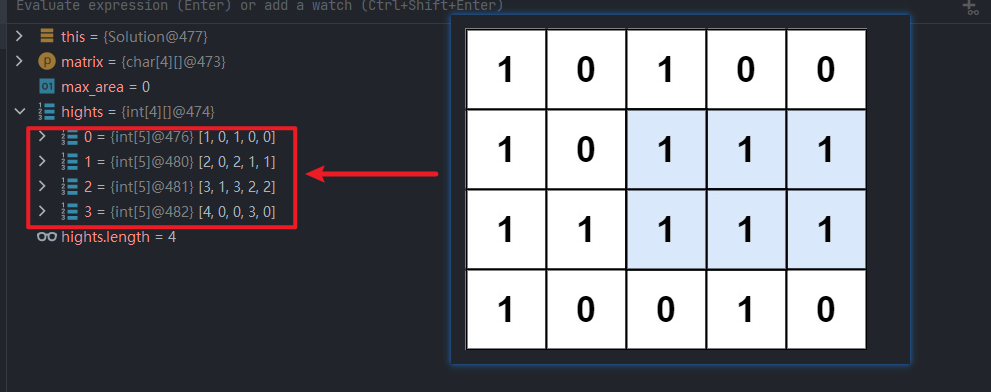
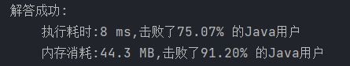

给定一个仅包含 `0` 和 `1` 、大小为 `rows x cols` 的二维二进制矩阵，找出只包含 `1` 的最大矩形，并返回其面积。

 

**示例 1：**


```
输入：matrix = [["1","0","1","0","0"],["1","0","1","1","1"],["1","1","1","1","1"],["1","0","0","1","0"]]
输出：6
解释：最大矩形如上图所示。
```

**示例 2：**

```
输入：matrix = [["0"]]
输出：0
```

**示例 3：**

```
输入：matrix = [["1"]]
输出：1
```

 

**提示：**

- `rows == matrix.length`
- `cols == matrix[0].length`
- `1 <= row, cols <= 200`
- `matrix[i][j]` 为 `'0'` 或 `'1'`

```
// Related Topics 栈 数组 动态规划 矩阵 单调栈 👍 1665 👎 0
```

### 动态规划 + 单调栈

该题可以抽象成`84柱状图中最大的矩形`题的多次求解

1. 将矩阵转换为表示`1`高度的矩阵，每个单元表示当前连续1的个数
   
2. 对于矩阵中的每一层数组求面积最大值相当于求解`84柱状图中最大的矩形`
3. 遍历所有层即能得到最大面积

```java
class Solution {
    public int maximalRectangle(char[][] matrix) {
        int max_area = 0;
        int[][] hights = new int[matrix.length][matrix[0].length];
        for (int j = 0; j < matrix[0].length; j++) {
            hights[0][j] = matrix[0][j] == '1' ? 1 : 0;
        }
        for (int i = 1; i < matrix.length; i++) {
            for (int j = 0; j < matrix[i].length; j++) {// 转换为高度矩阵
                if (matrix[i][j] == '1'){
                    hights[i][j] = matrix[i-1][j] == '1' ? hights[i -1][j] + 1 : 1;
                }
            }
        }
        int area;
        for (int i = 0; i < hights.length; i++) {
            area = largestRectangleArea(hights[i]);// 84的题解，遍历每层求解最大值
            if (max_area < area){
                max_area = area;
            }
        }

        return max_area;
    }

    public int largestRectangleArea(int[] heights) {
        int max_area = 0;
        Deque<Integer> stack = new ArrayDeque<>();
        int[] left = new int[heights.length];
        int[] right = new int[heights.length];
        for (int i = 0; i < heights.length; i++) {// 找右边界
            right[i] = heights.length - 1;
            while (!stack.isEmpty() && heights[stack.peek()] > heights[i]){
                Integer pop = stack.pop();
                right[pop] = i - 1;
            }
            stack.push(i);
        }
        stack.clear();
        for (int i = heights.length - 1; i >= 0; i--) {// 找左边界
            left[i] = 0;
            while (!stack.isEmpty() && heights[stack.peek()] > heights[i]){
                Integer pop = stack.pop();
                left[pop] = i + 1;
            }
            stack.push(i);
        }

        for (int i = 0; i < heights.length; i++) {
            int area = heights[i] * (right[i] - left[i] + 1);// 计算面积
            if (area > max_area){
                max_area = area;
            }
        }
        return max_area;

    }
}
```

时间复杂度：O(n * m)

