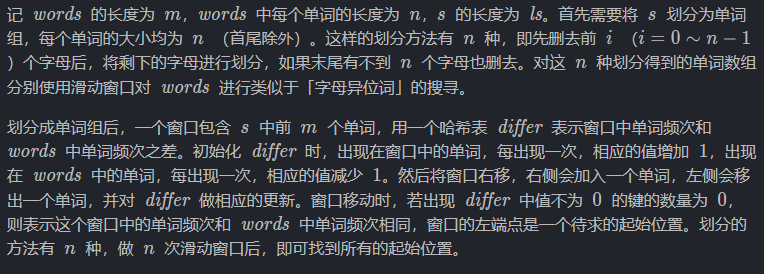

```
//给定一个字符串 s 和一个字符串数组 words。 words 中所有字符串 长度相同。 
//
// s 中的 串联子串 是指一个包含 words 中所有字符串以任意顺序排列连接起来的子串。 
//
// 
// 例如，如果 words = ["ab","cd","ef"]， 那么 "abcdef"， "abefcd"，"cdabef"， "cdefab"，
//"efabcd"， 和 "efcdab" 都是串联子串。 "acdbef" 不是串联子串，因为他不是任何 words 排列的连接。 
// 
//
// 返回所有串联子串在 s 中的开始索引。你可以以 任意顺序 返回答案。 
//
// 
//
// 示例 1： 
//
// 
//输入：s = "barfoothefoobarman", words = ["foo","bar"]
//输出：[0,9]
//解释：因为 words.length == 2 同时 words[i].length == 3，连接的子字符串的长度必须为 6。
//子串 "barfoo" 开始位置是 0。它是 words 中以 ["bar","foo"] 顺序排列的连接。
//子串 "foobar" 开始位置是 9。它是 words 中以 ["foo","bar"] 顺序排列的连接。
//输出顺序无关紧要。返回 [9,0] 也是可以的。
// 
//
// 示例 2： 
//
// 
//输入：s = "wordgoodgoodgoodbestword", words = ["word","good","best","word"]
//输出：[]
//解释：因为 words.length == 4 并且 words[i].length == 4，所以串联子串的长度必须为 16。
//s 中没有子串长度为 16 并且等于 words 的任何顺序排列的连接。
//所以我们返回一个空数组。
// 
//
// 示例 3： 
//
// 
//输入：s = "barfoofoobarthefoobarman", words = ["bar","foo","the"]
//输出：[6,9,12]
//解释：因为 words.length == 3 并且 words[i].length == 3，所以串联子串的长度必须为 9。
//子串 "foobarthe" 开始位置是 6。它是 words 中以 ["foo","bar","the"] 顺序排列的连接。
//子串 "barthefoo" 开始位置是 9。它是 words 中以 ["bar","the","foo"] 顺序排列的连接。
//子串 "thefoobar" 开始位置是 12。它是 words 中以 ["the","foo","bar"] 顺序排列的连接。 
//
// 
//
// 提示： 
//
// 
// 1 <= s.length <= 10⁴ 
// 1 <= words.length <= 5000 
// 1 <= words[i].length <= 30 
// words[i] 和 s 由小写英文字母组成 
// 
//
// Related Topics 哈希表 字符串 滑动窗口 👍 1138 👎 0
```


哈希表、滑动窗口

https://leetcode.cn/problems/substring-with-concatenation-of-all-words/solutions/1616997/chuan-lian-suo-you-dan-ci-de-zi-chuan-by-244a/



```java
class Solution {
    public List<Integer> findSubstring(String s, String[] words) {
        List<Integer> res = new ArrayList<>();
        int m = words.length, n = words[0].length(), ls = s.length();
        for (int i = 0; i < n; i++) {// 只需要遍历前n次，后续遍历结果都包含再前面的滑动窗口内
            if (i + m * n > ls) {
                break;
            }
            Map<String, Integer> differ = new HashMap<>();
            for (int j = 0; j < m; j++) {
                String word = s.substring(i + j * n, i + (j + 1) * n);
                differ.put(word, differ.getOrDefault(word, 0) + 1);
            }
            for (String word : words) {
                differ.put(word, differ.getOrDefault(word, 0) - 1);
                if (differ.get(word) == 0) {
                    differ.remove(word);
                }
            }
            for (int start = i; start < ls - m * n + 1; start += n) {
                if (start != i) {
                    String word = s.substring(start + (m - 1) * n, start + m * n);
                    differ.put(word, differ.getOrDefault(word, 0) + 1);
                    if (differ.get(word) == 0) {
                        differ.remove(word);
                    }
                    word = s.substring(start - n, start);
                    differ.put(word, differ.getOrDefault(word, 0) - 1);
                    if (differ.get(word) == 0) {
                        differ.remove(word);
                    }
                }
                if (differ.isEmpty()) {
                    res.add(start);
                }
            }
        }
        return res;
    }
}
```

