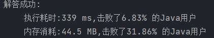
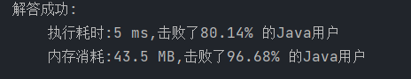

```
//给你一个字符串 s 、一个字符串 t 。返回 s 中涵盖 t 所有字符的最小子串。如果 s 中不存在涵盖 t 所有字符的子串，则返回空字符串 "" 。 
//
// 
//
// 注意： 
//
// 
// 对于 t 中重复字符，我们寻找的子字符串中该字符数量必须不少于 t 中该字符数量。 
// 如果 s 中存在这样的子串，我们保证它是唯一的答案。 
// 
//
// 
//
// 示例 1： 
//
// 
//输入：s = "ADOBECODEBANC", t = "ABC"
//输出："BANC"
//解释：最小覆盖子串 "BANC" 包含来自字符串 t 的 'A'、'B' 和 'C'。
// 
//
// 示例 2： 
//
// 
//输入：s = "a", t = "a"
//输出："a"
//解释：整个字符串 s 是最小覆盖子串。
// 
//
// 示例 3: 
//
// 
//输入: s = "a", t = "aa"
//输出: ""
//解释: t 中两个字符 'a' 均应包含在 s 的子串中，
//因此没有符合条件的子字符串，返回空字符串。 
//
// 
//
// 提示： 
//
// 
// m == s.length 
// n == t.length 
// 1 <= m, n <= 10⁵ 
// s 和 t 由英文字母组成 
// 
//
// 
//进阶：你能设计一个在 
//o(m+n) 时间内解决此问题的算法吗？
//
// Related Topics 哈希表 字符串 滑动窗口 👍 2971 👎 0
```


### 滑动窗口

https://leetcode.cn/problems/minimum-window-substring/solutions/257359/zui-xiao-fu-gai-zi-chuan-by-leetcode-solution/


```java
class Solution {
    Map<Character, Integer> dict = new HashMap<>();
    Map<Character, Integer> map = new HashMap<>();
    public String minWindow(String s, String t) {

        for (int i = 0; i < t.length(); i++) {
            dict.put(t.charAt(i), dict.getOrDefault(t.charAt(i), 0) + 1);
        }

        int l = 0;
        int len = -1, left=0,right=0;
        for (int i = 0; i < s.length(); i++) {
            map.put(s.charAt(i), map.getOrDefault(s.charAt(i), 0) + 1);// 有边界移动
            while (isContains() && l <= i){// 左边界移动
                if (len < 0 || i - l + 1 < len){
                    left = l;
                    right = i;
                    len = right - left + 1;
                }
                l++;
                map.put(s.charAt(l - 1), map.getOrDefault(s.charAt(l - 1), 0) - 1);
            }
        }

        return len == -1 ? "" : s.substring(left, right + 1);
    }


    private boolean isContains() {
        for (Map.Entry<Character, Integer> entry : dict.entrySet()) {
            if (!map.containsKey(entry.getKey()) ||map.get(entry.getKey()) < entry.getValue() ){
                return false;
            }
        }
        return true;
    }

}
```

设字符集大小为 *C*

时间复杂度：O(C⋅∣s∣+∣t∣)

空间复杂度：O(*C*)




优化是否包含在窗口内判断，减去一层map遍历

```java
class Solution {
    Map<Character, Integer> dict = new HashMap<>();
    Map<Character, Integer> map = new HashMap<>();
    Map<Character, Integer> map1 = new HashMap<>();
    public String minWindow(String s, String t) {

        for (int i = 0; i < t.length(); i++) {
            dict.put(t.charAt(i), dict.getOrDefault(t.charAt(i), 0) + 1);
        }
        map.putAll(dict);
        map1.putAll(dict);

        int l = 0;
        int len = -1, left=0,right=0;
        for (int i = 0; i < s.length(); i++) {
            if (dict.containsKey(s.charAt(i))){
                map1.put(s.charAt(i), map1.get(s.charAt(i)) - 1);
                if (map1.get(s.charAt(i)) <= 0){
                    map.remove(s.charAt(i));
                }
            }
            while (map.isEmpty() && l <= i){// 符合条件，左边界移动
                if (len < 0 || i - l + 1 < len){
                    left = l;
                    right = i;
                    len = right - left + 1;
                }
                if (dict.containsKey(s.charAt(l))){
                    map1.put(s.charAt(l), map1.get(s.charAt(l)) + 1);
                    if (map1.get(s.charAt(l)) > 0){
                        map.put(s.charAt(l), 1);
                    }
                }
                l++;
            }
        }

        return len == -1 ? "" : s.substring(left, right + 1);
    }
}
```

设字符集大小为 *C*

时间复杂度：O(∣s∣+∣t∣)

空间复杂度：O(*C*)


把map抽象成数组，简化判断逻辑，用一个遍历记录是否包含

```java
class Solution {
    int[] dict = new int[128];
    int[] map1 = new int[128];
    public String minWindow(String s, String t) {
        int total = 0;
        for (int i = 0; i < t.length(); i++) {
            dict[t.charAt(i)] = dict[t.charAt(i)] + 1;
            map1[t.charAt(i)] = map1[t.charAt(i)] + 1;
            if (dict[t.charAt(i)] == 1){
                total++;// 初始化记录子串一共有多少种字符，不重复计数
            }
        }

        int l = 0;
        int len = -1, left=0,right=0;
        for (int i = 0; i < s.length(); i++) {
            if (dict[s.charAt(i)] > 0 ){
                map1[s.charAt(i)] = map1[s.charAt(i)] - 1;
                if (map1[s.charAt(i)] == 0){
                    total--;// 出现字符达标则 -1
                }
            }
            while (total == 0 && l <= i){// 为0时表示滑动窗口内包含所有字符，符合条件，左边界移动
                if (len < 0 || i - l + 1 < len){
                    left = l;
                    right = i;
                    len = right - left + 1;
                }
                if (dict[s.charAt(l)] > 0){
                    map1[s.charAt(l)] = map1[s.charAt(l)] + 1;
                    if (map1[s.charAt(l)] > 0){
                        total++;// 某一字符被全部移出窗口，增加计数，当前窗口不符合条件需要扩大边界
                    }
                }
                l++;
            }
        }

        return len == -1 ? "" : s.substring(left, right + 1);
    }
}
```

设字符集大小为 *C*

时间复杂度：O(∣s∣+∣t∣)

空间复杂度：O(*C*)

