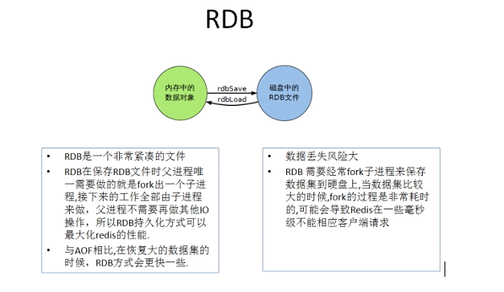
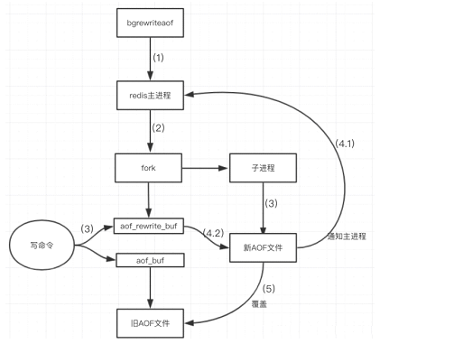
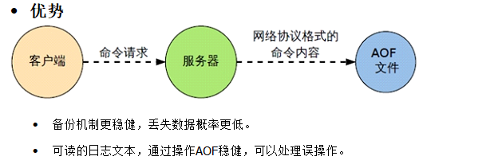

### Redis持久化

Redis提供了两种持久化方式

- RDB：Redis DataBase
- AOF：Append Of File

默认开启RDB

### RDB

原理：将当前内存中的数据快照保存在磁盘中，恢复时直接读取快照文件

实现流程：

Redis会单独创建（fork）一个子进程来进行持久化，原进程的服务不会被阻塞，子进程会先将数据写入一个临时文件，在当前快照设置的间隔结束后再将临时文件替换掉上一次保存的快照文件，

备份恢复：Redis启动时会自动加载快照文件

相关配置：在配置文件的`SNAPSHOTTING` 部分

优势

⦁	适合大规模的数据恢复
⦁	对数据完整性和一致性要求不高更适合使用
⦁	节省磁盘空间
⦁	恢复速度快

劣势

⦁	Fork的时候，内存中的数据被克隆了一份，大致2倍的膨胀性需要考虑
⦁	虽然Redis在fork时使用了写时拷贝技术,但是如果数据庞大时还是比较消耗性能。
⦁	在备份周期在一定间隔时间做一次备份，所以如果Redis意外down掉的话，就会丢失最后一次快照后的所有修改。

> 禁用RDB：不设置save指令，或者给save传入空字符串
>
> 动态停止RDB：redis-cli config set save "" #save后给空值，表示禁用保存策略，启动控制端时传入
>
> 几种手动快照保存指令
>
> save ：save时只管保存，其它不管，全部阻塞。手动保存。不建议。
> bgsave：Redis会在后台异步进行快照操作， 快照同时还可以响应客户端请求。
> 可以通过lastsave 命令获取最后一次成功执行快照的时间

### AOF

原理：以日志的形式来记录每个`写操作`（增量保存），将Redis执行过的所有写指令记录下来(读操作不记录)， 只许追加文件但不可以改写文件，redis启动之初会读取该文件重新构建数据，换言之，`redis 重启的话就根据日志文件的内容将写指令从前到后执行一次以完成数据的恢复工作`。

aof重写即在aof文件在一定大小之后，重新将整个内存写到aof文件当中，以反映最新的状态(相当于bgsave)

实现流程

（1）客户端的请求写命令会被append追加到AOF缓冲区内；
（2）AOF缓冲区根据AOF持久化策略[always,everysec,no]将操作sync同步到磁盘的AOF文件中；
（3）AOF文件大小超过重写策略或手动重写时，会对AOF文件rewrite重写，压缩AOF文件容量；
（4）Redis服务重启时，会重新load加载AOF文件中的写操作达到数据恢复的目的；

备份恢复：redis服务启动时自动加载日志文件进行恢复，`若同时存在RDB和AOF，恢复时使用AOF的日志文件进行恢复`

> 如遇到AOF文件损坏，通过/usr/local/bin/redis-check-aof--fix appendonly.aof进行恢复

相关配置：在配置文件的`APPEND ONLY MODE`处

AOF重写流程

（1）bgrewriteaof触发重写，判断是否当前有bgsave或bgrewriteaof在运行，如果有，则等待该命令结束后再继续执行。
（2）主进程fork出子进程执行重写操作，保证主进程不会阻塞。
（3）子进程遍历redis内存中数据到临时文件，`客户端的写请求同时写入aof_buf缓冲区和aof_rewrite_buf重写缓冲区`保证原AOF文件完整以及新AOF文件生成期间的新的数据修改动作不会丢失。
（4）1).子进程写完新的AOF文件后，向主进程发信号，父进程更新统计信息。2).`主进程把aof_rewrite_buf中的数据写入到新的AOF文件`。
（5）使用新的AOF文件覆盖旧的AOF文件，完成AOF重写

优点

缺点

> 官方推荐两个都启用。
> 如果对数据不敏感，可以选单独用RDB。
> 不建议单独用 AOF，因为可能会出现Bug。
> 如果只是做纯内存缓存，可以都不用。