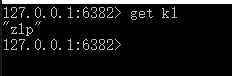
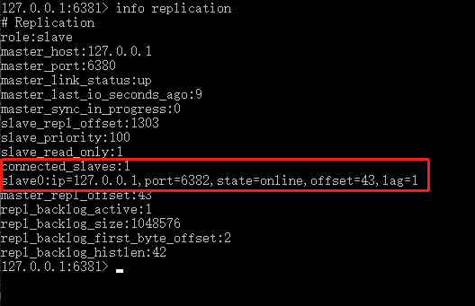

### 主从架构

在当前大数据场景下，对服务的`高可靠性，和高响应性`，提出了更高的要求。

传统的单一数据库架构容易出现单点故障问题，并且性能容易达到瓶颈。

由此分布式场景下的多数据库架构必然更加适应时代发展。

分布式架构下需要考虑的问题：数据同步问题，功能定义问题（主从、互备、读写分离？）


### Redis主从架构搭建

启动3台redis

使用：slaveof  <ip><port>指令指定主机

Redis主从架构中，采用读写分离的方式，主机负责写，从机负责读

info replication指令可以查看当前主机的主从信息


场景模拟

在3个端口启动redis（6380、6381、6382），用3个客户端连接

查看主从信息


指定6380为主机


主机写入，自动复制到从机




主机可读可写，从机只读


### 主从复制

⦁	Slave启动成功连接到master后会发送一个sync命令
⦁	Master接到命令启动后台的存盘进程，同时收集所有接收到的用于修改数据集命令， 在后台进程执行完毕之后，master将传送整个数据文件到slave,以完成一次完全同步
⦁	全量复制：而slave服务在接收到数据库文件数据后，将其存盘并加载到内存中。
⦁	增量复制：Master继续将新的所有收集到的修改命令依次传给slave,完成同步
⦁	但是只要是重新连接master,一次完全同步（全量复制)将被自动执行

（全量复制是从机发起的，增量复制时主机发起的）


### 主从结构特性

#### 主机永存

主从结构中，主机意外宕机后重启依然是主机，从机依然是从机。

从机依然不能进行写操作，从机会不断的向挂掉的从机发送心跳信号。


#### 从机健忘

主从结构中，从机意外宕机后重启会忘记之前的主机，需要重新指定主机


#### 薪火相传

从机也可以作为其他从机的主机，可以用来分层分发数据，减少主机大量复制的开销




#### 反客为主

主机宕机后从机可以通过一些特殊的手段成为主机。

用 slaveof  no one  将从机变为主机。或哨兵机制


### 哨兵模式

使用哨兵监视主机状态，若主机宕机了，则在从机中选举一个作为主机。原主机重启后自动成为新主机的从机。


选举机制

1. 优先级高的
2. 选中偏移量最大的
3. 选中runid最小的

优先级在redis.conf中默认：slave-priority 100，值越小优先级越高
偏移量是指获得原主机数据最全的
每个redis实例启动后都会随机生成一个40位的runid


示例

创建哨兵服务配置文件，`sentinel.conf`，内容填写要监视的主机

```
// 哨兵，监听，主机别名（自定义），主机IP，端口，1为至少有多少个哨兵同意
sentinel monitor mymaster 127.0.0.1 6379 1
```

启动哨兵服务，默认监听26379端口
windows下启动命令：redis-server redis.windows.sentinel.conf --sentinel

