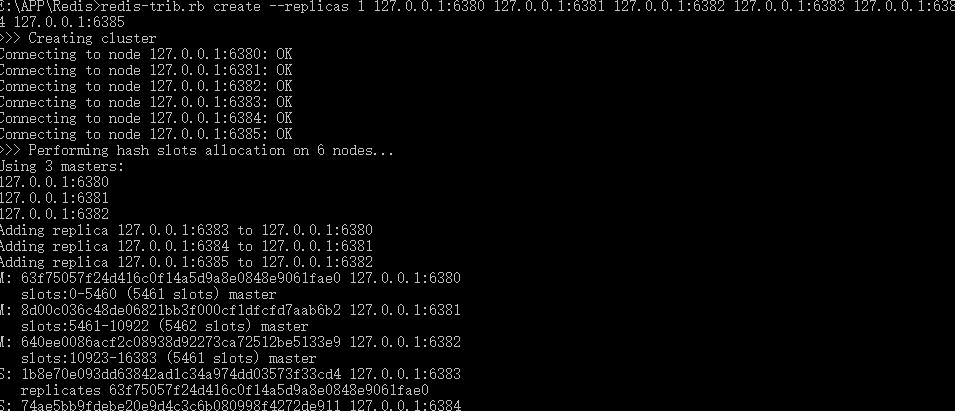
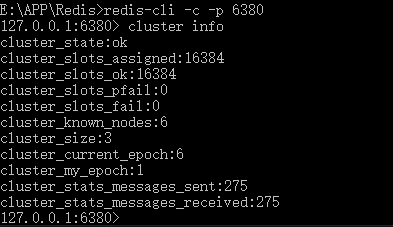
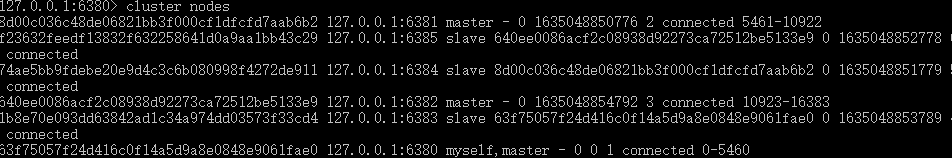
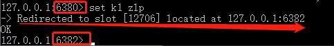
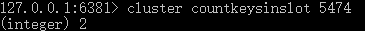
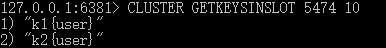

### Redis集群

​	集群：使用一组计算机来代替一个计算机，相较于一个计算机集群能提供更大的内存容量，CUP资源，避免单点故障等优点。

​	集群需要解决的问题：如何对外表现为一个计算机，如最大化利用所以计算机资源。

Redis 集群实现了对Redis的水平扩容，即启动N个redis节点，将整个数据库分布存储在这N个节点中，每个节点存储总数据的1/N。
Redis 集群通过分区（partition）来提供一定程度的可用性（availability）： 即使集群中有一部分节点失效或者无法进行通讯， 集群也可以继续处理命令请求。

​	redis3.0采用无中心化集群配置，任何一个节点都可以接受请求，会根据操作的key去计算对应的插槽，再根据插槽的分配将请求交给对应的节点处理

### Redis集群搭建

模拟场景：6台设备，两两一组，各位主从。

1. 配置文件

   ```
   cluster-enabled yes    打开集群模式
   cluster-config-file nodes-6379.conf  设定节点配置文件名
   cluster-node-timeout 15000   设定节点失联时间，超过该时间（毫秒），集群自动进行主从切换。
   ```

2. 启动服务

   ```
   确保服务启动后都生成了nodes-xxx.conf配置文件
   ```

3. 合并为集群，redis集群需要ruby依赖，redis6内置ruby，windows需要自行安装，linux需要进入src文件夹下执行命令

   ```
   // --cluster create创建集群
   // --cluster-replicas 1指定每个主机的从机个数
   // 6台设备的ip+端口，不能用127.0.0.1
   redis-cli --cluster create --cluster-replicas 1 10.16.188.124:6380 10.16.188.124:6381 10.16.188.124:6382 10.16.188.124:6383 10.16.188.124:6384 10.16.188.124:6385
   
   
   // windows下使用ruby脚本创建集群
   redis-trib.rb create --replicas 1 127.0.0.1:6380 127.0.0.1:6381 127.0.0.1:6382 127.0.0.1:6383 127.0.0.1:6384 127.0.0.1:6385
   ```

   

4. 连接集群

   ```
   // -c 表示集群方式连接
   redis-cli -c -p 6379 
   ```

5. 查看集群状态

   ```
   cluster info // 可以查看集群信息
   cluster nodes // 可以查看集群节点信息，主从、负责的插槽段
   ```

   

   


#### slots

一个 Redis 集群包含 16384 个插槽（hash slot）， 数据库中的每个键都属于这 16384 个插槽的其中一个， 
集群使用公式 `CRC16(key) % 16384 来计算键 key 属于哪个槽`， 其中 CRC16(key) 语句用于计算键 key 的 CRC16 校验和 。
集群中的每个节点负责处理一部分插槽。 举个例子， 如果一个集群可以有主节点， 其中：
节点 A 负责处理 0 号至 5460 号插槽。
节点 B 负责处理 5461 号至 10922 号插槽。
节点 C 负责处理 10923 号至 16383 号插槽。


### Redis集群操作

#### 添加key

```
set k1 zlp
```

内部执行流程

1. 根据key计算出插槽
2. 切换到对应的节点进行保存操作



#### 获取key

```
get k1
```

内部执行流程

1. 根据key计算出插槽
2. 切换到对应的节点进行查询操作


#### 批量添加

集群中不能直接使用mset、mget进行批量操作，要使用`组`的特殊格式

```
// 原本的指令
mset k1 v1 k2 v2

// 集群中的指令，表示k1和k2属于一组
mset k1{user} v1 k2{user} v1
```


#### 查看key属于哪个插槽

```
cluster keyslot <key>
```


#### 查询某个插槽中有多少个key

```
 cluster countkeysinslot <插槽号>
```




#### 获取某个插槽中n个key

```
CLUSTER GETKEYSINSLOT <slot><count> 
```




### Redis集群故障恢复

- 主节点宕机后，从节点自动成为主节点

- 原主节点恢复后成为从节点，不会保持原主节点身份

- 某一段插槽的主从节点都宕掉，redis服务是否还能继续，取决于配置文件

  ```
  cluster-require-full-coverage 为yes 整个集群都挂掉
  cluster-require-full-coverage 为no，那么，该插槽数据全都不能使用，也无法存储。
  ```

  


### Jedis操作集群

```java
public class JedisClusterTest {
  public static void main(String[] args) { 
      // 这里可以不用设置集合模式，因为集群可以自动切换，所以只需要连接一个节点即可
     Set<HostAndPort>set =new HashSet<HostAndPort>();
     set.add(new HostAndPort("192.168.31.211",6379));
     JedisCluster jedisCluster=new JedisCluster(set);
     jedisCluster.set("k1", "v1");
     System.out.println(jedisCluster.get("k1"));
  }
}

```

