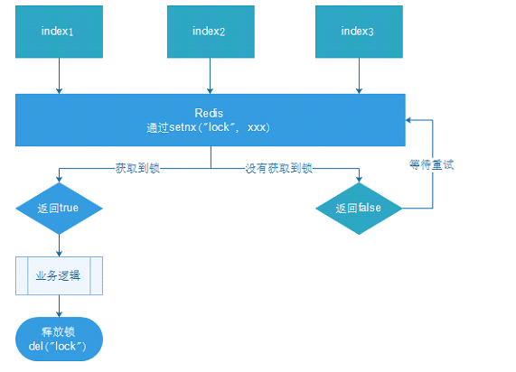
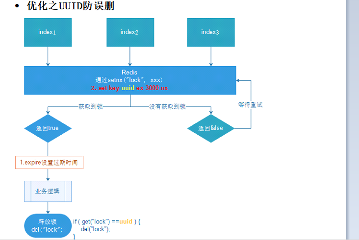

### 缓存穿透

问题描述：一次请求在个系统中转了一圈，没有任何命中。像是穿透了一遍。请求会经过所以数据层（缓存，数据库）


发生场景：大量恶意请求，不断穿透服务器恶意消耗服务器资源。


解决方案

1. 对空值进行缓存：如果一个查询返回的数据为空（不管是数据是否不存在），我们仍然把这个空结果（null）进行缓存，设置空结果的过期时间会很短，最长不超过五分钟。
   该方法治标不治本，请求方随便更改一个参数就会创建一个key，导致大量无用key存在
2. 设置访问白名单：使用bitmaps类型定义一个可以访问的名单，名单id作为bitmaps的偏移量，每次访问和bitmap里面的id进行比较，如果访问id不在bitmaps里面，进行拦截，不允许访问。
3. 采用布隆过滤器：布隆过滤器原理和bitmaps一致，不过底层算法对查找进行了高度的优化，查询效率极高。判断不存在的一定能成功，判断存在的可能会误判，但概率较小


### 缓存击穿

问题描述：热点缓存没有命中，大量并发直接去请求数据库，导致数据库压力大增


发生场景：redis中热点key过期


解决方案

1. 预设置：在访问高峰期之前，将热点key的过期时间刷新，或者延长
2. 实时调整：监控热点缓存，提前更新缓存
3. 加锁：出现key过期后一个线程查询数据库时进行加排他锁，查询完后更新缓存，其他线程等待一段时间后再查询缓存，这时候缓存已经更新了，就不会增加数据库压力
   （阻塞其他线程会增加请求的延迟）


### 缓存雪崩

问题描述：相当于没有缓存的场景，所有请求都到了数据库层，缓存雪崩是严重的问题。


发生场景：大量热点key失效，redis服务宕机


解决方案

1. 构建多级缓存：nginx缓存 + redis缓存 +其他缓存（ehcache等）
2. 使用锁或队列：保证不会有大量的线程对数据库一次性进行读写，从而避免失效时大量的并发请求落到底层存储系统上。不适用高并发情况
3. 设置过期标准，自动更新缓存：记录缓存数据是否过期（设置提前量），如果过期会触发通知另外的线程在后台去更新实际key的缓存。
4. 将缓存失效时间分散开：在原有的失效时间基础上增加一个随机值，比如1-5分钟随机，这样每一个缓存的过期时间的重复率就会降低，就很难引发集体失效的事件。
5. 使用主从、哨兵、集群提高redis服务可靠性


### 分布式锁

​	分布式锁：分布式场景下加锁

​	随着业务发展的需要，原单体单机部署的系统被演化成分布式集群系统后，由于分布式系统多线程、多进程并且分布在不同机器上，这将`使原单机部署情况下的并发控制锁策略失效`，单纯的Java API并不能提供分布式锁的能力。为了解决这个问题就需要一种`跨JVM的互斥机制来控制共享资源的访问`，这就是分布式锁要解决的问题！


分布式锁实现方案：

1. 基于数据库
2. 基于缓存
3. 基于Zookeeper

原理：都是使用一种共公共资源来代替锁的特性


每一种分布式锁解决方案都有各自的优缺点：
1. 性能：redis最高
2. 可靠性：zookeeper最高


#### 模拟Redis分布式锁

实现依据：使用set指令中的互斥模式，一共key被设置后不能重复设置`setnx k1 v1`指令作为获取锁操作，以`del k1`作为释放锁操作

为了防止不规范操作——加锁后没有释放锁，一般加锁时都会设置过期时间，让锁在一定时间内容自动失效


分布式锁下执行流程

1. 多个客户端同时获取锁（setnx）
2. 获取成功，执行业务逻辑{从db获取数据，放入缓存}，执行完成释放锁（del）
3. 其他客户端等待重试




命令

```
// 
setnx k1 v1
expire k1 10
del k1

// 
set k v NX EX 10
del k1
```


#### java实现

```java
@GetMapping("testLock")
public void testLock(){
    //1获取锁，setne，设置过期时间
// redisTemplate.opsForValue().setIfAbsent("lock", "111",3,TimeUnit.SECONDS);
    Boolean lock = redisTemplate.opsForValue().setIfAbsent("lock", "111");
    //2获取锁成功、查询num的值
    if(lock){
        Object value = redisTemplate.opsForValue().get("num");
        //2.1判断num为空return
        if(StringUtils.isEmpty(value)){
            return;
        }
        //2.2有值就转成成int
        int num = Integer.parseInt(value+"");
        //2.3把redis的num加1
        redisTemplate.opsForValue().set("num", ++num);
        //2.4释放锁，del
        redisTemplate.delete("lock");

    }else{
        //3获取锁失败、每隔0.1秒再获取
        try {
            Thread.sleep(100);
            testLock();
        } catch (InterruptedException e) {
            e.printStackTrace();
        }
    }
}

```


#### UUID防止锁误删

A加锁，被B误删除


发生场景：

1. A加锁并设置了过期时间3s，A执行业务操作7s（正常业务可能只需要1s，不排除异常阻塞情况会导致业务操作加长）
2. B等待3s后获取锁，设置过期时间10s
3. A执行完业务操作进行删除锁操作，将B的锁删除了（`A将B的锁删除`）
4. 此时B的业务没有完成，都是锁已经不在了，其他进程C可以获取锁进行操作
5. 异常发生了，临界区中有两个进程同时再操作


解决方案：

充分利用value的值，将value的值设置成UUID，每个进程只能删除自己UUID的key。




#### LUA脚本保证操作的原子性

UUID防止误删除中判断UUID相等，和删除动作执行两者并不是一共原子性操作，也就是这两个动作之间依然可能发生误删除情况，如下

1. A判断UUID相等，准备执行删除操作
2. A设置的key过期，B获取了锁
3. A执行删除锁操作将B的锁删除了

又发生了误删除情况，这是由于判断动作和删除动作执行没有原子性造成的。


类似的没有原子性问题，都可以使用lua脚本解决

```java
@GetMapping("testLockLua")
public void testLockLua() {
    //1 声明一个uuid ,将做为一个value 放入我们的key所对应的值中
    String uuid = UUID.randomUUID().toString();
    //2 定义一个锁：lua 脚本可以使用同一把锁，来实现删除！
    String skuId = "25"; // 访问skuId 为25号的商品 100008348542
    String locKey = "lock:" + skuId; // 锁住的是每个商品的数据

    // 3 获取锁
    Boolean lock = redisTemplate.opsForValue().setIfAbsent(locKey, uuid, 3, TimeUnit.SECONDS);

    if (lock) {
        // 执行的业务逻辑开始
        // 获取缓存中的num 数据
        Object value = redisTemplate.opsForValue().get("num");
        // 如果是空直接返回
        if (StringUtils.isEmpty(value)) {
            return;
        }
        int num = Integer.parseInt(value + "");
        // 使num 每次+1 放入缓存
        redisTemplate.opsForValue().set("num", String.valueOf(++num));
        
        
/*使用lua脚本来删除锁*/
        // 定义lua 脚本
        String script = "if redis.call('get', KEYS[1]) == ARGV[1] then return redis.call('del', KEYS[1]) else return 0 end";
        // 封装再对象中
        DefaultRedisScript<Long> redisScript = new DefaultRedisScript<>();
        redisScript.setScriptText(script);
        // 设置一下返回值类型 为Long
        // 因为删除判断的时候，返回的0,给其封装为数据类型。如果不封装那么默认返回String 类型，
        // 那么返回字符串与0 会有发生错误。
        redisScript.setResultType(Long.class);
        // 执行脚本，第一个要是script 脚本 ，第二个需要判断的key，第三个就是key所对应的值。
        redisTemplate.execute(redisScript, Arrays.asList(locKey), uuid);
        
        
    } else {
        // 其他线程等待
        try {
            // 睡眠
            Thread.sleep(1000);
            // 睡醒了之后，调用方法。
            testLockLua();
        } catch (InterruptedException e) {
            e.printStackTrace();
        }
    }
}

```


#### 分布式锁使用小结

- 互斥性。在任意时刻，只有一个客户端能持有锁。
- 不会发生死锁。即使有一个客户端在持有锁的期间崩溃而没有主动解锁，也能保证后续其他客户端能加锁。
- 解铃还须系铃人。加锁和解锁必须是同一个客户端，客户端自己不能把别人加的锁给解了。
- 加锁和解锁必须具有原子性。