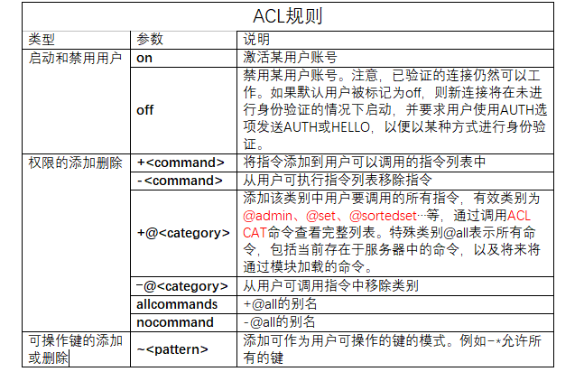
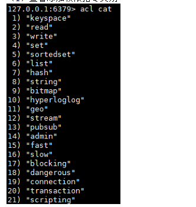
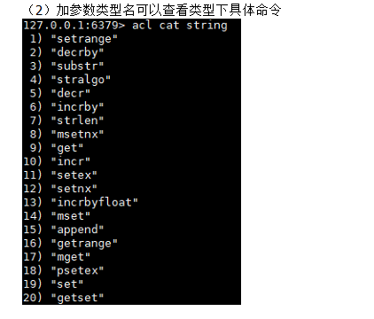
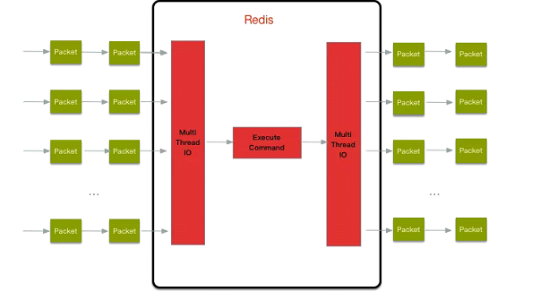

### ACL

访问控制列表：是Redis6中新增加的特性，为了弥补老版本redis安全性不足的问题。acl可以控制不同用户是否有执行redis的命令权限（如：flushdb等危险性操作），控制不同用户是否有查看某些key的权限

进行更细粒度的权限控制 ：
（1）接入权限:用户名和密码 
（2）可以执行的命令 
（3）可以操作的 KEY


相关命令

- 展现用户权限列表

  ```
  acl list
  ```

- 查看当前用户

  ```
  acl whoami
  ```

- 创建用户

  ```
  // 设置用户，默认没有激活
  acl setuser name
  
  // 设置用户和密码，并激活
  // on表示激活，>后跟着的就是密码
  acl setuser name on >password
  
  // 创建用户设置权限
  // ~开头表示可以操作的key，这里设置了所有以cached:开头的key都可以操作
  // +开头表示可以使用的指令，这里设置了只能使用get指令
  acl setuser name on >password ~cached:* +get
  ```

  

- 切换用户

  ```
  auth name password 
  ```

- 查看添加权限指令类别

  ```
  acl cat
  
  // 进一步附加参数查看详细信息
  acl cat string
  ```

  
  


### IO多线程

Redis6终于支撑多线程了，告别单线程了吗？
IO多线程其实指客户端交互部分的`网络IO交互处理模块多线程`，而非执行命令多线程。Redis6`执行命令依然是单线程`。

Redis 的多线程部分只是用来处理网络数据的读写和协议解析，执行命令仍然是单线程。

之所以这么设计是不想因为多线程而变得复杂，需要去控制 key、lua、事务，LPUSH/LPOP 等等的并发问题




多线程需要配置文件开启

```
// 开启多线程
io-threads-do-reads  yes 

// 配置线程个数
io-threads 4
```


### Cluster集群支持

Redis5以后将redis-trib.rb集成到redis-cli中，不需要单独安装ruby

官方redis-benchmark.exe支持cluster 模式了，通过多线程的方式对多个分片进行压测


### 其他特性

1、RESP3新的 Redis 通信协议：`优化服务端与客户端之间通信`

2、Client side caching客户端缓存：基于 RESP3 协议实现的客户端缓存功能。为了进一步提升缓存的性能，`将客户端经常访问的数据cache到客户端。减少TCP网络交互`。

3、Proxy集群代理模式：Proxy 功能，`让 Cluster 拥有像单实例一样的接入方式`，降低大家使用cluster的门槛。不过需要注意的是代理不改变 Cluster 的功能限制，不支持的命令还是不会支持，比如跨 slot 的多Key操作。

4、Modules API
Redis 6中模块API开发进展非常大，因为Redis Labs为了开发复杂的功能，从一开始就用上Redis模块。Redis可以变成一个框架，利用Modules来构建不同系统，而不需要从头开始写然后还要BSD许可。Redis一开始就是一个向编写各种系统开放的平台。