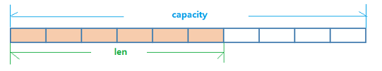
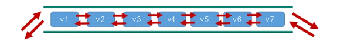
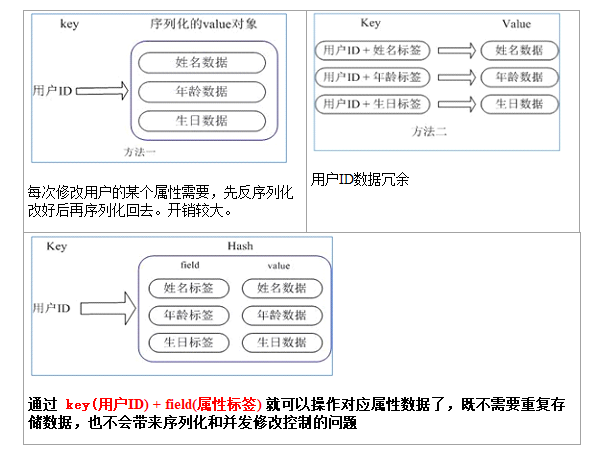
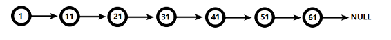
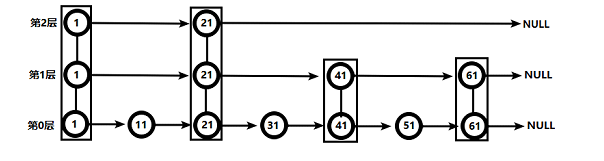

### Redis Key操作

- 查看当前库中的所有key

  ```
  keys *
  ```

- 某个key是否存在

  ```
  // 返回1表示存在，0表示不存在
  exists key
  ```

- 判断key的类型

  ```
  type key
  ```

- 删除key

  ```
  // 直接删除key，和其对应的value
  del key
  ```

- 删除key，非阻塞式

  ```
  // 先将key从keyspace中删除，后续的value会异步删除
  unlink key
  ```

- 设置key过期时间

  ```
  // 单位是秒
  expire key 10
  ```

- 查看有效时间

  ```
  // -1表示永不过期，-2表示已经过期，若创建key时没有设置过期时间则永不过期
  ttl key
  ```

- 切换数据库

  ```
  // 切换到1数据库
  select 1
  ```

- 查看当前数据库中key的数量

  ```
  dbsize
  ```

- 清空当前库

  ```
  flushdb
  ```

- 清空所有库

  ```
  flushall
  ```

  


> 在Redis中key都是字符串形式，value有如下5种形式
>
> redis中的数据类型都是指value的类型，类型判断也是对value进行判断

### 字符串：String

String是Redis最基本的类型，你可以理解成与Memcached一模一样的类型，一个key对应一个value。

String类型是`二进制安全的`。意味着Redis的string可以包含任何数据。比如jpg图片或者序列化的对象。

（将二进制内容以字节方式表示为字符串保存在redis中后，取出时可以正常转换回去）

String类型是Redis最基本的数据类型，一个Redis中字符串value最多可以是512M


#### 常用命令

- 添加k-v

  ```
  // 添加k-v，若k已经存在则覆盖原有的value，XX模式，默认
  set k v
  // 添加k-v，若k已经存在则插入k-v失败，NX模式
  set k v NX
  // 设置key的有效时间为10秒
  set k v EX 10
  // 设置key的有效时间为10毫秒
  set k v PX 10
  
  
  *NX：当数据库中key不存在时，可以将key-value添加数据库
  *XX：当数据库中key存在时，可以将key-value添加数据库，与NX参数互斥
  *EX：key的超时秒数
  *PX：key的超时毫秒数，与EX互斥
  
  ```

- 通过key获取value

  ```
  get k
  ```

- 追加value

  ```
  // 在value尾部追加字符串，结果返回追加后整个value的长度
  append k v
  ```

- 获取对应key的value长度

  ```
  strlen k
  ```

- 添加k-v

  ```
  // 只有库中不存在相同key时才能插入成功
  setnx k v
  ```

- 数值型value+1

  ```
  // 若非数值型则报错，成功则返回增加后的结果，原子性操作
  incr k
  ```

- 数值型value-1

  ```
  // 若非数值型则报错，成功则返回减少后的结果，原子性操作
  decr k
  ```

- 数值型value +/- 自定义步长

  ```
  // 若非数值型则报错，成功则返回增加/减少后的结果，非原子性操作
  incrby / decrby  <key><步长>
  ```

-  同时设置多个k-v

  ```
  // 覆盖模式
  mset  <key1><value1><key2><value2>
  ```

- 同时设置多个k-v

  ```
  // 非覆盖模式，只有全部不存在时才插入成功，不会出现部分插入成功的情况
  msetnx  <key1><value1><key2><value2>
  ```

- 同时获得多个value

  ```
  mget  <key1><key2>
  ```

- 获取部分value

  ```
  // 获取从起始位置开始，到结束位置的子串，包含开始和结束位置
  getrange <key> <start> <stop>
  ```

- 在value的指定位置插入

  ```
  // 在指定下标之前插入值
  setrange <key> <offset> <value>
  ```

- 获取旧值设置新值

  ```
  // 复合命令
  getset key value
  ```


#### 底层数据结构

String的数据结构为简单动态字符串(Simple Dynamic String,缩写SDS)。是可以修改的字符串，内部结构实现上类似于Java的ArrayList，采用预分配冗余空间的方式来减少内存的频繁分配.



如图中所示，内部为当前字符串实际分配的空间capacity一般要高于实际字符串长度len。当字符串长度小于1M时，扩容都是加倍现有的空间，如果超过1M，扩容时一次只会多扩1M的空间。需要`注意的是字符串最大长度为512M`。


### 列表：List

List类型是一个单键多值形式
Redis 列表是简单的字符串列表，按照插入顺序排序。你可以添加一个元素到列表的头部（左边）或者尾部（右边）。
它的底层实际是个双向链表，对两端的操作性能很高，通过索引下标的操作中间的节点性能会较差。




#### 常用命令

- 从头或尾插入一个元素

  ```
  lpush/rpush  <key><value1><value2><value3> 
  ```

- 从头或为弹出一个元素

  ```
  // 从列表中弹出一个值，若弹出后列表为空，则键被删除
  lpop/rpop <key>
  ```

- 从一个列表的右边弹出，插入到另一个列表的左边

  ```
  rpoplpush  <key1><key2>
  ```

- 查看列表一定范围内的元素

  ```
  // 从左边开始，输出开始位置到结束位置的元素，包含开始和结尾
  lrange <key><start><stop>
  
  // 输出列表的全部元素，-1表示最后
  lrange <key> 0 -1
  ```

- 按照索引获取元素

  ```
  // 索引从左开始计算
  lindex <key><index>
  ```

- 获取列表长度

  ```
  llen <key>
  ```

- 插入元素

  ```
  // 在指定值之前插入一个元素，会逐个值比较
  linsert <key>  before <value><newvalue>
  
  // 在指定值之后插入一个元素，会逐个值比较
  linsert <key>  after <value><newvalue>
  ```

- 删除n个元素

  ```
  // 从左边开始，删除n个指定值
  lrem <key><n><value>
  // 删除k1列表中从左边开始的一个3
  lrem k1 1 3
  ```

- 替换元素

  ```
  // 从左边开始替换下表为index元素的值
  lset<key><index><value>
  ```


#### 数据结构

List的数据结构为快速链表quickList。
首先在列表元素较少的情况下会使用一块连续的内存存储，这个结构是ziplist，也即是压缩列表。
它将所有的元素紧挨着一起存储，分配的是一块连续的内存。
当数据量比较多的时候才会改成quicklist。
因为普通的链表需要的附加指针空间太大，会比较浪费空间。比如这个列表里存的只是int类型的数据，结构上还需要两个额外的指针prev和next。


Redis将链表和ziplist结合起来组成了quicklist。也就是将多个ziplist使用双向指针串起来使用。这样既满足了快速的插入删除性能，又不会出现太大的空间冗余。


### 集合：Set

Redis set对外提供的功能与list类似是一个列表的功能，特殊之处在于set是可以`自动排重`的，当你需要存储一个列表数据，又不希望出现重复数据时，set是一个很好的选择，并且`set提供了判断某个成员是否在一个set集合内的重要接口`，这个也是list所不能提供的。
Redis的Set是string类型的无序集合。它底层其实是一个value为null的hash表，所以添加，删除，查找的复杂度都是O(1)。
一个算法，随着数据的增加，执行时间的长短，如果是O(1)，数据增加，查找数据的时间不变


#### 常用命令

- 添加元素到集合中

  ```
  sadd sadd <key><value1><value2> ..... 
  ```

- 取出集合中的所有值

  ```
  // 不会删除集合中的值
  smembers <key>
  ```

- 获取集合元素个数

  ```
  scard<key>
  ```

- 判断一个值是否在集合中

  ```
  // 若放在返回1，不存在返回0
  sismember <key><value>
  ```

- 删除集合中的某些值

  ```
  srem <key><value1><value2> ...
  ```

- 从集合中随机吐出n个值

  ```
  spop <key> <count>
  ```

- 随机从该集合中取出n个值。不会从集合中删除

  ```
  srandmember <key><n>
  ```

- 把值从一个集合转移到另一个集合

  ```
  // 移动的值会从原集合中删除
  smove <source><destination>value
  ```

- 计算集合交集元素

  ```
  sinter <key1><key2>
  ```

- 计算集合并集元素

  ```
  sunion <key1><key2>
  ```

- 计算集合差集元素

  ```
  // k1中有k2中没有的值
  sdiff <key1><key2>
  ```


#### 数据结构

Set数据结构是dict字典，字典是用哈希表实现的。
Java中HashSet的内部实现使用的是HashMap，只不过所有的value都指向同一个对象。Redis的set结构也是一样，它的内部也使用hash结构，所有的value都指向同一个内部值。


### 哈希表：Hash

Redis hash 是一个`键值对集合`。（集合的内容是键值对，上述集合的内容都只是单单的值）

相当于：k-v（v里面也是k-v的形式，一种键值对的嵌套，这里内层的key叫做field）

Redis hash是一个string类型的field和value的映射表，hash特别适合用于存储对象。
类似Java里面的Map<String,Object>
用户ID为查找的key，存储的value用户对象包含姓名，年龄，生日等信息，如果用普通的key/value结构来存储




#### 常用操作

- 向hash中添加元素

  ```
  // 返回值1表示添加成功，返回值0表示覆盖原有的value
  hset <key><field><value>
  // 当field不存在时才能添加成功，若存在则添加失败，返回值0表示失败，1表示成功
  hsetnx <key><field><value>
  ```

- 获取hash中某个field的value

  ```
  hget <key1><field>
  ```

- 批量向hash中添加元素

  ```
  // 若有重复field则覆盖原有value
  hmset <key1><field1><value1><field2><value2>...
  ```

- 判断给定field是否存在

  ```
  // 返回1表示存在，0表示不存在
  hexists<key1><field>
  ```

- 列出该hash中所有field

  ```
  hkeys <key>
  ```

- 列出该hash中所有value

  ```
  hvals <key>
  ```

- 给某个field的value增加一定数值

  ```
  // 返回增加后的结果
  hincrby <key><field><increment>
  ```


#### 数据结构

Hash类型对应的数据结构是两种：ziplist（压缩列表），hashtable（哈希表）。当field-value长度较短且个数较少时，使用ziplist，否则使用hashtable。


### 有序集合：Zset

Redis有序集合zset与普通集合set非常相似，是一个没有重复元素的字符串集合。
不同之处是有序集合的`每个成员都关联了一个评分（score）`,这个评分（score）被用来按照从最低分到最高分的方式排序集合中的成员。集合的成员是唯一的，但是评分可以是重复了 。
因为`元素是有序的`, 所以你也可以很快的根据评分（score）或者次序（position）来获取一个范围的元素。
访问有序集合的中间元素也是非常快的,因此你能够使用有序集合作为一个没有重复成员的智能列表。


#### 常用方法

- 批量添加元素

  ```
  // 批量添加，可以选参数是否覆盖，自增等
  zadd key [NX|XX] [CH] [INCR] score member [score member ...]
  ```

- 获取集合中索引在一定范围内的元素

  ```
  // 包括开始和结束位置，可选参数是否展示value对应的score,从小到大
  zrange <key><start><stop>  [WITHSCORES]
  
  // 从大到小排序结果
  zrevrange key start stop [WITHSCORES] 
  ```

- 获取集合中score在一定范围内的元素的value

  ```
  // 包括最大值和最小值，可选参数是否展示value对应的score,从小到大
  zrangebyscore key min max [withscores] [limit offset count]
  
  // 从大到小排序结果
  zrevrangebyscore key max min [withscores] [limit offset count]               
  ```

- 为元素的score增加数值

  ```
  // 返回增加后的结果
  zincrby <key><increment><value>
  ```

- 删除指定元素

  ```
  zrem  <key><value>
  ```

- 统计一定score范围内的元素个数

  ```
  // 包含最大值和最小值，结果返回个数
  zcount <key><min><max>
  ```

- 返回元素在集合中的排名

  ```
  zrank <key><value>
  ```


#### 数据结构

SortedSet(zset)是Redis提供的一个非常特别的数据结构，一方面它等价于Java的数据结构Map<String, Double>，可以给每一个元素value赋予一个权重score，另一方面它又类似于TreeSet，内部的元素会按照权重score进行排序，可以得到每个元素的名次，还可以通过score的范围来获取元素的列表。
zset底层使用了两个数据结构
（1）hash，hash的作用就是关联元素value和权重score，`保障元素value的唯一性`，可以通过元素value找到相应的score值。
（2）跳跃表，`跳跃表的目的在于给元素value排序`，根据score的范围获取元素列表。


> 跳跃表
>
> 1、简介
> 	有序集合在生活中比较常见，例如根据成绩对学生排名，根据得分对玩家排名等。对于有序集合的底层实现，可以用数组、平衡树、链表等。数组不便元素的插入、删除；平衡树或红黑树虽然效率高但结构复杂；链表查询需要遍历所有效率低。Redis采用的是跳跃表。跳跃表效率堪比红黑树，实现远比红黑树简单。
> 2、实例
> 	对比有序链表和跳跃表，从链表中查询出51
> ⦁	有序链表
>
> 
>
> 要查找值为51的元素，需要从第一个元素开始依次查找、比较才能找到。共需要6次比较。
> ⦁	跳跃表
>
> 
>
> 从第2层开始，1节点比51节点小，向后比较。
> 21节点比51节点小，继续向后比较，后面就是NULL了，所以从21节点向下到第1层
> 在第1层，41节点比51节点小，继续向后，61节点比51节点大，所以从41向下
> 在第0层，51节点为要查找的节点，节点被找到，共查找4次。
>
> 从此可以看出跳跃表比有序链表效率要高