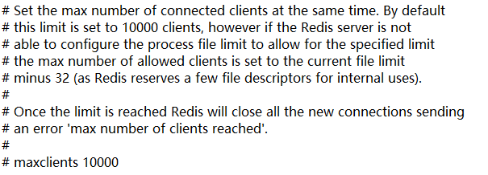

### 配置有以下几个部分

#### 单位（UNIT）

redis默认的单位简写


#### 包含(INCLUDES )

可以将配置单独写在一个配置文件中然后通过语句引入


#### 网络(NETWORK )

使用bind配置允许哪些ip连接


保护模式下只允许本地连接


本地监听的端口


TCP连接队列数


连接超时设置


TCP保活时间


#### 通用(GENERAL )

配置为后台进程


日志提示等级


日志输出路径


设置默认数据库个数


#### 安全(SECURITY )

开启认证


foobared就是密码

在命令行中开启临时认证，重启服务即失效


#### 限制(LIMITS )

设置最大连接数




设置最大内存量，若超过则根据maxmemory-policy指定的策略来丢弃key


⦁	设置redis可以使用的内存量。一旦到达内存使用上限，redis将会试图移除内部数据，移除规则可以通过maxmemory-policy来指定。
⦁	如果redis无法根据移除规则来移除内存中的数据，或者设置了“不允许移除”，那么redis则会针对那些需要申请内存的指令返回错误信息，比如SET、LPUSH等。
⦁	但是对于无内存申请的指令，仍然会正常响应，比如GET等。如果你的redis是主redis（说明你的redis有从redis），那么在设置内存使用上限时，需要在系统中留出一些内存空间给同步队列缓存，只有在你设置的是“不移除”的情况下，才不用考虑这个因素。


⦁	volatile-lru：使用LRU算法移除key，只对设置了过期时间的键；（最近最少使用）
⦁	allkeys-lru：在所有集合key中，使用LRU算法移除key
⦁	volatile-random：在过期集合中移除随机的key，只对设置了过期时间的键
⦁	allkeys-random：在所有集合key中，移除随机的key
⦁	volatile-ttl：移除那些TTL值最小的key，即那些最近要过期的key
⦁	noeviction：不进行移除。针对写操作，只是返回错误信息


设置样本数量


#### 快照(SNAPSHOTTING)

快照保存规则

```
// 900s内发生1次key的修改则进行保存
save 900 1 
// 300s内发生10次key的修改则进行保存
save 300 10
// 60s内发生1000次key的修改则进行保存
save 60 10000
```

当硬盘空间不足时停止写功能


快照文件使用LZF压缩算法，默认开启


快照文件使用CRC算法校验完整性，默认开启


快照文件默认名：dump.rdb


快照文件默认保存位置：当前文件夹下


#### AOF(APPEND ONLY MODE)

默认关闭


默认文件名称：appendonly.aof


设置同步频率


在重写时是否继续AOF操作，默认为no，表示重写时依然要进行AOF，这时候就会发生阻塞，等待重写完成。若设置为yes，就表示重写时不进行AOF操作，用户请求不会阻塞。要容忍这一段时间内数据丢失的可能性


设置重写基准值

auto-aof-rewrite-percentage：AOF文件增长多少比例时才进行重写，默认为一倍

auto-aof-rewrite-min-size：第一次AOF增长到多大时进行重写，默认为64，后续重写不考虑这个值，只关注增长比利。


恢复操作时会忽略最后一条可能存在错误的指令


#### 集群(CLUSTER )

开启集群


集群节点配置文件名


集群节点超时设置


```markdown
cluster-slave-validity-factor 10  
#在进行故障转移的时候全部slave都会请求申请为master，但是有些slave可能与master断开连接一段时间了导致数据过于陈旧，不应该被提升为master。该参数就是用来判断slave节点与master断线的时间是否过长。判断方法是：比较slave断开连接的时间和(node-timeout * slave-validity-factor)+ repl-ping-slave-period如果节点超时时间为三十秒, 并且slave-validity-factor为10，假设默认的repl-ping-slave-period是10秒，即如果超过310秒slave将不会尝试进行故障转移
```


```markdown
cluster-migration-barrier 1  
#master的slave数量大于该值，slave才能迁移到其他孤立master上，如这个参数被设为2，那么只有当一个主节点拥有2个可工作的从节点时，它的一个从节点才会尝试迁移。
```


一组节点挂掉整个集群是否挂掉，yes表示会挂掉，no表示不会挂掉

