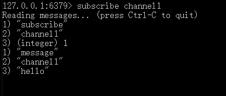

### 简介

Redis 发布订阅 (pub/sub) 是一种消息通信模式：发送者 (pub) 发送消息，订阅者 (sub) 接收消息。

### 示例

⦁	打开一个客户端订阅channel1
SUBSCRIBE channel1

2、打开另一个客户端，给channel1发布消息hello
publish channel1 hello

返回的1是订阅者数量
3、打开第一个客户端可以看到发送的消息

注：发布的消息没有持久化，如果在订阅的客户端收不到hello，只能收到订阅后发布的消息