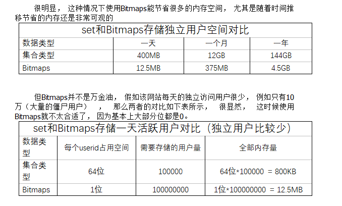

### Bitmaps

value为字符串类型，不过可以对字符串进行位操作，可以将该类型看作一个以位为元素的集合，数组的每个单元只能存储0和1， 数组的下标在Bitmaps中叫做偏移量


#### 常用命令

- 设置值

  ```
  //设置Bitmaps中某个偏移量的值（0或1）
  setbit<key><offset><value>
  ```

- 获取值

  ```
  getbit<key><offset>
  ```

- 统计位数组中为1的个数

  ```
  // 统计一定范围内的1个数，默认统计所有，包含开始和结束
  bitcount <key>[start end]
  ```

- 逻辑运算

  ```
  bitop  and(or/not/xor) <destkey> [key…]
  
  // 返回k1、k2中相同位的数量
  bitop and k1 k2
  ```

#### Bitmaps与set比较





#### 数据结构

string


### HyperLogLog

是一种用来解决基数统计场景下，内存占用量大的难题

Redis HyperLogLog 是用来做基数统计的算法，HyperLogLog 的优点是，在`输入元素的数量或者体积非常非常大时，计算基数所需的空间总是固定的、并且是很小的`。

在 Redis 里面，每个 `HyperLogLog 键只需要花费 12 KB 内存，就可以计算接近 2^64` 个不同元素的基数。这和计算基数时，元素越多耗费内存就越多的集合形成鲜明对比。

但是，因为 `HyperLogLog 只会根据输入元素来计算基数，而不会储存输入元素本身`，所以 HyperLogLog 不能像集合那样，返回输入的各个元素。

什么是基数?
比如数据集 {1, 3, 5, 7, 5, 7, 8}， 那么这个数据集的基数集为 {1, 3, 5 ,7, 8}, 基数(不重复元素)为5。 基数估计就是在误差可接受的范围内，快速计算基数。


#### 常用命令

- 添加元素到HyperLogLog 中

  ```
  // 返回值1表示添加成功，0表示已存在
  pfadd <key>< element> [element ...]   
  ```

- 统计HyperLogLog中元素个数

  ```
  pfcount<key> [key ...] 
  ```

- 合并两个HyperLogLog到一个新的HyperLogLog中

  ```
  pfmerge<destkey><sourcekey> [sourcekey ...]
  ```


#### HyperLogLog与set

HyperLogLog功能目的明确，值统计不重复元素的个数，不保存元素本地

set可以获取元素本身的值


#### 数据结构

string


### Geospatial

Redis 3.2 中增加了`对GEO类型的支持`。GEO，Geographic，地理信息的缩写。该类型，就是元素的2维坐标，在地图上就是经纬度。redis基于该类型，提供了经纬度设置，查询，范围查询，距离查询，经纬度Hash等常见操作。


#### 常用命令

- 添加地理位置

  ```
  // 经度，纬度，名称
  geoadd<key>< longitude><latitude><member> [longitude latitude member...]  
  
  // 实例
  geoadd china:city 121.47 31.23 shanghai
  ```

- 获取位置的经纬度

  ```
  //
  geopos  <key><member> [member...] 
  ```

- 获取两个地点之间的直线距离

  ```
  // 可以设置距离单位
  geodist<key><member1><member2>  [m|km|ft|mi ]  
  ```

- 以给定的经纬度为中心，找出某一半径内的元素

  ```
  georadius<key>< longitude><latitude>radius  m|km|ft|mi   
  ```

  

#### 数据结构

ZSET