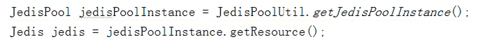

### Redis的事务性

​	Redis的事务是一个完全隔离的操作，事务中的所有命令都会被序列化，按照顺序执行，不会被其他客户端发送来的命令所打断。

​	Redis事务的主要目的就是串联多个命令，防止事务之外的命令插队。相当于mysql中的最高的隔离等级。


### Redis事务操作

​	Redis事务操作通过3个关键字实现，Multi、Exec、discard


1. 执行Multi指令，进入组队阶段，该阶段执行的命令都会进入命令队列中
2. 执行Exec指令，进入执行阶段，会顺序执行命令队列中的指令
3. 在组队阶段执行discard指令，可以退出组队阶段，抛弃命令队列中所有的指令


#### 示例1

组队-执行


#### 示例2

组队-放弃


#### 异常情况处理

组队阶段出现异常，指令队列中的所有指令都不会执行（大多为指令格式错误）


执行阶段出现异常，只有异常指令不会执行其他指令正常执行（大多为值操作错误），错误之前之后执行的指令结果都不会回滚。


### Redis事务冲突

​	由于Redis没有默认的隔离机制，在`事务的组队阶段其他事务可以被执行`，这意味着组队阶段的先决条件在执行阶段时可能已经发送变化，这就可能导致并发问题。

示例

1. 客户端一：设置一个k-v


2. 客户端一：进行组队阶段
   
3. 客户端二：对k1进行修改
   
4. 客户端一：进入执行阶段
   


客户端一原先预想的120并没有出现，而是变成了140


### Redis乐观锁机制实现

​	乐观锁(Optimistic Lock), 顾名思义，就是很乐观，每次去拿数据的时候都认为别人不会修改，所以不会上锁，但是在更新的时候会判断一下在此期间别人有没有去更新这个数据，可以使用版本号等机制。乐观锁适用于多读的应用类型，这样可以提高吞吐量。Redis就是利用这种`check-and-set机制`实现事务的。

​	check-and-set机制通过一个内置的版本号实现，每次修改时都会更新版本号，当下一个修改发生时先检查版本号与之前条件判断时的版本号是否一致，若不一致则期间有其他客户端进行修改，则不进行后续修改操作


实现：WATCH key [key ...] 指令

在事务执行之前使用watch指令监视一个key，在事务执行阶段前先检查该key的value是否发送过修改，若发生过则不进行执行阶段直接退出。

1. 客户端一：设置一个k-v


2. 客户端一：先对k1进行监视，再进行组队阶段
   
3. 客户端二：对k1进行修改
   
4. 客户端一：进入执行阶段，由于k1被修改过，所以执行失败
   


unwatch指令

取消 WATCH 命令对所有 key 的监视。
如果在执行 WATCH 命令之后，EXEC 命令或DISCARD 命令先被执行了的话，那么就不需要再执行UNWATCH 了。


### Redis事务特性

- 单独的隔离操作 
  - 事务中的所有命令都会序列化、按顺序地执行。事务在执行的过程中，不会被其他客户端发送来的命令请求所打断。

- 没有隔离级别的概念 
  - 队列中的命令没有提交之前都不会实际被执行，因为事务提交前任何指令都不会被实际执行

- 不保证原子性 
  - 事务中如果有一条命令执行失败，其后的命令仍然会被执行，没有回滚 


### Redis商品秒杀案例

步骤

1. 接受商品ID、用户ID作为参数，两者都不为空时才进行后续操作
2. 连接redis
3. 拼接key，商品库存key（string类型）、秒杀成功用户key（set类型）
4. 通过商品key获取库存信息，若库存为空则返回活动未开始
5. 判断用户是否已经秒杀商品，一人只能秒杀一次
6. 通过商品key获取库存信息，若库存大于0则进行秒杀
   1. 库存-1
   2. 用户加入成功集合
7. 通过商品key获取库存信息，若库存小于大于0则活动结束

```java
    public Boolean test(String pid, String uid){
        // 1、
        if (pid==null || uid==null){
            return false;
        }
        // 2、
        ValueOperations<String, String> ops = redisTemplate.opsForValue();
        SetOperations<String, String> opsForSet = redisTemplate.opsForSet();
        // 3、
        String kcKey = "sk:" + pid + ":qt";
        String userKey = "sk" + pid + ":user";
		// 4、
        if (ops.get(kcKey)==null){
            System.out.println("活动未开始");
            return false;
        }

        // 4、
        if (opsForSet.isMember(userKey,uid)!=null){
            System.out.println("不能重复参与");
            return false;
        }
        

        // 6、
        if (Integer.parseInt(ops.get(kcKey))>0){
            ops.decrement(kcKey);
            opsForSet.add(userKey,uid);
            return true;
        }
        // 7、
        else{
            System.out.println("活动结束");
            return false;
        }
    }
```

通过centOS内置的ab工具并发测试，在2000个请求300并发下出现超卖问题和连接超时问题


#### 超卖问题

问题原因：进行条件判断，和修改redis数据时没有锁操作和检查操作，导致两个或多个并发都通过了条件检查，都对库存进行了修改。


解决方法：redis乐观锁方案


1、原生Jedis乐观锁和事务实现

```java
jedis.watch(kckey);
Transcation multi = jedis.multi();

// 组队阶段
multi.decr(kckey);
multi.sadd(uid);

// 执行阶段
multi.exec();
```

2、redisTemplate的事务使用，使用@Transactional方式必须要配置数据源

```java
    @Test
    @Transactional
    void test(){
        ValueOperations<String, String> ops = redisTemplate.opsForValue();
        redisTemplate.setEnableTransactionSupport(true);
        redisTemplate.watch("k1");
        redisTemplate.multi();
        ops.set("k1","100");
        ops.set("k2","200");
        ops.get("k1");
        ops.get("k2");
	    redisTemplate.discard();
    }
```

3、redisTemplate的事务使用+乐观锁，execute方式

```java
    @Test
    void test() {
        redisTemplate.execute(new SessionCallback<String>() {
            @Override
            public <K, V> String execute(RedisOperations<K, V> operations) throws DataAccessException {
                ValueOperations<String, String> ops = redisTemplate.opsForValue();
                redisTemplate.watch("k1");
                redisTemplate.multi();
                ops.set("k1","100");
                ops.set("k2","200");
                ops.get("k1");
                ops.get("k2");
                redisTemplate.exec();
                return null;
            }
        });
    }
```


#### 连接超时问题

问题原因：大量的并发带来大量的redis连接操作，当连接数大于redis可处理上限时就会发生连接超时。


解决方法：复用已有连接


通过配置连接池解决


- MaxTotal：控制一个pool可分配多少个jedis实例，通过pool.getResource()来获取；如果赋值为-1，则表示不限制；如果pool已经分配了MaxTotal个jedis实例，则此时pool的状态为exhausted。
- maxIdle：控制一个pool最多有多少个状态为idle(空闲)的jedis实例；
- MaxWaitMillis：表示当borrow一个jedis实例时，最大的等待毫秒数，如果超过等待时间，则直接抛JedisConnectionException；
- testOnBorrow：获得一个jedis实例的时候是否检查连接可用性（ping()）；如果为true，则得到的jedis实例均是可用的；



池对象的getResource来获取客户端连接对象


#### 库存遗留问题

该问题时使用乐观锁解决超卖问题时，带来的另一个问题


产生原因：由于乐观锁的存在导致大量的并发请求通过条件判断，但是修改redis失败，导致库存大量遗留，用户抢购失败。


解决方法：

0、不处理，由于测试时请求数量有限，导致有库存剩余，实际场景中请求失败的用户也会再次请求，所以不用担心库存遗留，这种方案存在一定公平性问题


1、优化原有代码：在处理乐观锁修改失败的情况下，不直接退出，尝试再次修改。

该方案可能会导致大量redis连接循环等待，后续请求得不到处理


2、LUA脚本：超卖问题产生的原因是条件判断后才进行redis修改操作，这两个操作不在同一个事务中，使用`LUA脚本在redis中执行时是一个事务性的`，所以将源代码转换未LUA脚本后，就可以避免条件检查和修改redis不在一个事务中的问题。也就不会产生超卖问题和库存遗留问题。

> 将复杂的或者多步的redis操作，写为一个脚本，一次提交给redis执行，减少反复连接redis的次数。提升性能。
> LUA脚本是类似redis事务，有一定的原子性，不会被其他命令插队，可以完成一些redis事务性的操作。
> 但是注意redis的lua脚本功能，只有在Redis 2.6以上的版本才可以使用。

秒杀案例的LUA脚本代码

```lua
local userid=KEYS[1]; 
local prodid=KEYS[2];
// 拼接key
local qtkey="sk:"..prodid..":qt";
local usersKey="sk:"..prodid.":usr'; 
// 判断用户是否已经存在
local userExists=redis.call("sismember",usersKey,userid);
if tonumber(userExists)==1 then 
  return 2;
end
// 获取库存信息
local num= redis.call("get" ,qtkey);
if tonumber(num)<=0 then 
  return 0; 
else 
  redis.call("decr",qtkey);
  redis.call("sadd",usersKey,userid);
end
return 1;

// 返回值1表示抢购成功，0表示已经抢空，2表示已经抢购过
// 该LUA脚本里面的代码作为一个事件执行
```

Jedis中执行Lua脚本

1. 加载脚本（脚本是一个字符串）
2. 传入参数执行脚本


RedisTemplate执行Lua脚本

```java
    public <T> T execute(RedisScript<T> script, List<K> keys, Object... args) {
        return this.scriptExecutor.execute(script, keys, args);
    }

// RedisScript<T>可以通过传入一个String对象创建
```

