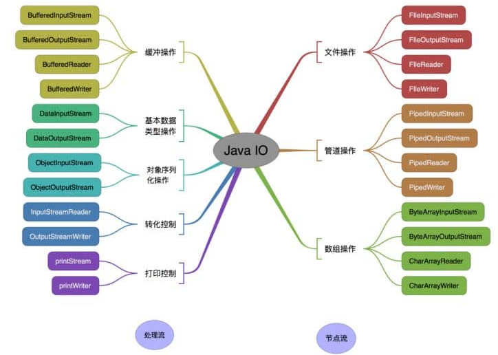
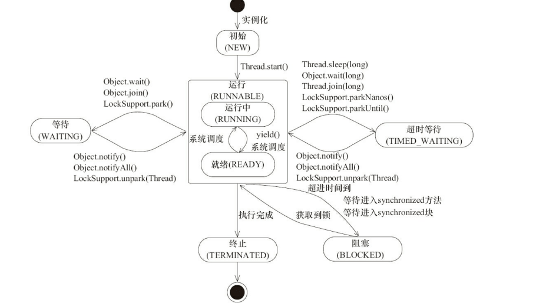
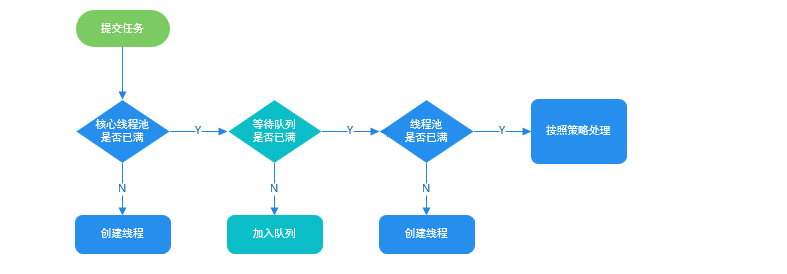
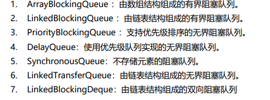
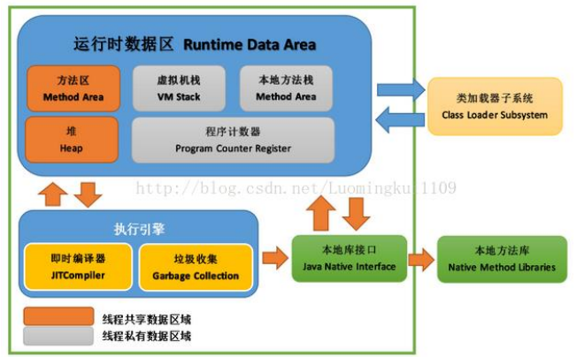

### Java基础

#### 1、基本数据类型

> java有8种基本数据类型
>
> 数值型：short、int、long、float、double
>
> 字符型：byte、char
>
> 布尔型：boolean

#### 2、方法重写与重载

> 重写：子类中重写父类方法，是多态的一种表现
>
> 要求
>
> - 方法名、方法参数列表都一致
> - 返回值必须比父类返回值类型更小或相等
> - 抛出异常的范围小于等于父类
> - 访问修饰符范围大于父类访问范围
>
> 重载：方法名称必须相同、参数列表中的参数个数、类型、排列顺序可以不同、方法返回值可以相同或不同（返回值不是方法签名的一部分——java核心技术卷）

#### 3、equal与==的区别

> ==：用来判断两个变量的值是否相等，在比较基本数据类型的时候直接使用，但对于保存对象地址的引用类型变量时就不符合实际要求了
>
> equeal()：是Object对象定义的方法，目的是提供一个判断引用类型相等情况的统一处理方法，在String等包装类中默认提供了equal()方法的实现——先判断对象地址是否相同，若相同直接直接返回，若不同在比较内存中的值是否相同

#### 4、HashCode()

> 在使用Hash表相关的集合中时使用。它可以用来快速得一个对象在集合中的位置，从而判断值是否相等。并且在必要的时候应该重写hashcode，默认提供的hashcode方法在对内容相同的不同对象可能回计算出两个不同的哈希值，这时候预期得到的应该是一个相同的预期时。这就会造成HashSet中存在重复元素的问题。
>
> 总结：
>
> - 在非集合对象中只需要重写equal()方法
> - 在哈希表有关的集合中应该重写HashCode()方法

#### 5、包装类型常量池

> Byte、Short、integer、Long：默认创建了[-128~127]对应数据的缓存
>
> Character：默认创建了[0,127]范围内的缓存数据
>
> 示例
>
> ```java
> Integer i1 = 33;
> Integer i2 = 33;
> System.out.println(i1 == i2);// 输出 true
> ```
>
> ```java
> Integer i1 = 40;
> Integer i2 = new Integer(40);
> System.out.println(i1==i2);// 输出false
> ```

#### 6、自动装箱自动拆箱

> ```java
> Integer i = 10;  //装箱
> int n = i;   //拆箱
> ```
>
> 对应的字节码
>
> ```
>    L1
> 
>     LINENUMBER 8 L1
> 
>     ALOAD 0
> 
>     BIPUSH 10
> 
>     INVOKESTATIC java/lang/Integer.valueOf (I)Ljava/lang/Integer;
> 
>     PUTFIELD AutoBoxTest.i : Ljava/lang/Integer;
> 
>    L2
> 
>     LINENUMBER 9 L2
> 
>     ALOAD 0
> 
>     ALOAD 0
> 
>     GETFIELD AutoBoxTest.i : Ljava/lang/Integer;
> 
>     INVOKEVIRTUAL java/lang/Integer.intValue ()I
> 
>     PUTFIELD AutoBoxTest.n : I
> 
>     RETURN
> 
> ```
>
> 装箱调用包装类的valueOf()方法
>
> 拆箱调用xxxValue()
>
> - `Integer i = 10` 等价于 `Integer i = Integer.valueOf(10)`
> - `int n = i` 等价于 `int n = i.intValue()`;


#### 7、面向对象

> - 子类拥有父类对象所有的属性和方法（包括私有属性和私有方法），但是父类中的私有属性和方法子类是无法访问，**只是拥有**。
>
> - 子类可以拥有自己属性和方法，即子类可以对父类进行扩展。
>
> - 子类可以用自己的方式实现父类的方法。


#### 8、浅拷贝和深拷贝

> **浅拷贝**：浅拷贝会在堆上创建一个新的对象（区别于引用拷贝的一点），不过，如果原对象内部的属性是引用类型的话，浅拷贝会直接复制内部对象的引用地址，也就是说拷贝对象和原对象共用同一个内部对象。
>
> **深拷贝** ：深拷贝会完全复制整个对象，包括这个对象所包含的内部对象。

#### 9、String、StringBuffer、StringBuild

> String：不可变字符串
>
> StringBuffer：可变字符串，线程安全，通过在方法上添加synchronized实现，字符串创建后回预留16bit
>
> StringBuild：可变字符串，线程不安全，字符串创建后回预留16bit
>
> 
>
> 扩容机制
>
> 当前数组容量不足时，创建一个新的char[]数组，将原char[]中的内容复制到新数组中
>
> 新数组的长度，若原数组长度*2+2能满足则使用这个新长度，若不能满足则使用要添加的字符串长度+原长度

#### 10、反射

> 反射：可以在程序运行期间多套获取类的信息、修改类


#### 11、序列化和反序列化

> - **序列化**： 将数据结构或对象转换成二进制字节流的过程
> - **反序列化**：将在序列化过程中所生成的二进制字节流转换成数据结构或者对象的过程
>
> **序列化的主要目的是通过网络传输对象或者说是将对象存储到文件系统、数据库、内存中。**
>
> java中不会被序列化的情况
>
> - 成员变量使用`transient`关键字修饰
> - 成员变量使用`static`关键字修饰

#### 12、I/O

> 字符输入流（Reader）
>
> - 节点流
>     - FileReader
>     - PipedReader
>     - CharArrayReader
>
> - 处理流
>     - BufferedReader
>     - InputStreamReader
>
> 字符输出流（Writer）
>
> - 节点流
>     - FileWriter
>     - PipedWriter
>     - CharArrayWriter
> - 处理流
>     - BufferedWriter
>     - OutputStreamWiter
>     - printWriter
>
> 字节输入流(InputStream)
>
> - 节点流
>     - FileInputStream
>     - PipedInputStream
>     - ByteArrayInputStream
> - 处理流
>     - BufferedInputStream
>     - DataInputStream
>     - ObjectInputStream
>     - SequenceInputStream
>
> 字节输出流（OutputStream）
>
> - 节点流
>     - FileOutputStream
>     - PipedOutputStream
>     - ByteArrayOutputStream
> - 处理流
>     - BufferedOutputStream
>     - DataOutputStream
>     - objectOutputStream
>     - PrintStream
>
> 


### Java集合

#### 1、List

> 特点：元素有序、可重复
>
> 实现类
>
> - ArrayList：是可扩容数组（动态数组），ArrayList不是线程安全的容器，多个线程操作时会发生并发错误，内部**基于数组实现**。支持随机访问
> - LinkedList：基于链表结构的数组，不支持随机访问（JDK1.6 之前为循环链表，JDK1.7为双向链表）
> - Vector：Vector是一个线程安全容器，它对内部的每个方法都粗暴的加锁，因此Vector的内存开销和使用效率与ArrayList相比较差。其内部也是**基于数组实现**。支持随机访问
> - Stack：堆栈它**继承了Vector**，是一种线程安全的容器，提供了常用的堆栈方法，如pop和push方法，是否为空empty方法，用来模拟栈结构

#### 2、Set

> 特点：元素无序、不可重复
>
> 实现类
>
> - HashSet：底层结构是**哈希表**(基于HashMap实现)，不是线程安全型，将对象的hashcode作为K，对象内容存储在Value中，非线程安全
> - TreeSet：是一个有序的集合，使用Comparable对元素进行自然排序，或者使用Comparator在创建时对元素提供定制的排序规则，不是一个线程安全型（**底层结构为红黑树**）
> - LinkedHashSet：用于保证元素的插入和取出顺序满足 FIFO 的场景，是Set接口的Hash和LinkedLisk的实现，与HashSet不同的是它维护着一个贯穿所有条目的双向链表，链表定义了元素插入集合的顺序，元素的插入和取出顺序满足 FIFO。不是线程安全型

#### 3、Queue

> 特点：按特定的排队规则来确定先后顺序，存储的元素是有序的、可重复的。
>
> Queue：单端队列，只能在一端插入另一端删除
>
> Deque：双端队列，可以在任意端插入和删除
>
> Queue实现类：
>
> - PriorityQueue：非线程安全，是在 JDK1.5 中被引入的, 其与 `Queue` 的区别在于元素出队顺序是与优先级相关的，即总是优先级最高的元素先出队。
>
> Deque实现类：
>
> - ArrayDeque：是基于可变长的数组和双指针来实现

#### 4、Map

> 特点：K-V形式存储，查找效率高
>
> 实现类
>
> - HashMap：非线程安全，初始大小16、负载因子0.75
>
>     - 扩容机制：当前集合中的元素=当前集合程度*负载因子，时触发扩容，容量变为原来的 2 倍
>
>     - null：可以保存null，只能由一个null的key，可以由任意多个null的value
>
>     - 哈希冲突：拉链法解决，当某个key上的链表长度大于8时且集合长度大于64时，将转换为红黑树，否则就会进行集合的扩容，并进行rehash
>
>     - 数组下标的确定：`(n - 1) & hash`，n代表当前哈希表的长度，hash代表当前key的哈希值，正常情况下元素下标是通过**hash%length**计算确定的，而HashMap将自身大小约束为2的整数倍就使得（**hash%length==hash&(length-1)的前提是 length 是 2 的 n 次方**），而&运算的速度远远大于%运算，所有HashMap回约束自身大小为2的整数倍
>
>     - hashCode计算：对象的HashCode值通过扰乱函数进一步散列之后得到
>
>         ```java
>             static final int hash(Object key) {
>               int h;
>               // key.hashCode()：返回散列值也就是hashcode
>               // ^ ：按位异或
>               // >>>:无符号右移，忽略符号位，空位都以0补齐
>               return (key == null) ? 0 : (h = key.hashCode()) ^ (h >>> 16);
>           }
>         ```
>
>     - 类属性：
>
>         ```java
>         public class HashMap<K,V> extends AbstractMap<K,V> implements Map<K,V>, Cloneable, Serializable {
>             // 序列号
>             private static final long serialVersionUID = 362498820763181265L;
>             // 默认的初始容量是16
>             static final int DEFAULT_INITIAL_CAPACITY = 1 << 4;
>             // 最大容量
>             static final int MAXIMUM_CAPACITY = 1 << 30;
>             // 默认的填充因子
>             static final float DEFAULT_LOAD_FACTOR = 0.75f;
>             // 当桶(bucket)上的结点数大于这个值时会转成红黑树
>             static final int TREEIFY_THRESHOLD = 8;
>             // 当桶(bucket)上的结点数小于这个值时树转链表
>             static final int UNTREEIFY_THRESHOLD = 6;
>             // 桶中结构转化为红黑树对应的table的最小大小
>             static final int MIN_TREEIFY_CAPACITY = 64;
>             // 存储元素的数组，总是2的幂次倍
>             transient Node<k,v>[] table;
>             // 存放具体元素的集
>             transient Set<map.entry<k,v>> entrySet;
>             // 存放元素的个数，注意这个不等于数组的长度。
>             transient int size;
>             // 每次扩容和更改map结构的计数器
>             transient int modCount;
>             // 临界值 当实际大小(容量*填充因子)超过临界值时，会进行扩容
>             int threshold;
>             // 加载因子
>             final float loadFactor;
>         }
>         
>         ```
>
> - HashTable：默认的初始大小为 11，之后每次扩充，容量变为原来的 2n+1，线程安全，通过整个哈希表加锁实现
>
> - TreeMap：TreeMap` 和`HashMap` 都继承自`AbstractMap`TreeMap`它还实现了`NavigableMap`接口和`SortedMap` 接口。
>     实现 `NavigableMap` 接口让 `TreeMap` 有了对集合内元素的搜索的能力。
>
>     实现`SortedMap`接口让 `TreeMap` 有了对集合中的元素根据键排序的能力。默认是按 key 的升序排序，可以自定义比较器
>
>     ```java
>     /**
>      * @author shuang.kou
>      * @createTime 2020年06月15日 17:02:00
>      */
>     public class Person {
>         private Integer age;
>     
>         public Person(Integer age) {
>             this.age = age;
>         }
>     
>         public Integer getAge() {
>             return age;
>         }
>     
>     
>         public static void main(String[] args) {
>             TreeMap<Person, String> treeMap = new TreeMap<>(new Comparator<Person>() {
>                 @Override
>                 public int compare(Person person1, Person person2) {
>                     int num = person1.getAge() - person2.getAge();
>                     return Integer.compare(num, 0);
>                 }
>             });
>             treeMap.put(new Person(3), "person1");
>             treeMap.put(new Person(18), "person2");
>             treeMap.put(new Person(35), "person3");
>             treeMap.put(new Person(16), "person4");
>             treeMap.entrySet().stream().forEach(personStringEntry -> {
>                 System.out.println(personStringEntry.getValue());
>             });
>         }
>     }
>     
>     ```
>
> - LinkedHashMap：是哈希表和链表两种结构的实现，维护着一个贯穿所有条目的双向链表，链表定义了元素插入集合的顺序

### Java多线程

#### 1、线程状态和生命周期



> sleep()与wait()的区别
>
> - sleep不会释放锁
> - wait会释放锁
>
> join()与wait()
>
> - join()：是由当前线程对象调用，底层还是调用wait()，JVM会帮我们隐式调用`notify`，因此我们不需要主动notify唤醒主线程。
> - wait()：Object的方法，通过对象.wait()调用

#### 2、synchronized关键字

> synchronized关键字用来解决多线程的同步问题，它可以保证被它修饰的内容在任意时刻只有一个只有一个线程执行
>
> 修饰内容
>
> - 修饰示例方法
>
>     ```java
>     synchronized void method() {
>         //业务代码
>     }
>     ```
>
> - 修饰静态方法
>
>     ```java
>     synchronized static void method() {
>         //业务代码
>     }
>     ```
>
> - 修饰代码块
>
>     ```java
>     synchronized(this) {
>         //业务代码
>     }
>     //指定加锁对象，对给定对象/类加锁。synchronized(this|object) 表示进入同步代码库前要获得给定对象的锁。synchronized(类.class) 表示进入同步代码前要获得 当前 class 的锁
>     
>     ```
>
> `synchronized` 同步语句块的实现使用的是 `monitorenter` 和 `monitorexit` 指令，其中 `monitorenter` 指令指向同步代码块的开始位置，`monitorexit` 指令则指明同步代码块的结束位置。
>
> `synchronized` 修饰的方法并没有 `monitorenter` 指令和 `monitorexit` 指令，取得代之的确实是 `ACC_SYNCHRONIZED` 标识，该标识指明了该方法是一个同步方法。

#### 3、ReentrantLock

> 可重入锁：自己可以再次获取自己内部的锁
>
> ReentrantLock与synchronized
>
> 相同点
>
> - ReentrantLock与synchronized都是可重入锁，都保证了可见性、互斥性
>
> 不同点
>
> - ReentrantLock是API级别的锁实现，synchronized是JVM级别的锁实现
> - ReentrantLock提供几个高级功能
>     - 等待可中断：可以中断正在等待锁的线程，通过 `lock.lockInterruptibly()` 来实现这个机制。也就是说正在等待的线程可以选择放弃等待，改为处理其他事情
>     - 可实现公平锁： `ReentrantLock`可以指定是公平锁还是非公平锁。而`synchronized`只能是非公平锁。所谓的公平锁就是先等待的线程先获得锁。`ReentrantLock`默认情况是非公平的，可以通过 `ReentrantLock`类的`ReentrantLock(boolean fair)`构造方法来制定是否是公平的。
> - synchronized在发生异常时会自动释放锁不会发生死锁现象，ReentrantLock在发生异常时若没有进行unlock处理可能会发生死锁现象
> - 

#### 4、线程池

> 使用线程池的好处
>
> - 提供响应效率
> - 降低资源开销
> - 提高线程可管理性
>
> 线程池结构
>
> - 线程管理器：创建并管理线程池
> - 工作线程：线程池中的线程
> - 任务接口：每个任务必须实现接口，用于工作线程调度
> - 任务队列：用来存放在处理的任务
>
> ThreadPoolExecutor构造参数
>
> 1. corePoolSize：指定线程池中最少线程数量
> 2. maximumPoolSize：指定线程池中最大可创建线程数量
> 3. keepAliveTime：当线程池中线程数大于corePoolSize时，多余线程的存活时间
> 4. unit：时间得
> 5. workQueue：任务队列
> 6. threadFactory：线程工厂，用来创建线程
> 7. handler：拒绝策略，任务队列满时执行的动作
>     1. AbortPolicy：抛出 `RejectedExecutionException`来拒绝新任务的处理。（默认策略）
>     2. CallerRunsPolicy：调用执行自己的线程运行任务，也就是直接在调用`execute`方法的线程中运行(`run`)被拒绝的任务，如果执行程序已关闭，则会丢弃该任务。因此这种策略会降低对于新任务提交速度，影响程序的整体性能，可以保证每一个任务都被执行，但效率低。
>     3. DiscardOldestPolicy：丢弃最老的一个请求
>     4. DiscardPolicy：丢弃最新的请求
>
> 几种常见的线程池实现
>
> 1. FixedThreadPool：固定数量线程池，使用无边界队列`LinkedBlockingQueue`，可能会发生OOM
>
>     ```java
>        /**
>          * 创建一个可重用固定数量线程的线程池
>          */
>         public static ExecutorService newFixedThreadPool(int nThreads, ThreadFactory threadFactory) {
>             return new ThreadPoolExecutor(nThreads, nThreads,
>                                           0L, TimeUnit.MILLISECONDS,
>                                           new LinkedBlockingQueue<Runnable>(),
>                                           threadFactory);
>         }
>     
>     ```
>
> 2. SingleThreadPool：单线程线程池，同样使用`LinkedBlockingQueue`无边界队列作为任务队列可能会发生OOM
>
>     ```java
>        /**
>          *返回只有一个线程的线程池
>          */
>         public static ExecutorService newSingleThreadExecutor(ThreadFactory threadFactory) {
>             return new FinalizableDelegatedExecutorService
>                 (new ThreadPoolExecutor(1, 1,
>                                         0L, TimeUnit.MILLISECONDS,
>                                         new LinkedBlockingQueue<Runnable>(),
>                                         threadFactory));
>         }
>     
>     ```
>
> 3. CachedThreadPool：缓冲线程池，coreSize=0，maximunPoolSize=Integer.MAX_VALUE，主线程提交任务的速度高于 `maximumPool` 中线程处理任务的速度时，`CachedThreadPool` 会不断创建新的线程。极端情况下，这样会导致耗尽 cpu 和内存资源。
>
>     ```java
>         /**
>          * 创建一个线程池，根据需要创建新线程，但会在先前构建的线程可用时重用它。
>          */
>         public static ExecutorService newCachedThreadPool(ThreadFactory threadFactory) {
>             return new ThreadPoolExecutor(0, Integer.MAX_VALUE,
>                                           60L, TimeUnit.SECONDS,
>                                           new SynchronousQueue<Runnable>(),
>                                           threadFactory);
>         }
>     
>     ```
>
> 4. ScheduledThreadPool ：主要用来在给定的延迟后运行任务，或者定期执行任务，使用的任务队列 `DelayQueue` 封装了一个 `PriorityQueue`，`PriorityQueue` 会对队列中的任务进行排序，执行所需时间短的放在前面先被执行(`ScheduledFutureTask` 的 `time` 变量小的先执行)，如果执行所需时间相同则先提交的任务将被先执行，改线程池的maximunPoolSize=Integer.MAX_VALUE，也可能导致创建的线程过多耗尽cpu内存资源
>
> 线程池执行流程
>
> 
>
> 阻塞队列
>
> 

#### 5、AQS

> AQS 的全称为（`AbstractQueuedSynchronizer`），这个类在`java.util.concurrent.locks`包下面。AQS 是一个用来构建锁和同步器的框架，使用 AQS 能简单且高效地构造出大量应用广泛的同步器，比如我们提到的 `ReentrantLock`，`Semaphore`，其他的诸如 `ReentrantReadWriteLock`，`SynchronousQueue`，`FutureTask` 等等皆是基于 AQS 的。当然，我们自己也能利用 AQS 非常轻松容易地构造出符合我们自己需求的同步器。

#### 6、原子类

> 原子类中的所有操作都是原子性的，java.util.concurrent.atomic包下提供了大量的原子类

#### 7、CountDownLatch

> 线程计数器，统计某个条件达成的次数，判断一个目标是否达成从而进行下一步工作
>
> ```java
> import java.util.concurrent.CountDownLatch;
> import java.lang.InterruptedException;
> 
> public class t{
> public static void main(String []args){
>   CountDownLatch c = new CountDownLatch(2);
>      new Thread(){
>          public void run(){
>              try {
>                  System.out.println("线程1开始执行");
>                  Thread.sleep(3000);
>                  c.countDown();			// countDown方法执行标志c中计数器+1
>                  System.out.println("线程1执行结束");
>              }
>              catch (InterruptedException e){
>                  e.printStackTrace();
>              }
>          }
>      }.start();
>      new Thread(){
>          public void run(){
>              try {
>                  System.out.println("线程1开始执行");
>                  Thread.sleep(3000);
>                  c.countDown();
>                  System.out.println("线程1执行结束");
>              }
>              catch (InterruptedException e){
>                  e.printStackTrace();
>              }
>          }
>      }.start();
>      System.out.println("等待所有线程执行结束");
>      try {
>          c.await();		// 等待计数器的值到达指定数
>      }
>      catch (InterruptedException e){
>          e.printStackTrace();
>      }
>      System.out.println("所有线程执行结束");
>  }
> }
> 
> 
> ```

#### 8、CyclicBarrier

> ​		CyclicBarrier类位于java.util.concurrent包下，让多个线程等待至某一条件到达再继续执行
>
> ​		与CountDownLatch类不同的是，**使用CountDownLatch类的线程是告知外界已经达到某一条件，线程本身不会停止**
>
> ​		CyclicBarrier类是让所有使用该类的线程统一到达某一条件后再执行，**等于是再线程中插入一个暂停点**，必须所有线程都运行到这个暂停点后所有暂停的进程才能继续向下运行。（一般用于等待条件同步）
>
> ```java
> import java.util.concurrent.*;
> import java.lang.InterruptedException;
> 
> public class t{
> public static void main(String []args){
>   CyclicBarrier c = new CyclicBarrier(2);
>      new Thread(){
>          public void run(){
>              try {
>                  System.out.println("线程1开始执行");
>                  Thread.sleep(1000);
>                  System.out.println("线程1开始等待");
>                  c.await();
>                  System.out.println("线程1执行结束");
>              }
>              catch (InterruptedException e){
>                  e.printStackTrace();
>              }
>              catch (BrokenBarrierException e){
>                  e.printStackTrace();
>              }
>          }
>      }.start();
>      new Thread(){
>          public void run(){
>              try {
>                  System.out.println("线程2开始执行");
>                  Thread.sleep(3000);
>                  System.out.println("线程2开始等待");
>                  c.await();
>                  System.out.println("线程2执行结束");
>              }
>              catch (InterruptedException e){
>                  e.printStackTrace();
>              }
>              catch (BrokenBarrierException e){
>                  e.printStackTrace();
>              }
>          }
>      }.start();
>  }
> }
> ```

#### 9、Semaphore

> 信号量：可以作进入临界区的线程个数

#### 10、Volatile

> Volatile是java中的一种弱同步机制有两大特点（Volatile变量访问是不加锁的，Volatile变量的单次读写操作是原子性的）
>
> 1. 变量可见性：Volatile定义的变量对所有进程可见且一个线程修改了变量值其他线程可以立即看到新值，在多核CPU中每个线程被分配到不同核上处理，读取变量是会将变量读取到cache中，然后到寄存器，当变量被修改时另一个核上的cache中的变量和该变量的一致性发生了改变。为了避免这种情况Volatile变量每次都只能从内存中获取跳过cache这一步。
> 2. 禁止重排序：禁止指令重排序

#### 11、线程本地

> ThreadLocal：线程本地变量


### Java单例模式

#### 1、饿汉模式（静态成员）

```java
class Scratch {
    private static Scratch SingleObject = new Scratch();

    public static Scratch getSingleObject() {
        return SingleObject;
    }
    
    private Scratch(){}

    public static void main(String []args){
        System.out.println("success");
    }

}
```

#### 2、饿汉模式（静态代码块）

```java
class Scratch {
    private static Scratch SingleObject;
    static{
        SingleObject = new Scratch();
    }
    
    public static Scratch getSingleObject() {
        return SingleObject;
    }
    
    private Scratch(){}
    
    public static void main(String []args){
        System.out.println("success");
    }
}
```

#### 3、懒汉模式（线程不安全）

```java
class Scratch {
    private static Scratch SingleObject;

    public static Scratch getSingleObject() {
        if (SingleObject==null){
            SingleObject = new Scratch();
        }
        return SingleObject;
    }

    private Scratch(){}

    public static void main(String []args){
        System.out.println("success");
    }

}
```

#### 4、懒汉模式（synchronized）

```java
class Scratch {
    private static Scratch SingleObject;

    public synchronized static Scratch getSingleObject() {
        if (SingleObject==null){
            SingleObject = new Scratch();
        }
        return SingleObject;
    }

    private Scratch(){}

    public static void main(String []args){
        System.out.println("success");
    }

}
```

#### 5、懒汉模式（同步代码块）

```java
class Scratch {
    private static Scratch SingleObject;

    public static Scratch getSingleObject() {
        if (SingleObject==null){
            synchronized(Scratch.class){
                SingleObject = new Scratch();
            }
        }
        return SingleObject;
    }

    private Scratch(){}

    public static void main(String []args){
        System.out.println("success");
    }
}
```

#### 6、懒汉模式（双重检查）

```java
class Scratch {
    private static Scratch SingleObject;

    public static Scratch getSingleObject() {
        if (SingleObject==null){
            synchronized(Scratch.class){
                if (SingleObject==null){
                    SingleObject = new Scratch();   
                }
            }
        }
        return SingleObject;
    }

    private Scratch(){}

    public static void main(String []args){
        System.out.println("success");
    }
}
```

#### 7、静态内部类

```java
// 和饿汉模式原理类是，都是利用类加载机制使用static标识让jvm来保证线程安全
// 和饿汉模式不同的是，内部类不会再外部类加载的时候就初始化，而是再需要的时候进行加载，所有又具备懒汉模式的懒加载特点
class Scratch {
    static class InnerScratch{
        private static final Scratch SingleObject = new Scratch();
    }

    public static Scratch getSingleObject() {
        return InnerScratch.SingleObject;
    }

    private Scratch(){}

    public static void main(String []args){
        System.out.println("success");
    }
}
```

#### 8、枚举

```java
enum Scratch{
    SINGLE;
}
```


### JVM



JVM不仅仅只有一种，只要满足JVM规范的都行

常见的有：HotSpot、JRockit、J9(IBM)

