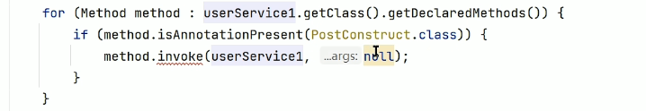
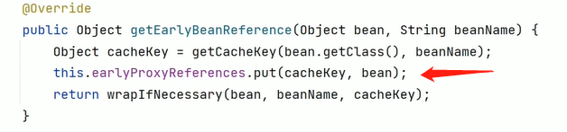
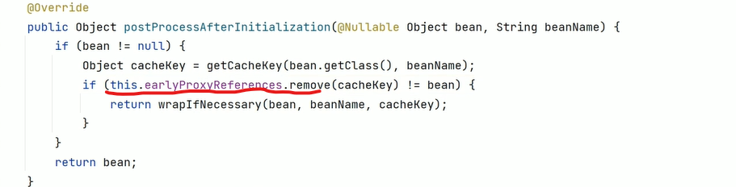

### Spring

#### 1、Bean对象生命周期

> 1. 调用对象构造方法
>     （若存在多个构造方法则默认调用无参构造，若不存在无参构造且没有指定使用哪个构造方法则spring会抛出异常，可以使用@Autowired注解指定，有参构造方法中的参数spring会自动注入根据先byType——>再byName的方式，这个过程可能产生`循环依赖`）
> 2. 注入属性值（依赖注入，可能会产生循环依赖的步骤）
> 3. bean前置处理器
>     （实现钩子模式的效果，通过继承BeanPostProcessor接口重写方法，@PostConstruct注解）
>     
> 4. 初始化bean（继承InitializingBean接口，重写方法，在源码doCreateBean方法中可以看到通过判断当前bean是否是InitializingBean对象从而去调用重写的方法）
> 5. bean后置处理器
>     （实现钩子模式的效果，通过继承BeanPostProcessor接口重写方法）
>     注解原理
> 6. 放入Map单例池中
> 7. 使用bean
> 8. 销毁bean

#### 2、单例Bean

> 一个Bean在堆中只存在一个对象，Spring使用Map来保存单例Bean
>
> 单例Bean不等价于单例模式
>
> - 单例模式：一个类只有一个实例化对象
> - 单例Bean：一个类可以有多个实例化的Bean，每个Bean只存在唯一指向
>     - map的key（类型）是唯一的，都是value（Bean）可以存在多个，不同Bean通过名字区分，所以就存在使用`类型+名字`的注入方式

#### 3、AOP

> Spring中AOP作用的位置：
>
> 1. 构造对象
> 2. 初始化化前
> 3. 初始化
> 4. 初始化后（`AOP`）
> 5. 代理对象
>     （使用cglib生成的代理对象中存在一个target属性用来保存被代理对象，以及后续调用原对象方法，代理对象中不存在依赖注入过程，所以需要保存被代理对象的引用）
> 6. 放入Map单例池（若存在代理对象则代理对象被放入单例池中）

#### 4、Spring事务

> 数据库连接由spring的事务管理器管理，保证多个sql执行是在同一连接上，出现异常时可以顺利回滚
>
> @Transactional注解原理
>
> - 配置数据源管理数据库连接
> - 使用AOP创建代理对象，调用代理对象方法（这里的方法是被加强后的方法）
> - 设置conn.autocommit属性为false，不自动提交
> - 执行被注解标记的方法
> - 没有异常则提交（conn.commit），有异常则回滚（conn.rollback）
>
> 事务失效场景——1
>
> ```java
> @Service
> public class UserService { 
>     @Transactional
>    public void test(){
>         // 执行SQL
>         a();
>     }
>     
>     @Transactional(propagation = Propagation.NEVER)
>     public void a(){
>         // 执行SQL
>     }
> }
> ```
>
> 通过test调用a时当前执行方法的对象并不是加强后的代理对象，而是源对象，所以源对象执行a方法时并不会对`@Transactional(propagation = Propagation.NEVER)`注解做特殊处理，所以注解会失效。
>
> 解决方法
>
> 原理：`使用代理对象去调用代理对象增强后的方法`，这里可以通过自我注入（Spring支持），或者将a方法放置在其他代理对象中通过调用`其他代理对象.a()`的形式也可。
>
> ```JAVA
> @Service
> public class UserService {
>     @Autowired
>     UserService userService;
>     
>     @Transactional
>    public void test(){
>         // 执行SQL
>         userService.a();
>     }
> 
>     @Transactional(propagation = Propagation.NEVER)
>     public void a(){
>         // 执行SQL
>     }
> }
> ```
>
> 事务失效场景——2
>
> 事务管理器配置的数据源与执行SQL对象（mybatis、JDBCTemplate）配置的数据源不同，就会产生事务失效。
>
> 根本原因：两个不同的数据源创建了不同的数据库连接，不同连接之间事务相互独立
>
> 可能造成的原因：
>
> 1. 没有配置@Configurable注解，导致生成的数据源Bean不是单例的
> 2. 配置了多个数据源，事务管理器与SQL执行对象的数据源不一致
>
> 
>
> 事务失效场景——3
>
> 事务标注的方法使用private修饰，由于spring使用CGlib实现动态代理，private修饰的方法无法被代理对象调用
>
> 失效场景总结
>
> 1. 数据库引擎不支持（如MyISAM）
> 2. 被@Transactional修饰的类或方法没有被Spring管理（不是Bean）
> 3. @Transactional修饰的方法不是public访问权限（CGlib代理性质）
> 4. @Transactional修饰的方法内发生自调用（没有使用代理对象调用增强的方法）
> 5. 事务管理器数据源配置问题
> 6. @Transactional(propagation = Propagation.NOT_SUPPORTED)主动放弃事务
> 7. 标注事务注解的方法中异常被捕获没有抛出（不触发事务回滚）
> 8. 抛出的异常不是运行时异常（@Transactional默认发生运行时异常触发回滚）
>     （自定义其他异常回滚的格式：@Transactional(rollbackFor = Exception.class) ）

#### 5、Spring三级缓存解决循环依赖

> 循环依赖场景
>
> | A对象创建                                                    | B对象创建                                                    |
> | ------------------------------------------------------------ | ------------------------------------------------------------ |
> | 1、根据构造方法创建A对象<br />2、依赖注入（A需要注入B对象）<br />3、初始化前<br />4、初始化<br />5、初始化后<br />6、放入单例池 | 1、根据构造方法创建B对象<br />2、依赖注入（B需要注入A对象）<br />3、初始化前<br />4、初始化<br />5、初始化后<br />6、放入单例池 |
>
> 在第二步时A需要注入B对象——>去单例池中获取不到——>创建B对象
>
> B对象创建——>注入A对象——去单例池中获取不到——>创建A对象
>
> 形成循环
>
> 解决方式：增加一个缓存池，在对象刚创建后就将对象放入池中（供依赖注入时使用），对象初始化后再放入单例池中。（形成二级缓存结构）
>
> 
>
> **存在AOP的情况**
>
> 假设A对象后续会进行AOP，那么B对象就需要租入A对象的代理对象而不是原对象，这里就需要提前将A对象进行AOP操作，提前创建的`AOP对象需要放入一个新的缓存中以便其他对象依赖A时不会再次创建A的代理对象`保证代理对象的单例性，
>
> 
>
> 完整的Bean创建逻辑
>
> 1. 使用构造方法创建Bean对象
>     （放入`缓存singletonfactories`中，key是类名，value是一个lambda表达式用于后续提前AOP）
> 2. 依赖注入
>     1. 去单例池中获取——>
>     2. 若没有则判断目标依赖是否再创建中——>
>     3. 若在创建中则出现循环依赖——>
>     4. 从`earlySingletonObject缓存`中获取，若没有——>
>     5. 从`缓存singletonfactories`获取目标依赖lambda表达式并执行——>
>         1. 目标依赖若不需要AOP则，返回普通对象引用
>         2. 目标依赖若需要AOP，创建代理对象，返回代理对象引用
>             （会添加一个标志表示该对象进行过AOP操作）
>             
>     6. 将返回的对象引用放入`earlySingletonObject缓存`，移除`缓存singletonfactories`中对应的缓存项
> 3. 初始化前
> 4. 初始化
> 5. 初始化后
>     （AOP，此处的AOP会进行判断是否提前进行过AOP操作）
>     
> 6. 从`earlySingletonObject缓存`取出，放入`单例池singletonObject`
>
> 完整的三级缓存结构
>
> 一级缓存：`单例池singletonObject`，保存初始化后的完整对象
>
> 二级缓存：`earlySingletonObject缓存`，保存没有完成全部初始化的对象
>
> 三级缓存：`singletonfactories缓存`，保存刚刚创建还未进行依赖注入的对象（打破循环）

#### 6、构造方法造成循环依赖

> 普通的循环依赖Spring通过3级缓存可以自动解决，但是通过有参构造造成的循环依赖Spring不会自动解决。
>
> ```java
> @Service
> public class A {
>     
>     B b;
> 
>     public A(B b) {
>         this.b = b;
>     }
> }
> ```
>
> 上述代码中Spring在调用有参构造时会从单例池中寻找b对象，若发生循环依赖由于A对象没有被创建也就无法放入3级缓存中，会抛出循环依赖异常
>
> 解决方法：@Lazy
>
> ```java
> @Service
> public class A {
>     
>     B b;
> 
>     @Lazy
>     public A(B b) {
>         this.b = b;
>     }
> }
> ```
>
> @Lazy注解表示懒加载，在注入依赖时会直接创建一个B类型的代理对象，将代理对象传入构造方法。当使用代理对象时Spring才会去创建B对象，从而避免循环依赖。

#### 7、Spring中的设计模式

> 1. 工厂模式：BeanFactory、FactoryBean
> 2. 适配器模式：AdvisorAdapter接口
> 3. 访问者模式：PropertyAccessor，属性访问器
> 4. 装饰器模式：BeanWrapper
> 5. 代理模式：AOP
> 6. 观察者模式：事件监听器
> 7. 策略模式：InstantiationStrategy——根据不同的情况进行实例化
> 8. 模板模式：JdbcTemplate
> 9. 委派模式：BeanDefinitionParserDelegate
> 10. 责任链模式：BeanPostProcessor

### SpringMvc

### SpringBoot

