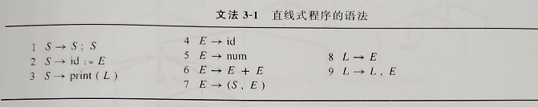
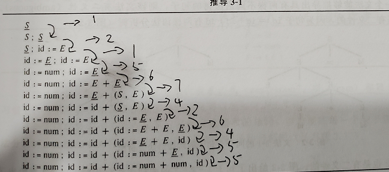
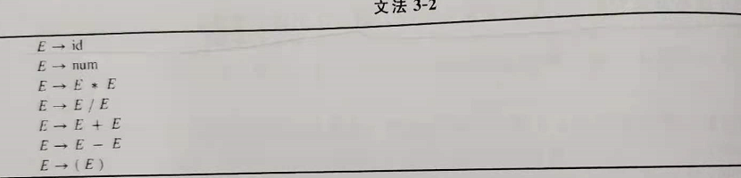
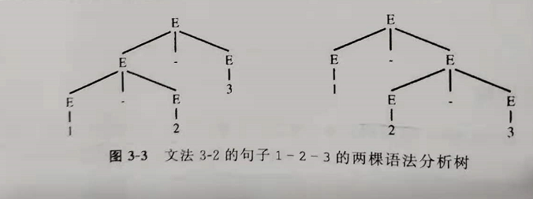
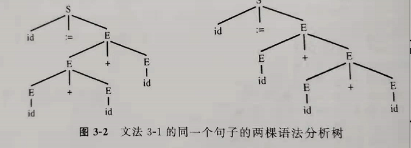
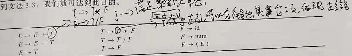
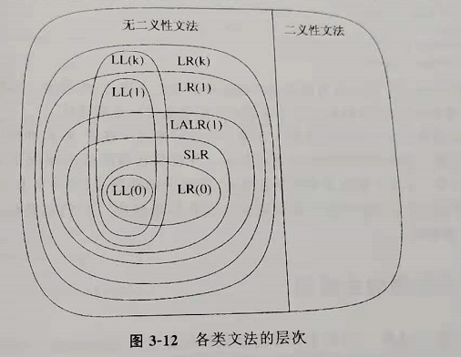

> **语法分析：**检查文本是否满足语法规范

> **上下文无关无法：**一种用来定义语法结构的方法。其特点是将一组表达式缩写为一个符号
>
> 一个简单的直线式程序语法
>
> 
>
> 其可能的推导
>
> 
>
> **二义性文法：**是指对于一个字符串可以推导出两个或以上正确的语法格式。这样会使编译器编译带来问题。
>
> 例：一个会产生二义性的文法
>
> 
>
> 
>
> 
>
> 消除二义性：通过定义优先级和规则可以消除二义性。
>
> 例：定义乘除有更高的结合性，每一个操作都是做结合的，得到如下文法
>
> 

> **分析：**有了上下文无关文法对语法进行定义后，就需要实现如何进行语法分析。
>
> **1、递归下降**：也成为预测分析，只适合于每一个子表达式的第一个终结符号能够为产生式的选择提供足够信息的文法。**使用FIRST结合和FOLLOW集合的概念实现一个无冲突的递归下降语法分析器**（使用LL(1)文法：从左至右分析、最左推导、超前查看一个符号）
>
> 2、**LR分析**：使用LR文法，从左至右分析、最右推导、超前查看
>
> 3、SLR分析：Simple LR分析是一种比LR(0)更好的分析器
>
> 4、LALR(1)分析：超前查看LR(1)分析
>
> **各类文法层次图**
>
> 

> **抽象语法**：一类特殊语法