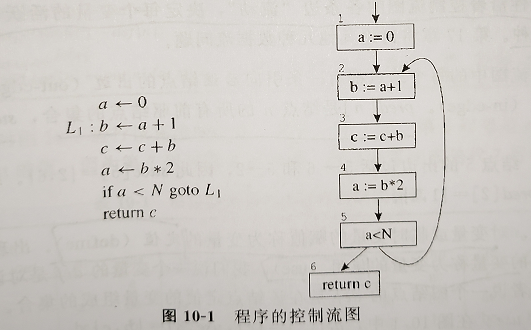
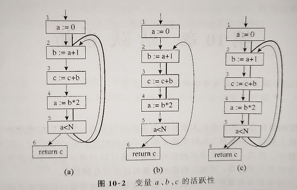
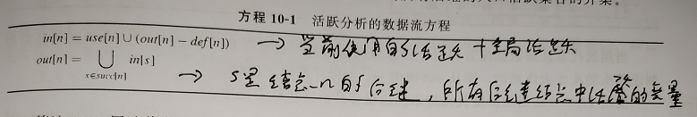
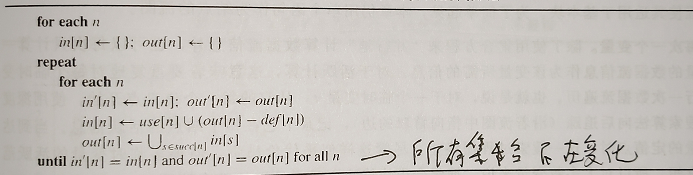

> 活跃分析：确定哪些类是变量在同时被使用，如果一个变量在未来还需要被使用则称这个变量是活跃的。活跃性分析将为后续的寄存器分配做铺垫

>  ## 控制流图
>
> ​		为了对程序进行分析，通常有益的做法是生成程序的控制流图。
>
> 
>
> 
>
> 从图中不难看出a在{1—>2，4—>5—>2}是活跃的，b在{2—>3，3—>4是活跃的}，c全程活跃可能是形式参数

> ## 数据流方程的解
>
> ​		在控制流图中确定变量的活跃范围是数据流问题的一种。
>
> #### 流图术语
>
> 1. pred[n]：结点n所有前驱结点的集合
> 2. succ[n]：结点n所有后继结点的集合
> 3. 定值：对变量或临时变量的赋值称为变量的定值（def）
> 4. 使用：出现在赋值号右边的称为变量的使用（use）
> 5. 入口活跃：变量在一个结点的入边上活跃（live-in）
> 6. 出口活跃：变量在一个结点的出边上活跃（live-out）

> ## 活跃性计算
>
> ​		入口活跃和出口活跃可以用以下方式在use和def集合中求出
>
> 1. 一个变量属于结点的ues[n]，那么它在该结点是入口活跃的。
> 2. 一个变量在结点n是入口活跃，那么它所属的pred[n]的所有结点中都是出口活跃
> 3. 一个变量在结点n是出口活跃，而且不属于def[n]，则该变量在结点n是入口活跃的（类是上述形参C在整个流程中活跃）
>
> 根据上述方法可以推导出活跃分析的数据流方程
>
> 
>
> 根据方式可以推导出伪代码
>
> 

> ## 集合的表示
>
> 表示数据流方程的集合至少有两种方法：位数组或有序变量表
>
> 1. 位数组：使用二进制位来表示N位变量，求集合并集是对位数组求“按位或”
> 2. 有序变量表：使用链表来表示，其中链表的成员是组成集合的袁术，并按任意关键字排序，求并集的计算通过合并链表来实现
>
> 如果集合稀疏，则有序表表示的方法速度会快，如果集合是密集的则位数组表示会更好

> ## 冲突图
>
> 有了活跃性分析后，为了阻止两个同时活跃的变量分配到统一寄存器可以使用冲突图的方式表达。最插件的冲突条件是两个变量同时活跃，但不仅仅限于这一个冲突情况。
>
> 冲突信息的表示
>
> 1. 矩阵：两个存在冲突的变量可以在矩阵的对应位置上坐好标记
> 2. 无向图：存在冲突的变量之间使用一条边连接